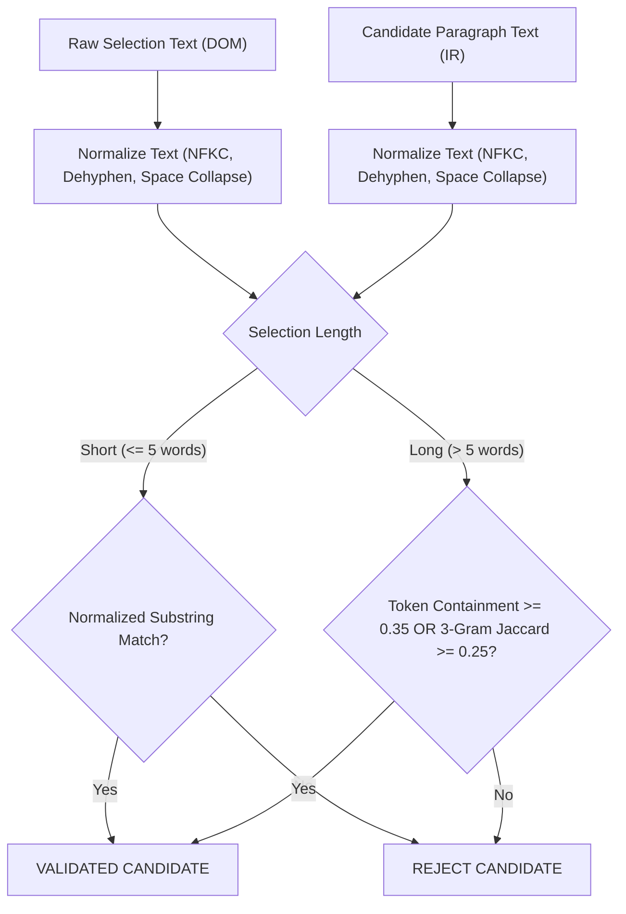

# Acceptance Criteria Specification: DS-QA-005

**Feature:** Selection → `ParagraphIR` Mapping & Selection QA  
**Author:** Gemini (Independent Acceptance Criteria Author)  
**Implementer:** DeepSeek (Lead Engineer)  
**Status:** Approved for Implementation  
**Target Release:** Academic PDF Copilot — Local-First Desktop / Web Core  

---

## 1. Architectural Assessment & Correction of False Premises

Before resolving Decisions A–J, we must correct five false premises present in the brief and affirm the architectural locus for the mapping.

### 1.1 Validation of Local Mapping (Option A)
The brief proposed **Option (a)**: fetching `GET /api/documents/{id}/ir` once per document at ready time and resolving selections entirely in the client. **This decision is confirmed.**
* **Latency:** Selection in a local-first reader must feel instantaneous (<16ms feedback). A network round-trip per `mouseup` introduces unacceptable UI lag and server thrashing during rapid re-selections.
* **Contract Integrity:** The `DocumentIR` is an immutable, canonical artifact. Computing spatial intersection client-side against static `ParagraphIR.bboxes` does not make the client the "source of truth"—the client is merely a geometric measurement engine mapping screen pixels to canonical backend IDs.

### 1.2 Corrections of False Premises in the Brief

> [!WARNING]
> ### False Premise 1: Coordinate Transform Inversion is Scale-Only
> **Brief's Claim:** $\text{pdf\_points} = (\text{client\_rect} - \text{page\_element\_rect}) / \text{scale}$.  
> **Reality:** This holds **only for unrotated pages** ($\text{rotation} = 0^\circ$). In academic papers, landscape tables, supplementary architectures, and appendix sheets regularly specify `rotation: 90`, `180`, or `270` in `PageIR.rotation`. PyMuPDF generates `ParagraphIR.bboxes` in unrotated PDF point coordinates (origin at top-left of the unrotated media box), whereas PDF.js renders rotated pages by swapping canvas dimensions and applying CSS transforms. Dividing by scale alone maps $X$ into $Y$ on rotated pages, completely corrupting candidate mapping. DeepSeek must implement full affine rotation inversion.

> [!WARNING]
> ### False Premise 2: Bounding Box Intersection is Sufficient for Multicolumn Geometry
> **Brief's Claim:** Bounding boxes of paragraphs and selection rectangles can be compared directly via intersection over selection or paragraph.  
> **Reality:** In standard two-column formats (such as ResNet), using a selection's overall `range.getBoundingClientRect()` spans across column gutters and vertical margins. Any multi-line selection in Column 1 would intersect paragraphs in Column 2 at matching vertical coordinates. DeepSeek **must not** use `getBoundingClientRect()`. DeepSeek **must** iterate discrete line fragments extracted via `range.getClientRects()`.

> [!WARNING]
> ### False Premise 3: Prose Paragraphs Include Section Titles in `ParagraphIR`
> **Brief's Claim:** In "The canonical IR", the brief states *"Prose paragraphs are assembled from plain text and title blocks only"*, but then in Question F states *"Headings are not ParagraphIR records — they are the section_title column of the paragraphs they govern"*.  
> **Reality:** Section titles (`title` layout class) are extracted as structural outline metadata (`sections`) and populated on child paragraphs as `section_title`. They are **not** standalone records in `ParagraphIR`. Consequently, selecting *only* a section heading matches zero `ParagraphIR` bounding boxes. DeepSeek must not synthesize fake paragraph IDs or expand a heading selection to the entire governed section.

> [!WARNING]
> ### False Premise 4: Character Offsets or Exact Snippets Can Be Sent in `Scope`
> **Brief's Claim:** Question D raises the option of sending character offsets or exact snippet text alongside paragraph IDs.  
> **Reality:** The backend contract is strictly frozen: `class Scope(BaseModel): extra="forbid"`. Sending `character_offsets` or `text` triggers an immediate HTTP `422 Unprocessable Entity`. Furthermore, DOM text extracted by PDF.js differs from `DocumentIR` text due to hyphenation stripping, ligature normalization (`fi` $\to$ `fi`), soft hyphens, and whitespace collapses. Any DOM-calculated offset is guaranteed to be misaligned with `DocumentIR` character offsets. Selection QA must strictly operate on whole-paragraph scope.

> [!WARNING]
> ### False Premise 5: Cross-Page Selection Can Be Supported Reliably in P0
> **Brief's Claim:** Question E asks whether cross-page selection should be included in P0 or deferred.  
> **Reality:** `PdfViewer` uses virtual windowing (`IntersectionObserver`). Dragging across page boundaries triggers dynamic mounting/unmounting of DOM nodes. When an unmount occurs mid-drag or during scrolling, the browser's native `Selection`/`Range` collapses or throws `IndexSizeError`. In P0, cross-page selection must be **explicitly rejected and deferred**.

---

## 2. Explicit Resolution of Decisions A–J

| Decision | Verdict | Technical Rule |
| :--- | :--- | :--- |
| **A. Multi-Paragraph Selection** | **SEND ALL (Capped & Ordered)** | Send all intersecting `paragraph_ids`. Deduplicate IDs. Order them strictly by canonical `DocumentIR` reading order. Cap at a maximum of **20 paragraphs** (see AC-04). |
| **B. Geometric Overlap Rule** | **LINE-FRAGMENT OVERLAP** | Use `range.getClientRects()`. For each line fragment $R$ and paragraph box $B$: require vertical overlap $\ge 50\%$ of line height and horizontal overlap $\ge 4.0\text{ pt}$. Paragraph qualifies if $\sum \text{Area}(R \cap B) \ge 100\text{ pt}^2$ or covers $\ge 50\%$ of a small fragment. |
| **C. Geometric vs Text Priority** | **GEOMETRY PRIMARY, TEXT VALIDATOR** | Geometry generates candidate paragraphs. Text normalization and containment verification acts as a secondary gatekeeper to reject figure axis labels, page headers, marginalia, and column bleed. |
| **D. Selection Granularity** | **WHOLE PARAGRAPH ID** | Send the whole `paragraph_id`. Do not send offsets or substrings. Backend scopes retrieval to the union of matched paragraphs. UI displays the exact selection snippet as a cosmetic quote/preview only. |
| **E. Cross-Page Selection** | **DEFERRED IN P0** | Restricted to single-page selections. If `range.startContainer` and `range.endContainer` belong to different page containers, disable Selection scope and display: `"暂不支持跨页选区问答，请在单页内选择"`. |
| **F. Headings & Captions** | **REJECTED IF ISOLATED** | Captions and headings are not `ParagraphIR` entities. If selected alone, mapping yields `[]` and Selection scope is disabled. If selected along with body prose, only the valid prose paragraph IDs are sent. |
| **G. Low-Confidence / Partial** | **PARTIAL PERMITTED, LOW-CONFIDENCE REJECTED** | If at least one paragraph validates with high confidence, enable Selection scope with the validated subset. If all candidates fail validation or confidence is low, scope remains unavailable. |
| **H. Reader Mode Availability** | **ORIGINAL & BILINGUAL (ORIGINAL PANE)** | Available in Original Mode, and available in Bilingual Mode *only* when the selection occurs in the original (left) pane. |
| **I. Bilingual Mode Restriction** | **ORIGINAL PANE ONLY** | Selections on the translated pane are rejected because translated layout geometry does not map to source `ParagraphIR.bboxes`. Tooltip: `"选区问答仅支持在原文栏中选中文本"`. |
| **J. Translation Mode Behavior** | **DISABLED WITH SWITCH ACTION** | Selection scope is disabled in Translation Mode. UI provides a 1-click action: `"切换至原文模式以使用选区问答"`, which switches the viewer to Original Mode at the current page. |

---

## 3. Mathematical & Geometric Specification

```
   Screen Viewport (client_rect via range.getClientRects())
                           │
                           ▼
          Page Container (data-testid="pdf-page-container")
                           │  Subtract container rect (CSS px)
                           ▼
                 Page-Local CSS Pixels
                           │  Divide by live scale
                           ▼
                Unscaled Display Points (pt)
                           │  Inverse Affine Transform (PageIR.rotation)
                           ▼
             Canonical PDF Points (top-left origin)
                           │
                           ▼
           Match with ParagraphIR.bboxes
```

### 3.1 Coordinate Inversion Transform
Let $C = [x_{\text{client}}, y_{\text{client}}, w_{\text{client}}, h_{\text{client}}]$ be a client rectangle from `range.getClientRects()`.  
Let $P_{\text{elem}}$ be the bounding client rect of the enclosing element matching `[data-testid="pdf-page-container"]`.  
Let $s$ be the numeric scale factor published on the container (`data-scale`).

1. **Page-Local CSS coordinates:**
   $$x_{\text{css}} = x_{\text{client}} - P_{\text{elem}}.\text{left}, \quad y_{\text{css}} = y_{\text{client}} - P_{\text{elem}}.\text{top}$$
   $$w_{\text{css}} = w_{\text{client}}, \quad h_{\text{css}} = h_{\text{client}}$$

2. **Unrotated Display Points:**
   $$x_{\text{disp}} = x_{\text{css}} / s, \quad y_{\text{disp}} = y_{\text{css}} / s$$
   $$w_{\text{disp}} = w_{\text{css}} / s, \quad h_{\text{disp}} = h_{\text{css}} / s$$

3. **Rotation Inversion (to canonical `DocumentIR` PDF points):**
   Given `PageIR.width_pt` ($W$) and `PageIR.height_pt` ($H$):
   * **$\text{rotation} = 0^\circ$:**
     $$x_0 = x_{\text{disp}}, \quad y_0 = y_{\text{disp}}, \quad x_1 = x_0 + w_{\text{disp}}, \quad y_1 = y_0 + h_{\text{disp}}$$
   * **$\text{rotation} = 90^\circ$ (Clockwise):**
     $$x_0 = y_{\text{disp}}, \quad y_0 = H - (x_{\text{disp}} + w_{\text{disp}}), \quad x_1 = y_{\text{disp}} + h_{\text{disp}}, \quad y_1 = H - x_{\text{disp}}$$
   * **$\text{rotation} = 180^\circ$:**
     $$x_0 = W - (x_{\text{disp}} + w_{\text{disp}}), \quad y_0 = H - (y_{\text{disp}} + h_{\text{disp}}), \quad x_1 = W - x_{\text{disp}}, \quad y_1 = H - y_{\text{disp}}$$
   * **$\text{rotation} = 270^\circ$:**
     $$x_0 = W - (y_{\text{disp}} + h_{\text{disp}}), \quad y_0 = x_{\text{disp}}, \quad x_1 = W - y_{\text{disp}}, \quad y_1 = x_{\text{disp}} + w_{\text{disp}}$$

### 3.2 Line-Overlap Matching Algorithm
For a given page, let $\mathcal{R} = \{R_1, R_2, \dots, R_m\}$ be the set of valid line-fragment rectangles (discarding fragments with $w_{\text{disp}} < 2\text{ pt}$ or $h_{\text{disp}} < 2\text{ pt}$).  
For each candidate paragraph $P \in \text{Paragraphs}(\text{page})$ having bounding boxes $\mathcal{B}_P = \{B_1, \dots, B_k\}$:

1. **Intersection Dimensions:** For fragment $R = [x_0^R, y_0^R, x_1^R, y_1^R]$ and box $B = [x_0^B, y_0^B, x_1^B, y_1^B]$:
   $$\Delta x = \max\left(0, \min(x_1^R, x_1^B) - \max(x_0^R, x_0^B)\right)$$
   $$\Delta y = \max\left(0, \min(y_1^R, y_1^B) - \max(y_0^R, y_0^B)\right)$$

2. **Line Match Condition:** $R$ matches $B$ if and only if:
   $$\frac{\Delta y}{\min\left(y_1^R - y_0^R, y_1^B - y_0^B\right)} \ge 0.50 \quad \text{AND} \quad \Delta x \ge 4.0\text{ pt}$$

3. **Paragraph Geometric Candidate Threshold:** $P$ is a geometric candidate if:
   $$\sum_{R \in \mathcal{R}} \sum_{B \in \mathcal{B}_P} (\Delta x \cdot \Delta y) \ge \min\left(80.0\text{ pt}^2, \; 0.40 \times \sum_{R \in \mathcal{R}} \text{Area}(R)\right)$$

---

## 4. Text Normalization & Verification Pipeline

To eliminate false matches from figure axes, page headers, and column bleed, every geometric candidate paragraph must pass text verification.



### 4.1 Normalization Function $\mathcal{N}(T)$
1. Apply Unicode NFKC normalization (`NFKC` decomposes ligatures: `fi` $\to$ `fi`, `fl` $\to$ `fl`, `ff` $\to$ `ff`, `–` $\to$ `-`).
2. Remove soft hyphens (`\u00ad`) and zero-width spaces (`\u200b`).
3. Reconcile line-break hyphenation: replace `(\w+)-\s*\n\s*(\w+)` with `$1$2`.
4. Replace all whitespace sequences (`[\s\r\n]+`) with a single ASCII space ` `.
5. Strip punctuation around word boundaries and lowercase: $T_{\text{norm}} = \text{toLower}(\text{trim}(T))$.

### 4.2 Verification Gate
* **Short selection ($\le 5$ tokens):** $\mathcal{N}(T_{\text{sel}})$ must appear as a substring within $\mathcal{N}(P.\text{text})$.
* **Long selection ($> 5$ tokens):**
  $$\text{Containment} = \frac{|\text{Tokens}(\mathcal{N}(T_{\text{sel}})) \cap \text{Tokens}(\mathcal{N}(P.\text{text}))|}{|\text{Tokens}(\mathcal{N}(T_{\text{sel}}))|} \ge 0.35$$
  If containment $< 0.35$, check character 3-gram Jaccard similarity $\ge 0.25$. If both fail, candidate is rejected.

---

## 5. Detailed Acceptance Criteria

### AC-01: Coordinate & Geometry Inversion
* **Given** a rendered PDF page at any zoom level (e.g. 50%, 100%, 171.5%, 200%, 400%) or window width (fit-width, fit-page),
* **When** a user drags across text on page $N$,
* **Then** the client must convert `DOMRect` elements from `range.getClientRects()` to PDF points using the container's published `data-scale` and top-left offset,
* **And** the resulting coordinates must match `DocumentIR.paragraphs[i].bboxes` within a tolerance of $\pm 2.0\text{ pt}$, independent of zoom factor or display pixel ratio (DPR).

### AC-02: Affine Rotation Support
* **Given** a PDF page with non-zero rotation (`PageIR.rotation` $\in \{90, 180, 270\}$),
* **When** a selection is made on that page,
* **Then** the coordinate mapper must apply the inverse rotation equations defined in Section 3.1,
* **And** must not map horizontal spans into vertical coordinates or yield negative coordinates.

### AC-03: Two-Column & Multi-Line Disambiguation
* **Given** a two-column academic paper layout,
* **When** a user selects a block of text in Column 1 that is vertically aligned with an unselected paragraph in Column 2,
* **Then** the mapping engine must evaluate line fragments independently via `range.getClientRects()`,
* **And** the paragraph in Column 2 must receive zero horizontal overlap ($\Delta x = 0$) and be excluded from `paragraph_ids`.

### AC-04: Multi-Paragraph Aggregation, Deduplication & Reading Order
* **Given** a selection that spans across paragraph boundaries (e.g. crossing from paragraph $A$ to paragraph $B$),
* **When** the selection is resolved at `mouseup`,
* **Then** both $A.\text{id}$ and $B.\text{id}$ must be present in `scope.paragraph_ids`,
* **And** each ID must appear exactly once (deduplicated),
* **And** the IDs must be sorted in strictly ascending order according to their index in `DocumentIR.paragraphs` (reading order), regardless of whether the user dragged forward or backward (reversed drag),
* **And** if the selection matches more than 20 paragraphs, the UI must cap the payload to the first 20 paragraphs and display an advisory: `"选区过大，已自动限制前20个段落"`.

### AC-05: Non-Prose Element Rejection (Headings, Captions, Figures)
* **Given** a selection that covers only a section title (`title` block), figure/table caption (`caption` block), isolated formula (`isolate_formula`), or page number/header,
* **When** geometry and text validation are executed,
* **Then** the candidate set must resolve to empty `[]`,
* **And** Selection scope must remain disabled with the tooltip: `"所选内容为标题或图表说明，无法作为选区问答范围"`.
* **Given** a selection covering a section title and the first line of the following body paragraph,
* **Then** only the body paragraph's ID must be included in `scope.paragraph_ids`.

### AC-06: Cross-Page Boundary Protection (P0 Invariant)
* **Given** a selection whose `anchorNode` and `focusNode` reside in different `[data-testid="pdf-page-container"]` elements,
* **When** the mouse is released,
* **Then** the selection mapping state must transition to `UNSUPPORTED_CROSS_PAGE`,
* **And** Selection scope must remain disabled,
* **And** the UI must present inline feedback: `"暂不支持跨页选区问答，请限制在单页内选择"`.

### AC-07: Reader Mode Enforcement & Bilingual Pane Isolation
* **Given** the application in **Original Mode**,
* **Then** selection mapping is active and enables Selection QA upon valid text selection.
* **Given** the application in **Bilingual Mode**,
* **When** text is selected inside the original (left) pane, Selection QA is enabled;
* **When** text is selected inside the translated (right) pane, Selection QA is disabled with tooltip: `"选区问答仅支持在原文栏中选中文本"`.
* **Given** the application in **Translation Mode**,
* **Then** Selection scope is disabled in the scope selector;
* **And** selecting translated text displays a prompt: `"切换至原文模式以使用选区问答"`, which switches the viewer to Original Mode upon click.

### AC-08: Non-Interference with Native Browser Interactions
* **Given** text selection in any mode,
* **Then** native clipboard copy (`Ctrl+C`, `Cmd+C`) must remain functional and copy raw text without interception,
* **And** no custom context menu or intrusive overlay may hijack right-click,
* **And** all DOM selection listeners must be passive or execute on `selectionchange` / `mouseup` without invoking `event.preventDefault()` or `event.stopPropagation()`.

### AC-09: Backend Contract Conformance & Payload Integrity
* **Given** an active selection that resolved to `["p_012", "p_013"]`,
* **When** the user submits a QA query,
* **Then** the request payload to `/api/chat` or `/api/qa` must conform strictly to:
  ```json
  {
    "query": "Explain the skip connection mechanism",
    "scope": {
      "type": "selection",
      "paragraph_ids": ["p_012", "p_013"]
    }
  }
  ```
* **And** the `scope` object must contain no extraneous keys (`extra="forbid"` compliance),
* **And** the frontend must never fall back to `type: "whole_paper"` if `paragraph_ids` is empty; if empty, the request must not be dispatched.

### AC-10: Empty Query ("Explain Selection") Behavior
* **Given** an active selection with valid `paragraph_ids`,
* **When** the user clicks "Ask" or presses Enter with an empty query input,
* **Then** the backend must receive `"query": ""` with `type: "selection"`,
* **And** the response must return the selected paragraphs in reading order without running FTS scoring or query rewrites,
* **And** the UI must render the synthesis or explanation of the highlighted passage.

### AC-11: UI Scope Selector, Preview & Stale Selection Management
* **Given** no active selection or a collapsed selection (cursor click without range),
* **Then** the Selection radio option in the QA Scope selector must be disabled and labeled: `选中内容（未选择）`.
* **Given** a valid selection mapping to 1 paragraph with text `"Deep residual networks..."`,
* **Then** the Selection radio option must become enabled and automatically selected,
* **And** the UI must display a quote preview: `已选 1 个段落: "Deep residual networks..."` (truncated at 60 characters with ellipsis),
* **And** deselecting text (clicking whitespace) or switching documents must immediately clear the preview, reset the selection state, and return the scope to the default (`whole_paper`).

### AC-12: Lifecycle Teardown & Request Cancellation
* **Given** an in-flight QA request scoped to a selection,
* **When** the user clears the selection, switches documents, or changes reader mode,
* **Then** the client must immediately abort the in-flight request via `AbortController`,
* **And** cached `DocumentIR` data must be garbage collected when the document is closed or switched.

---

## 6. Edge Case & Failure Mode Matrix

| Scenario | Trigger / Condition | Expected System Behavior |
| :--- | :--- | :--- |
| **Collapsed Selection** | User clicks on page without dragging (`range.collapsed == true`). | Clear `paragraph_ids`; disable Selection radio; revert scope to `whole_paper`. |
| **Reversed Drag** | User drags from bottom-right to top-left. | Normalized rects ensure positive widths/heights; sorting ensures canonical reading order. |
| **Figure Axis Selection** | User drags across numbers/labels inside an embedded plot. | Geometry may touch figure area, but text validation containment fails ($<0.35$). Scope stays disabled. |
| **Hyphenated Line Wrap** | Selection ends on `multi-` and wraps to `task`. | Normalizer reconciles to `multitask`; matches `DocumentIR` normalized prose. |
| **Formula in Selection** | User selects text enclosing an equation ($E = mc^2$). | Prose text matches paragraph; non-text math spans ignored without failing the paragraph match. |
| **Triple-Click Paragraph** | User triple-clicks to select entire DOM paragraph. | Generates complete set of line rects; maps to exact single `ParagraphIR.id` with $100\%$ confidence. |
| **Keyboard Selection** | User selects using `Shift + ArrowKeys`. | `selectionchange` event triggers debounce timer ($150\text{ms}$); maps identical to mouse drag. |
| **Virtual Page Unmount** | User scrolls active selection out of viewport. | Selection state in React store retains mapped `paragraph_ids` until explicitly cleared or replaced. |
| **Document Switch** | User loads a different document from sidebar. | Invalidate in-memory IR cache; reset selection store; clear preview; scope $\to$ `whole_paper`. |
| **Backend Unanswerable** | Query cannot be answered solely from selection. | Backend returns `INSUFFICIENT_EVIDENCE`. UI displays evidence gap notice; **does not** widen scope automatically. |

---

## 7. Verification & Test Plan for DeepSeek

DeepSeek must deliver test suites satisfying the following specifications prior to code review:

### 7.1 Frontend Unit Tests (`vitest` / `jest`)
1. `test_coordinate_inversion_unrotated`: Verify PDF point conversion at scales `1.0`, `1.715`, and `2.0` matches known PyMuPDF ground-truth rects within $\pm 0.5\text{ pt}$.
2. `test_coordinate_inversion_rotated`: Test rotation angles $90^\circ, 180^\circ, 270^\circ$ against landscape and inverted fixture pages.
3. `test_line_overlap_multicolumn`: Provide two adjacent column bounding boxes; verify a selection line rect in Column 1 produces $0$ overlap with Column 2.
4. `test_text_normalizer`: Assert NFKC ligature decomposition (`fi` $\to$ `fi`), hyphen removal across newlines (`con-\nnect` $\to$ `connect`), and whitespace collapsing.
5. `test_text_verification_gate`: Verify that axis labels (`"0 10 20 iter. (1e4)"`) overlapping a paragraph box fail containment and are rejected.
6. `test_reading_order_sort`: Given three matched paragraphs selected in reverse order ($P_3, P_1, P_2$), assert output is `["P1", "P2", "P3"]`.

### 7.2 Integration & Component Tests (`@testing-library/react`)
1. `test_scope_selector_lifecycle`: Mount `ScopeSelector` with empty selection $\to$ Selection disabled. Simulate selection mapped event $\to$ Selection enabled and checked with snippet preview. Simulate collapse $\to$ reverts to `whole_paper`.
2. `test_bilingual_mode_pane_guard`: Dispatch selection event in `#translated-pane` $\to$ assert Selection scope remains disabled with pane-guard tooltip.
3. `test_cross_page_guard`: Provide mock range spanning Page 1 and Page 2 containers $\to$ assert state is `UNSUPPORTED_CROSS_PAGE`.

### 7.3 Backend Regression Tests (`pytest`)
1. `test_selection_scope_exact_match`: Post `/api/qa` with `type: "selection"` and valid `paragraph_ids`. Assert SQL MATCH query contains `AND id IN (...)`.
2. `test_selection_scope_extra_keys_forbidden`: Post `{"type": "selection", "paragraph_ids": ["p1"], "offsets": [0, 10]}` $\to$ assert HTTP `422 Unprocessable Entity`.
3. `test_selection_scope_empty_query`: Post empty query `""` with `paragraph_ids` $\to$ assert selected paragraphs returned in reading order without running FTS scoring.
4. `test_selection_scope_no_fallback`: Post query with non-matching question $\to$ assert response status is `INSUFFICIENT_EVIDENCE` and no hits outside `paragraph_ids` are returned.

### 7.4 End-to-End Tests (`playwright`)
1. Load the ResNet PDF (`612x792 pt`).
2. Perform mouse drag across lines 2–4 of the Abstract at `scale=1.715`.
3. Verify Selection radio button enables and displays preview: `已选 1 个段落: "Deeper neural networks are more difficult to train..."`.
4. Click "Ask" with query `"What is the core degradation problem?"`.
5. Verify citations returned in response are strictly contained within the Abstract paragraph ID.
6. Verify ordinary copy shortcut (`Ctrl+C`) copies selected text to system clipboard uncorrupted.
