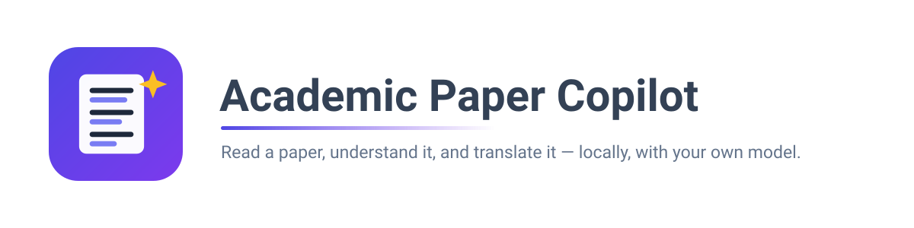
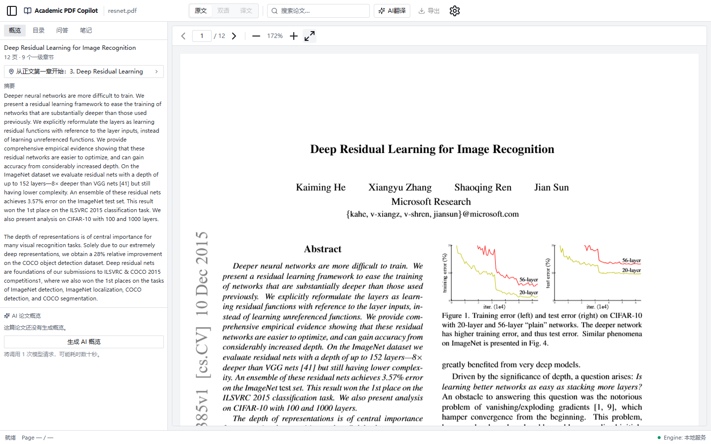
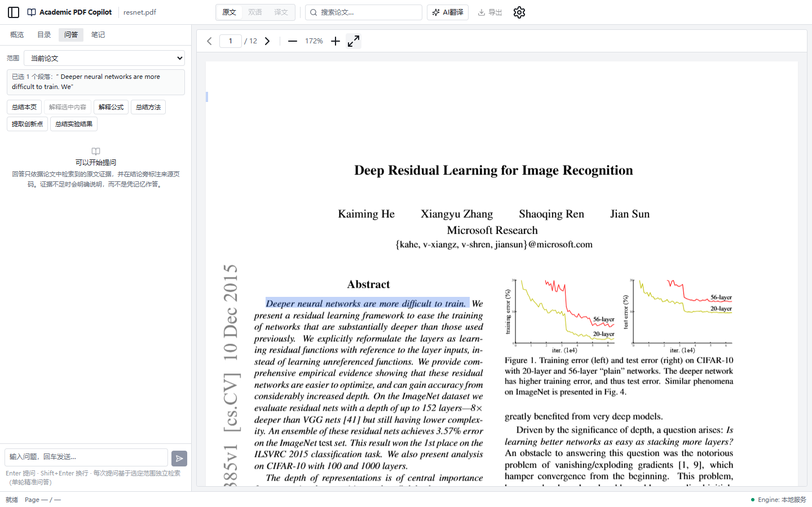
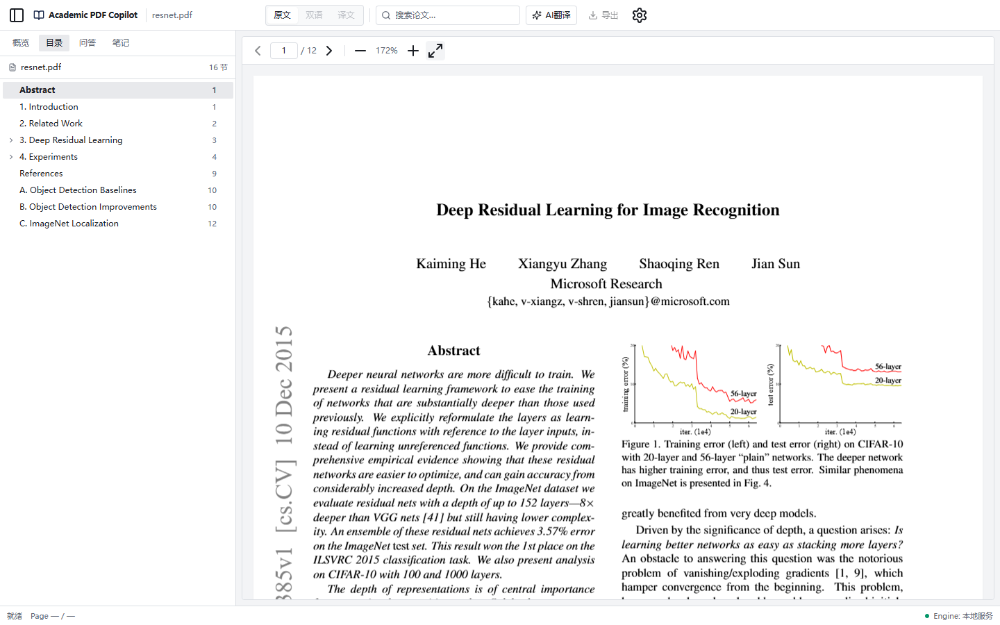
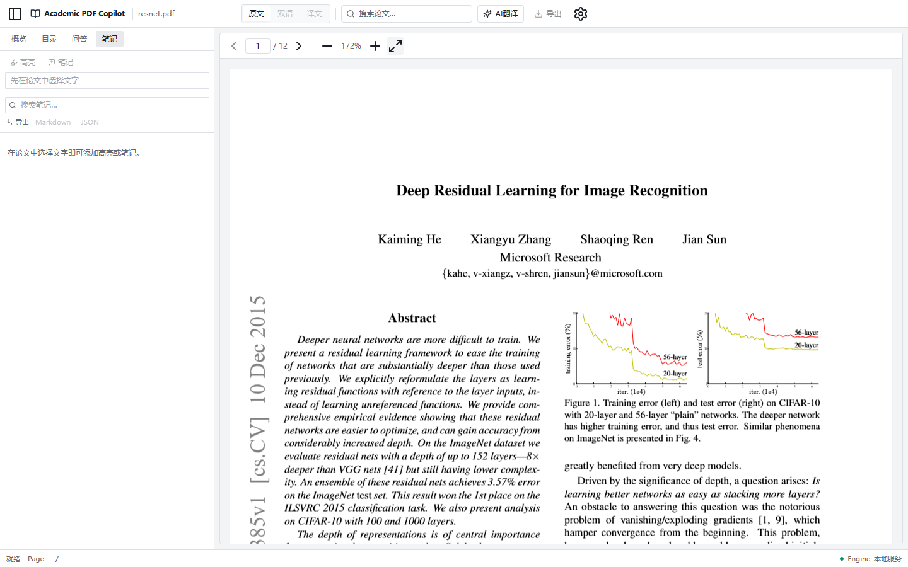

<div align="center">
  
</div>

<p align="center">
  <a href="LICENSE"></a>
  
  
  
  
  
</p>

<p align="center">
  <b>Read a paper, understand it, and translate it — on your own machine, with your own model.</b>
</p>

---

Academic Paper Copilot is a local-first reader for academic PDFs. It keeps the paper you are
reading in front of you — the original, not a re-typed copy — and builds everything else
around it: an extracted structure, an answer engine that cites the paragraphs it used, your
own notes and highlights, a translation of the whole paper, and a short orientation written
for a reader rather than for a machine.

Nothing leaves the machine except the model calls you explicitly ask for. There is no account,
no telemetry, no cloud sync, and no CDN: the browser talks to a loopback backend, the backend
talks to the endpoint you configured, and that is the whole of the network surface.

## Contents

- [What it does](#what-it-does)
- [Screenshots](#screenshots)
- [Quick start](#quick-start)
- [Configuring a model service](#configuring-a-model-service)
- [How it works](#how-it-works)
- [Reading continuity](#reading-continuity)
- [Evidence, not adjectives](#evidence-not-adjectives)
- [Testing](#testing)
- [Repository layout](#repository-layout)
- [Roadmap](#roadmap)
- [Contributing](#contributing)
- [License](#license)
- [Acknowledgements](#acknowledgements)

## What it does

**概览 · Reader Overview.** Opening a paper shows a deterministic orientation built from the
extraction the application already holds: title, the abstract verbatim, page and section
counts, and a recommendation for where to start reading. Asking for an AI overview runs one
bounded synthesis call that produces short, evidence-cited items — research question, core
idea, contributions, method, experiments, findings, limitations — in Chinese or English, with
every item linked to the page it came from. The result is cached **by the paper's content
hash**, so the same PDF reopened later, or re-imported after deletion, is free.

**目录 · Outline, 问答 · Paper QA, 笔记 · Notes.** A section tree that follows your reading
position; a question box that answers from retrieved paragraphs, cites them, and says when the
evidence is insufficient rather than guessing; notes and highlights anchored to the text you
selected, which survive re-extraction, re-import, and restart because they are keyed to the
document's content rather than to a database row.

**Translation.** Whole-paper translation through a local PDF translation kernel, producing a
translated document, a 2N-page interleaved original/translation artifact for export, and a
side-by-side bilingual reading mode with independent panes.

**论文库 · Library.** Every paper the application has registered, what each one has
(a translation, an overview, notes), and the record of the last successful translation —
language pair, engine, when. Opening a row adopts the existing paper rather than re-importing
it, so switching costs nothing and mints no duplicate.

**设置 · Provider settings.** Create, edit, delete and probe model service profiles from the
UI. A profile is a row in SQLite; **the API key is written to the operating system's
credential store and never to the database** — the client is only ever told whether a key is
set, and shown a mask. A key is optional, because a local OpenAI-compatible server needs none.

> **Language note.** The interface is Chinese-first (简体中文). The Reader Overview can be
> generated in Chinese or English; the rest of the UI is not yet localised.

## Screenshots

| Reader and instant orientation | Selection → question, with scope |
|---|---|
|  |  |

| Outline | Notes |
|---|---|
|  |  |

## Quick start

**Requirements.** Python **3.12** (the extraction library's supported range — the backend is
pinned to it), Node **20+**, and a PDF. Windows, macOS and Linux all work; the commands below
show the Windows layout and the POSIX one where they differ.

### 1. Backend

```bash
# Windows
uv pip install --python backend/.venv/Scripts/python.exe -e "backend[dev]"
cd backend && .venv/Scripts/python -m uvicorn app.main:app --host 127.0.0.1 --port 8000 \
    --no-server-header --no-date-header

# macOS / Linux
uv pip install --python backend/.venv/bin/python -e "backend[dev]"
cd backend && .venv/bin/python -m uvicorn app.main:app --host 127.0.0.1 --port 8000 \
    --no-server-header --no-date-header
```

```bash
curl -i http://127.0.0.1:8000/api/health
# {"status":"ok","version":"0.1.0"}
```

The service refuses to bind anywhere but loopback, and its own settings model rejects a
non-loopback host, so a mistake fails at startup instead of quietly exposing the service.

### 2. Frontend

```bash
cd frontend
npm install
npm run dev          # http://127.0.0.1:5173
```

Open the address, drop a PDF into the reader, and the application extracts its structure and
shows the reading entry. No model call happens until you ask for one.

### 3. Where your data lives

| What | Where |
|---|---|
| Documents, extractions, translations | `<data dir>/documents/<document_id>/` |
| Overview cache (content-addressed) | `<data dir>/documents/_cache/overview/` |
| Notes, highlights, profiles, tasks | `<data dir>/db.sqlite3` |
| API keys | the OS credential store (`keyring`) — never the database |

`<data dir>` is `%LOCALAPPDATA%\AcademicPDFCopilot` on Windows and
`~/.local/share/AcademicPDFCopilot` on Linux/macOS.

## Configuring a model service

Open the top bar's **设置** screen and add a profile: a name, the endpoint, the model, and —
optionally — a key. **测试连接** probes the endpoint on demand and reports what it found;
nothing is probed on open, on selection, or on save.

A profile can also be created from a terminal, which is useful on a machine with no browser
session. The key is read without echo and written straight to the credential store:

```bash
python backend/scripts/configure_provider.py
# or, unattended, from a variable you set in your own shell:
python backend/scripts/configure_provider.py --name Local \
    --base-url http://127.0.0.1:11434/v1 --model qwen2.5:7b --keyless
```

## How it works

```
              ┌──────────────────────────── browser (React + Vite) ────────────────────────────┐
              │  reader pane (PDF.js, windowed)   sidebar: 概览 · 目录 · 问答 · 笔记           │
              │  settings · library · translation dialogs                                        │
              └───────────────────────────────┬─────────────────────────────────────────────────┘
                                              │  HTTP, loopback only
              ┌───────────────────────────────┴─────────────────────────────────────────────────┐
              │  FastAPI service                                                                 │
              │                                                                                  │
              │   extraction ──► DocumentIR ──► sections · paragraphs · anchors                  │
              │                     │                                                            │
              │                     ├─► overview packet ─► one bounded synthesis ─► cached by hash│
              │                     ├─► Paper QA retrieval ─► cited answer                       │
              │                     └─► translation kernel ─► mono · dual (2N) artifacts         │
              │                                                                                  │
              │   SQLite: documents · tasks · annotations · profiles    OS keyring: API keys      │
              └──────────────────────────────────────────────────────────────────────────────────┘
```

Four ideas carry most of the design:

**The extraction is the spine.** Every feature — outline, questions, notes, overview,
translation context — resolves against one `DocumentIR`: pages, sections, paragraphs, text
blocks, and the anchors that make a piece of text identifiable across re-extraction.

**Identity is the content, not the row.** A PDF's SHA-256 is what the overview cache, the
notes, the search index and the translation artifacts are keyed to. That is why re-importing a
paper you deleted brings your notes back, and why reopening the same bytes never pays twice.
Document rows are disposable; content is not.

**Cost is a design constraint, not an afterthought.** Opening a paper, reading a cached
overview, switching papers, restoring a session after a reload, listing the library — all of
it is measured to be **zero** provider calls, against a ledger that wraps every provider the
application can construct. Only a button press spends anything, and the button says so first.

**Nothing is displayed that was not measured.** The overview shows the model that produced it
and the tokens the provider reported — or says the count is unavailable. The library shows the
language pair and the engine of the last successful translation, and shows no model, no tokens
and no latency, because neither is recorded. The acceptance documents carry this rule into the
tests themselves.

## Reading continuity

A reload used to close the paper. It no longer does: the session — which paper, which page,
which mode, which panel — is stored locally and restored on load, adopting the existing
document rather than re-importing it, so the translation, the notes and the cached overview
are all still there. Closing a paper deliberately forgets the session, so an empty workspace
is a state you can choose and keep.

## Evidence, not adjectives

Every task in this repository began with acceptance criteria written **before** any
implementation code: numbered, falsifiable, each stating the evidence it requires. The
criteria live in [`docs/acceptance/`](docs/acceptance/) — 40+ documents, each closed with a
per-criterion status and the exact test, browser scenario or measurement behind it, including
the criteria that were amended (with reasons) and the ones that failed.

Two habits are worth naming, because they are the reason to trust the numbers:

- **Measurements are recorded, not remembered.** Provider calls come from a backend ledger;
  bundle size from the production build; cache behaviour from files on disk; selection
  behaviour from real Chromium drags with a mouse. Where a claim could not be measured, it is
  written down as unmeasured rather than rounded to a pass.
- **The tests are expected to catch the product, not the code.** The browser harnesses drive
  the built application with a real backend, and they have found defects that every unit test
  was happy with — including a restored page that reported page 3 to the store while the
  viewer sat on page 1.

## Testing

```bash
# Backend — 1129 tests, offline by construction
cd backend && .venv/Scripts/python -m pytest

# Frontend — 359 tests
cd frontend && npm run typecheck && npx vitest run && npm run build

# Browser acceptance — real Chromium, real backend, real PDFs
cd frontend
node scripts/e2e-overview.mjs --generate     # reader overview lifecycle
node scripts/e2e-session-continuity.mjs      # reload restores the paper
node scripts/e2e-document-library.mjs        # library, switching, deletion
node scripts/e2e-qa.mjs                      # Paper QA
node scripts/e2e-notes.mjs                   # notes and highlights
node scripts/e2e-crosspage.mjs               # cross-page selection
node scripts/e2e-nonprose.mjs                # captions and formulas
node scripts/e2e-outline.mjs                 # outline navigation
node scripts/e2e-translation.mjs             # translation and reader modes
```

The backend suite fails any test that opens a non-loopback socket, and every test runs against
a temporary database — your real library is never touched by a test run.

The browser harnesses copy your data directory into a scratch directory and run against the
copy. They also report the provider ledger, which is how "this cost nothing" is a measurement
rather than a promise.

## Repository layout

```
backend/            FastAPI service
  app/document/     PDF extraction → DocumentIR
  app/overview/     reader overview: packet, prompt, pipeline, content-addressed cache
  app/qa/           retrieval, expansion, answering
  app/annotations/  notes and highlights, anchored to content
  app/pdfkernel/    translation kernel adapter
  app/llm/          provider resolution, accounting ledger, sanitisation
  tests/            1129 tests
frontend/           React + Vite application
  src/pdf/          reader pane (PDF.js, windowed rendering, text layer)
  src/qa/           selection capture, scope, answers, citations
  src/overview/     reading entry, generated overview, session
  src/library/      the document library
  src/settings/     provider settings
  src/session/      reading continuity across reloads
  scripts/e2e-*.mjs browser acceptance harnesses
docs/
  acceptance/       the frozen criteria and the evidence for each
  decisions/        architecture decision records
  ARCHITECTURE.md   how the pieces fit
  TEST_PLAN.md      what is verified at which layer
assets/             project marks
```

## Roadmap

- **Paragraph-level bilingual reading** — original and translation interleaved by paragraph,
  the way immersion readers present a page, as a new reading mode beside the existing ones.
- **Persisted run telemetry** — tokens and latency per generation, so the library's record can
  say what a translation cost instead of staying silent about it.
- **Localised interface** — the UI is Chinese-first today; English and others to follow.
- **English UI screenshots and documentation pass.**

## Contributing

Issues and pull requests are welcome — see [CONTRIBUTING.md](CONTRIBUTING.md). Two house rules
matter more than the rest: **write the acceptance criteria before the code**, and **report
measurements, not adjectives**.

## License

**GNU Affero General Public License v3.0** — see [LICENSE](LICENSE).

This is a copyleft licence, and it is not a preference: the translation kernel
([PDFMathTranslate](https://github.com/Byaidu/PDFMathTranslate)) and the PDF engine
([PyMuPDF](https://github.com/pymupdf/PyMuPDF)) are both AGPL-3.0, and this application links
them directly. AGPL-3.0 is therefore the only licence under which the combined work can be
distributed. If you fork this project, your distributed or network-hosted version must be
AGPL-3.0 as well. See [THIRD_PARTY_NOTICES.md](THIRD_PARTY_NOTICES.md) for the full list.

## Acknowledgements

- **[PDFMathTranslate](https://github.com/Byaidu/PDFMathTranslate)** — the translation kernel
  this project drives, and the reason the licence is AGPL-3.0.
- **[PyMuPDF](https://github.com/pymupdf/PyMuPDF)** — PDF parsing, rendering and text
  extraction (AGPL-3.0).
- **[PDF.js](https://mozilla.github.io/pdf.js/)** — the in-browser reader.
- **[React](https://react.dev/)**, **[Vite](https://vite.dev/)**, **[Zustand](https://zustand.docs.pmnd.rs/)**,
  **[FastAPI](https://fastapi.tiangolo.com/)**, **[Tailwind CSS](https://tailwindcss.com/)**,
  **[lucide](https://lucide.dev/)** — the rest of the stack.
