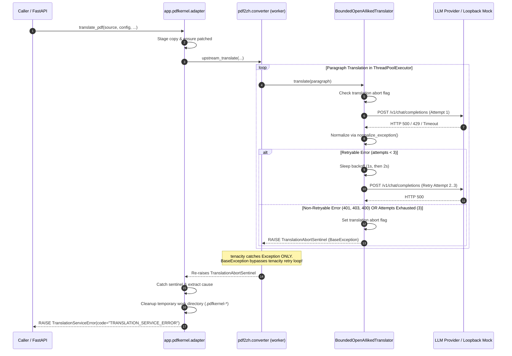
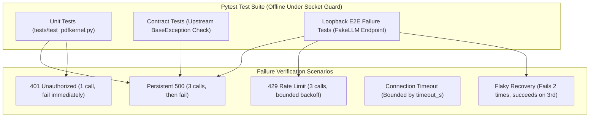

# DS-BE-FIX-002 — Acceptance Criteria (FROZEN)

> **Author:** project maintainer
> **Authored:** 2026-09-16, **before any implementation code was written**
> **Prompt:** the task brief
> **Raw model output:** the task brief
> **Baseline:** commit `3ca35e9`
>
> **FROZEN.** No criterion may be silently weakened or deleted (brief §10).

## Acceptance criteria review (before implementation)

**Verdict: accepted as-is. No `AC_CHANGE_REQUEST`.** 20 criteria (13 P0, 5 P1, 2 P2).
Every design question was settled with concrete numbers, and the mechanism matches the one I
verified experimentally before writing the task.

### What the criteria get right

- **Fail-fast is mandated, not suggested** (Q2, AC-FIX-04). Without it a failing provider costs
  `3 × N` calls — for a 300-paragraph paper, 900 doomed requests against an endpoint that is
  already struggling. The abort flag makes it 3.
- **The sentinel mechanism is the one I verified**, not an assumption: tenacity's default
  predicate catches `Exception` but lets `BaseException` through, and upstream's worker
  re-raises it. AC-FIX-05 pins that behaviour with its own unit test rather than trusting it.
- **Defence in depth** (Q4): if upstream ever stops re-raising `BaseException`, the adapter
  inspects the translator's recorded terminal error after the call returns. A future upstream
  change would degrade to a correct failure rather than a silent hang.
- **Lazy, idempotent injection** (Q5) — the patch must not run at import, which would contradict
  DS-PDF-001's AC-17.
- **Backoff must be zeroable in tests** (AC-FIX-19), keeping the suite fast and deterministic
  rather than sleeping 3 s per failure case.

### Implementation notes recorded at review time

1. **The abort flag must be instance state, not a module global.** `TranslateConverter`
   constructs one translator per document, so an instance attribute is document-scoped by
   construction — concurrent translations stay isolated (Q5).
2. **AC-FIX-04's exact count depends on the flag being checked *before* each attempt**, not only
   between paragraphs. Threads already inside an attempt will finish it; the count is asserted
   with `threads=1` precisely to make that deterministic.
3. **AC-FIX-11 and AC-FIX-12 are the regression guardrails** — the existing end-to-end
   translation tests are the thing most at risk from this change, since the fix substitutes a
   translator into the very path they exercise.

---# Acceptance Criteria: DS-BE-FIX-002 — Bound Provider Failure / Eliminate Infinite Translation Retry

> **Role:** Independent Acceptance Criteria Agent  
> **Status:** Specification Frozen / Ready for Implementation  
> **Target Scope:** Bounded retry budget, fail-fast abort on terminal provider failures, non-`Exception` sentinel escape across upstream tenacity loop, module-level translator injection, process survival, call-count verification, and cleanup.  
> **Explicit Exclusions:** Redesigning cache keys, building the future Context Engine, editing or vendoring upstream `pdf2zh` source code (ADR-001).

---

## 1. Resolution of Design Questions (Q1 – Q5)

### Q1. Retry Budget & Wall-Clock Latency Ceilings
* **Rule**:
  1. **Non-Retryable Errors** ([`LLMAuthenticationError`](file:///backend/app/llm/errors.py#L49) `401`, [`LLMPermissionDeniedError`](file:///backend/app/llm/errors.py#L54) `403`, [`LLMBadRequestError`](file:///backend/app/llm/errors.py#L59) `400`/`422`, [`LLMNotFoundError`](file:///backend/app/llm/errors.py#L64) `404`, invalid model):
     * **Max Attempts:** Exactly **1** (1 initial call, **0 retries**).
     * **Backoff Sleep:** **0.0s**.
  2. **Retryable Errors** ([`LLMServerError`](file:///backend/app/llm/errors.py#L96) `5xx`, [`LLMRateLimitError`](file:///backend/app/llm/errors.py#L81) `429`, [`LLMTimeoutError`](file:///backend/app/llm/errors.py#L86), [`LLMConnectionError`](file:///backend/app/llm/errors.py#L91)):
     * **Max Attempts:** Exactly **3** (1 initial call + **2 retries**).
     * **Backoff Policy:** Exponential backoff with fixed base:
       * After attempt 1: sleep **1.0 second**.
       * After attempt 2: sleep **2.0 seconds**.
       * After attempt 3: retries exhausted $\to$ terminal failure sentinel raised.
     * **Test Harness Mode:** Backoff sleep MUST be patchable or configurable to **0.0s** during automated test runs to preserve test determinism and execution speed.
* **Worst-Case Wall-Clock Ceilings for ONE Paragraph**:
  * For fast-failing endpoints (HTTP response time $\le 100\text{ms}$):
    * Non-retryable (401/403/400): $\le \mathbf{0.5\text{ seconds}}$.
    * Retryable (500/429): $1.0\text{s} + 2.0\text{s} + 3 \times \text{RTT} \le \mathbf{3.5\text{ seconds}}$.
  * For network timeouts:
    * Bounded by $(3 \times \text{timeout\_s} + 3.0\text{s})$, where `timeout_s` is read from [`ProviderConfig.timeout_s`](file:///backend/app/llm/models.py).

---

### Q2. Fail-Fast vs. Fail-Slow Policy & Call Counts
* **Rule**:
  * **FAIL-FAST is MANDATORY.** The adapter must NEVER allow each paragraph to independently exhaust its retry budget ($N \times \text{budget}$) when a provider is down.
  * The first paragraph that encounters a terminal failure (either a non-retryable error on attempt 1, or retry exhaustion after attempt 3) MUST set a translation-scoped abort flag.
  * All concurrent or subsequent paragraph tasks for that document MUST inspect this flag before issuing an HTTP request; if set, they abort immediately with **0 additional provider calls**.
* **Expected Provider-Call Count for a 2-Paragraph Page**:
  * **Persistent HTTP 500 (Retryable)**:
    * Paragraph 1: Attempt 1 (call 1) fails $\to$ wait 1s $\to$ Attempt 2 (call 2) fails $\to$ wait 2s $\to$ Attempt 3 (call 3) fails $\to$ abort flag set.
    * Paragraph 2: Abort flag detected $\to$ **0 calls**.
    * **Deterministic test target (`threads=1`): Exactly 3 calls**.
    * *Concurrent ceiling (`threads=2`): Maximum 4 calls* (paragraph 2 can make at most 1 in-flight initial call before the abort flag drops subsequent retries).
  * **HTTP 401 / 403 / 400 (Non-Retryable)**:
    * Paragraph 1: Attempt 1 (call 1) fails $\to$ non-retryable $\to$ abort flag set.
    * Paragraph 2: Abort flag detected $\to$ **0 calls**.
    * **Deterministic test target (`threads=1`): Exactly 1 call**.
    * *Concurrent ceiling (`threads=2`): Maximum 2 calls* (0 retries).

---

### Q3. What the Caller Receives (Partial Results vs. Task Failure)
* **Rule**:
  * **Any terminal provider failure MUST FAIL THE ENTIRE TRANSLATION TASK.** A partial result (e.g. half the paragraphs translated and half left untranslated due to an LLM outage) is **STRICTLY FORBIDDEN**.
  * While the principle *"formula safety > translation completeness"* permits preserving untranslated math notation selected by the layout engine, it does NOT permit delivering a damaged document caused by an infrastructure/provider outage.
  * **Contract Behavior**:
    1. [`translate_pdf`](file:///backend/app/pdfkernel/adapter.py#L154) MUST raise a typed [`TranslationServiceError`](file:///backend/app/pdfkernel/errors.py#L68) (inheriting from [`PDFKernelError`](file:///backend/app/pdfkernel/errors.py#L15)).
    2. The raised error must wrap the underlying [`LLMError`](file:///backend/app/llm/errors.py#L34) code (e.g., `LLM_SERVER_ERROR`, `LLM_AUTHENTICATION_ERROR`, `LLM_RATE_LIMIT`).
    3. The output directory MUST contain **zero output files** (`{stem}-mono.pdf` and `{stem}-dual.pdf` must not exist).
    4. The source PDF MUST remain bit-for-bit identical (SHA-256 and `mtime` unchanged).

---

### Q4. Sentinel Behavior & Containment
* **Rule**:
  * **Mechanism Confirmation**: A custom sentinel class `TranslationAbortSentinel(BaseException)` inheriting directly from `BaseException` (and NOT `Exception`) is the required mechanism. Because upstream's `worker` is wrapped with `tenacity.retry(wait=wait_fixed(1))` which catches `Exception`, a `BaseException` subclass passes straight through without triggering another tenacity attempt. Upstream's `worker` catches `BaseException` exclusively to log and re-raise it (`raise e`), allowing it to cleanly bubble up out of `concurrent.futures.ThreadPoolExecutor`.
  * **Containment / Leak Prevention**:
    * Inside [`_run_upstream`](file:///backend/app/pdfkernel/adapter.py#L104), a dedicated `except TranslationAbortSentinel as exc:` block intercepts the sentinel.
    * The adapter extracts the inner normalized [`LLMError`](file:///backend/app/llm/errors.py#L34) (or cause), sanitizes the message via [`sanitize_message`](file:///backend/app/llm/errors.py#L26), and raises [`TranslationServiceError`](file:///backend/app/pdfkernel/errors.py#L68).
    * `TranslationAbortSentinel` MUST NEVER escape [`translate_pdf`](file:///backend/app/pdfkernel/adapter.py#L154). Callers only ever receive [`PDFKernelError`](file:///backend/app/pdfkernel/errors.py#L15) (an `Exception` subclass).
  * **Defense-in-Depth Against Upstream Changes**:
    * The custom translator records terminal errors on its instance (e.g. `self._terminal_error`).
    * If upstream ever changes to swallow `BaseException`, the adapter inspects `translator._terminal_error` after `upstream_translate()` returns. If set, it raises [`TranslationServiceError`](file:///backend/app/pdfkernel/errors.py#L68) regardless of upstream's return status.
    * An explicit test verifies that upstream's `worker` re-raises `BaseException`.

---

### Q5. Injection Scope & Idempotence
* **Rule**:
  * **Injection Seam**: Attribute substitution targeting `pdf2zh.converter.OpenAIlikedTranslator`.
  * **Scope & Timing**:
    * To respect AC-17 (zero side effects on module import), the substitution MUST NOT execute at top-level module import of `app.pdfkernel`.
    * Injection is executed lazily via an idempotent initialization helper (e.g., `_ensure_upstream_patched()`) called inside [`_run_upstream`](file:///backend/app/pdfkernel/adapter.py#L104) before invoking `upstream_translate()`, guarded by a thread-safe flag.
    * Once injected, the substitution remains active for the process lifetime.
  * **Concurrency & Safety**:
    * The substituted translator class is stateless. When concurrent translation tasks execute, `TranslateConverter` instantiates independent translator instances for each document.
    * Each translation instance maintains its own isolated `ProviderConfig`, its own abort flag, and its own attempt counters. There is no shared mutable state between concurrent translations.

---

## 2. Failure Handling Architecture & Flow

---

## 3. Acceptance Criteria Table

| ID | Priority | Description & Verification Target |
| :--- | :--- | :--- |
| **AC-FIX-01** | **P0 MUST** | **`[Bound]` Elimination of Infinite Retry on Persistent HTTP 500** When the translation provider returns persistent HTTP 500 errors, [`translate_pdf`](file:///backend/app/pdfkernel/adapter.py#L154) MUST terminate with a typed failure rather than hanging indefinitely. *Verification Target*: Run [`translate_pdf`](file:///backend/app/pdfkernel/adapter.py#L154) against a loopback mock endpoint returning HTTP 500 on all requests. Assert the call raises [`TranslationServiceError`](file:///backend/app/pdfkernel/errors.py#L68) and terminates within a hard ceiling of $\le 5.0\text{s}$ (with 0.0s backoff in test harness). |
| **AC-FIX-02** | **P0 MUST** | **`[Budget]` Finite Retry Budget for Retryable Errors (5xx, 429, Timeout, Connection)** Retryable errors ([`LLMServerError`](file:///backend/app/llm/errors.py#L96), [`LLMRateLimitError`](file:///backend/app/llm/errors.py#L81), [`LLMTimeoutError`](file:///backend/app/llm/errors.py#L86), [`LLMConnectionError`](file:///backend/app/llm/errors.py#L91)) are retried at most **2 times** (maximum **3 attempts** total per paragraph). Backoff follows fixed exponential delays ($1.0\text{s}, 2.0\text{s}$). The 100-attempt loop from upstream `OpenAITranslator` is completely eliminated. *Verification Target*: Against a loopback endpoint returning 500 or 429, assert the number of provider requests for a single paragraph is exactly 3 before raising [`TranslationServiceError`](file:///backend/app/pdfkernel/errors.py#L68). |
| **AC-FIX-03** | **P0 MUST** | **`[Fail-Fast]` Immediate Abort on Non-Retryable Errors (401, 403, 400, 404, Invalid Model)** Non-retryable provider errors ([`LLMAuthenticationError`](file:///backend/app/llm/errors.py#L49), [`LLMPermissionDeniedError`](file:///backend/app/llm/errors.py#L54), [`LLMBadRequestError`](file:///backend/app/llm/errors.py#L59), [`LLMNotFoundError`](file:///backend/app/llm/errors.py#L64)) MUST abort immediately on the first attempt with **0 retries**. *Verification Target*: Against a loopback endpoint returning HTTP 401 or 400, assert [`translate_pdf`](file:///backend/app/pdfkernel/adapter.py#L154) raises [`TranslationServiceError`](file:///backend/app/pdfkernel/errors.py#L68) after exactly 1 provider request for that paragraph. |
| **AC-FIX-04** | **P0 MUST** | **`[Fail-Fast]` Document-Level Fail-Fast Abort Across Paragraphs** When any paragraph encounters a terminal failure (retry exhaustion or non-retryable error), the entire translation task aborts immediately. Subsequent paragraphs MUST NOT execute redundant provider retries. *Verification Target*: Translate a 2-page document with $\ge 2$ body paragraphs against a loopback server returning persistent 500 with `threads=1`. Assert the total provider request count across the entire run is exactly 3 (Paragraph 1 fails after 3 calls; Paragraph 2 makes 0 calls). For 401, total provider request count is exactly 1. |
| **AC-FIX-05** | **P0 MUST** | **`[Sentinel]` Non-`Exception` Sentinel Bypasses Upstream Tenacity** The custom translator signals terminal failures using a `BaseException` sentinel (`TranslationAbortSentinel`). Upstream's `@retry(wait=wait_fixed(1))` decorator does not catch it, breaking the infinite retry loop without modifying upstream code. *Verification Target*: Direct unit test decorating a mock worker with tenacity's default `@retry(wait=wait_fixed(1))`. Assert raising `TranslationAbortSentinel` terminates the call on attempt 1 and does not loop. |
| **AC-FIX-06** | **P0 MUST** | **`[Containment]` Sentinel Containment & Typed Error Mapping** `TranslationAbortSentinel` MUST NEVER leak outside the [`app.pdfkernel`](file:///backend/app/pdfkernel/__init__.py) boundary. It is caught inside [`_run_upstream`](file:///backend/app/pdfkernel/adapter.py#L104) and re-surfaced as [`TranslationServiceError`](file:///backend/app/pdfkernel/errors.py#L68) with root cause preserved in `.cause`. *Verification Target*: Assert `isinstance(exc, PDFKernelError)` and `isinstance(exc, Exception)` are `True`; assert `isinstance(exc, TranslationAbortSentinel)` is `False`. |
| **AC-FIX-07** | **P0 MUST** | **`[Survival]` Process Survival & Zero Unhandled SystemExit** Terminal provider failure, retries, and sentinel unwrapping MUST NOT invoke `exit()`, `sys.exit()`, `os._exit()`, or let an unhandled `SystemExit` terminate the server process. The server process MUST remain alive. *Verification Target*: Run a failed translation inside an isolated Python process; assert process exit code is 0 (test runner succeeds) and the server/runner is not terminated. |
| **AC-FIX-08** | **P0 MUST** | **`[Call-Counting]` Exact Provider Call-Count Verification in Integration Tests** Tests verifying failure boundaries MUST assert exact counts of HTTP requests received by the mock server, preventing tests from passing if a page's text was skipped or abandoned without contacting the provider. *Verification Target*: Test asserts `len(FakeLLM.requests) == 3` for persistent 500 with `threads=1`, and `len(FakeLLM.requests) == 1` for 401/400. |
| **AC-FIX-09** | **P0 MUST** | **`[Immutability]` Source Immutability Across All Provider Failure Modes** The original source PDF content and filesystem metadata MUST remain untouched across all provider failure scenarios (persistent 500, 401, timeout, cancellation). *Verification Target*: Assert `sha256(source_pdf)` and `st_mtime` before translation match `sha256(source_pdf)` and `st_mtime` after catching [`TranslationServiceError`](file:///backend/app/pdfkernel/errors.py#L68). |
| **AC-FIX-10** | **P0 MUST** | **`[Security]` Credential Scrubbing in Provider Failure Messages and Logs** API keys and authorization tokens (`OPENAILIKED_API_KEY`, `Bearer <token>`) MUST NEVER appear in exception strings, tracebacks, error envelopes, or log outputs when a provider call fails. *Verification Target*: Configure provider with `SECRET = "sk-live-test-secret-98765"`. Force HTTP 401 and 500 errors. Assert `SECRET` is not in `str(exc)`, `exc.message`, `exc.to_dict()`, or captured `caplog` output. |
| **AC-FIX-11** | **P0 MUST** | **`[Regression]` Non-Regression of Successful Translation** When the provider returns HTTP 200 with valid translations, [`translate_pdf`](file:///backend/app/pdfkernel/adapter.py#L154) produces valid mono and dual PDFs with exact page counts ($N$ and $2N$), correct page interleaving, and valid PDF metadata. *Verification Target*: Run `test_end_to_end_translation_against_a_loopback_provider` and `test_dual_pdf_alternates_original_and_translated`. Both MUST pass cleanly. |
| **AC-FIX-12** | **P0 MUST** | **`[Regression]` Zero Regression Across Existing Test Suites** All existing backend tests (465 tests) and frontend tests (27 tests) MUST remain 100% green without modification to unrelated modules. *Verification Target*: `pytest` in `backend/` passes $\ge 465$ tests; `npm test` in `frontend/` passes $\ge 27$ tests. |
| **AC-FIX-13** | **P0 MUST** | **`[ADR-001]` Upstream Source Code Immutability & Module Injection** Upstream [`pdf2zh`](file:///backend/.venv/Lib/site-packages/pdf2zh) source files are NEVER modified or vendored. The bounded translator is injected strictly via module attribute substitution (`pdf2zh.converter.OpenAIlikedTranslator`). *Verification Target*: Git diff check asserts zero changes outside `backend/app/` and `backend/tests/`. Upstream repository files remain untouched. |
| **AC-FIX-14** | **P1 SHOULD** | **`[Latency]` Total Failure Latency Ceilings** Under test execution or immediate provider responses, the entire translation call aborts within strict wall-clock ceilings: $\le 5.0\text{s}$ for persistent 500/429, and $\le 1.0\text{s}$ for 401/400. *Verification Target*: Measure `time.perf_counter()` around [`translate_pdf`](file:///backend/app/pdfkernel/adapter.py#L154) against loopback mock; assert elapsed time satisfies the respective ceilings. |
| **AC-FIX-15** | **P1 SHOULD** | **`[Cleanup]` Work Directory Purge and Zero Partial File Leakage** When translation fails due to provider errors, the temporary working directory (`.pdfkernel-*`) MUST be deleted, and NO partial output files (`{stem}-mono.pdf`, `{stem}-dual.pdf`) may remain in `output_dir`. *Verification Target*: After catching [`TranslationServiceError`](file:///backend/app/pdfkernel/errors.py#L68), assert `list(output_dir.iterdir()) == []`. |
| **AC-FIX-16** | **P1 SHOULD** | **`[Cancellation]` Async Task Cancellation Handling** If the caller cancels the [`translate_pdf`](file:///backend/app/pdfkernel/adapter.py#L154) coroutine via `asyncio.CancelledError`, the fail-fast abort flag is set, worker threads cease calling the provider, and temporary working files are purged. *Verification Target*: Trigger `asyncio.wait_for(translate_pdf(...), timeout=0.2)`; catch `TimeoutError`; assert no leftover `.pdfkernel-*` directories exist in `output_dir`. |
| **AC-FIX-17** | **P1 SHOULD** | **`[Lifecycle]` Idempotent Injection with Zero Import Side Effects** Importing [`app.pdfkernel`](file:///backend/app/pdfkernel/__init__.py) MUST NOT trigger heavy model loads, network calls, or eager upstream patching. Upstream injection is executed lazily and idempotently upon the first translation call. *Verification Target*: Re-run `test_importing_the_kernel_touches_nothing_outside_upstreams_cache` in an isolated subprocess; assert returncode is 0 and no unauthorized files are created. |
| **AC-FIX-18** | **P1 SHOULD** | **`[Contract Guard]` Upstream Tenacity Exception Contract Assertion** A dedicated contract unit test verifies that upstream's `pdf2zh.converter.TranslateConverter` worker continues to re-raise `BaseException` subclasses without catching or suppressing them. *Verification Target*: Execute a test passing a mock translator that raises `BaseException`; assert the exception propagates through `TranslateConverter` without hanging or being silenced. |
| **AC-FIX-19** | **P2 OPTIONAL** | **`[Ergonomics]` Configurable Retry Delay for Deterministic Fast Tests** Allow passing an optional test-only retry backoff configuration (e.g. `backoff_seconds=(0.0, 0.0)`) or patching the backoff delay so unit/integration tests run in $< 200\text{ms}$ without artificial sleeps. *Verification Target*: Integration tests execute all 3 attempts in $< 300\text{ms}$ when backoff is zeroed. |
| **AC-FIX-20** | **P2 OPTIONAL** | **`[Diagnostics]` Structured Error Envelope Context & Paragraph Diagnostics** When [`TranslationServiceError`](file:///backend/app/pdfkernel/errors.py#L68) is serialized via `.to_dict()`, include diagnostic metadata in `error.detail` (e.g., `{"provider_status": 500, "attempts": 3, "failed_phase": "paragraph_translation"}`). *Verification Target*: Inspect `exc.to_dict()["error"]["detail"]`; verify structured diagnostic keys are present without leaking sensitive text. |

---

## 4. Verification Matrix & Concrete Test Boundaries

### Specific Integration Test Cases to Add / Update in `tests/test_pdfkernel.py`:

1. `test_persistent_500_fails_fast_with_bounded_retries`:
   * Provider returns 500 indefinitely.
   * Assert [`TranslationServiceError`](file:///backend/app/pdfkernel/errors.py#L68) is raised.
   * Assert `len(FakeLLM.requests) == 3` (with `threads=1`).
   * Assert source PDF hash unchanged.
   * Assert output directory is empty.
2. `test_unauthorized_401_fails_immediately_without_retry`:
   * Provider returns 401 Unauthorized.
   * Assert [`TranslationServiceError`](file:///backend/app/pdfkernel/errors.py#L68) is raised.
   * Assert `len(FakeLLM.requests) == 1` (0 retries).
3. `test_flaky_provider_recovers_within_retry_budget`:
   * Update existing `test_source_survives_a_flaky_provider` where `FakeLLM.failures_remaining = 2`.
   * Assert translation **succeeds**, producing valid mono and dual PDFs.
   * Assert provider was called 3 times (2 failures + 1 success).
4. `test_no_secret_leak_on_bounded_provider_failure`:
   * Provider returns 500 containing raw auth header or error text.
   * Assert secret is scrubbed from exception string and log records.

---

## 5. Explicit Prohibitions for Implementation

1. **DO NOT edit or vendor upstream `pdf2zh` source files** (ADR-001). Any fix must reside entirely within `backend/app/pdfkernel/` via attribute substitution.
2. **DO NOT redesign the translation cache** or build the Context Engine; cache key semantics are out of scope for this defect fix.
3. **DO NOT use `exit()`, `sys.exit()`, or `os._exit()`** anywhere in the error handling path.
4. **DO NOT return partial PDF outputs** when a provider failure occurs.
5. **DO NOT weaken the existing 5.0s pre-flight check** on the layout model (`ensure_layout_model`).
