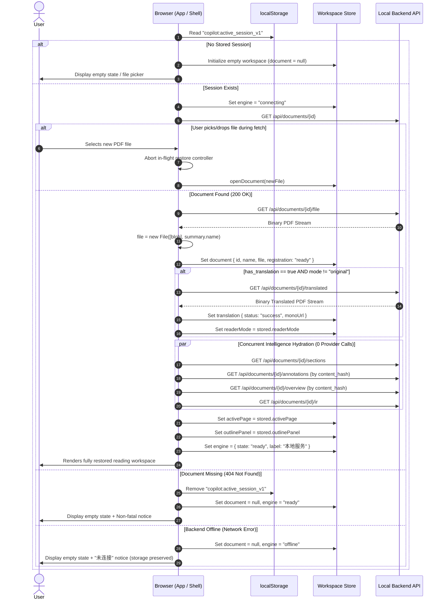

# Acceptance Criteria — DS-DOC-004: Reading Session Continuity

- **Author:** Gemini (`gemini-3.8-flash-high`), via the standing two-agent workflow
- **Reviewed and frozen by:** DeepSeek (Round 1 review pending)
- **Date:** 2026-09-21
- **Baseline:** Commit `85207e8` / Post-DS-QA-015 (`SCHEMA_VERSION = 5`, `IR_PIPELINE_VERSION = "5"`, `CountingProvider` ledger in `app/llm/accounting.py`, bundle ceiling amended to `310.0 kB`)
- **Deliverable:** `docs/acceptance/DS-DOC-004.md` (authored before any production code)
- **Status:** **PROPOSED FOR ROUND 1 REVIEW — 18 P0 · 5 P1 · 2 P2**

---

## 0. Independent Acceptance Author Statement & Review Framing

### 0.1 Process Discipline: Acceptance before Implementation
In this repository, process sequencing is load-bearing:
- **DS-DOC-002** bypassed pre-implementation acceptance criteria, resulting in reading-order and cache-invalidation defects that required retroactive diagnosis and repair (`.agent/evidence/DS-DOC-002.md`).
- **DS-DOC-003** strictly enforced acceptance criteria first (`docs/acceptance/DS-DOC-003.md`), catching three structural defects prior to coding.
- **DS-QA-010** established multi-target persistent notes (`docs/acceptance/DS-QA-010.md`), closing at **18/18 P0 PASS** (`2529674`) with 0 AI calls, 0 PDF mutations, and 0.0% wrong-attachment rate.
- **DS-QA-010-FIX-001** diagnosed and fixed the note list identity defect: notes were keyed to ephemeral document rows (`uuid4().hex`) and made unreachable on reopen; the fix keyed them to `content_hash`.
- **DS-QA-015** established the content-addressed Reader Overview and code splitting (`docs/acceptance/DS-QA-015.md`), closing at **55/55 P0 PASS** with initial bundle at 304.54 kB.

**This task will not violate process discipline.** This specification is produced independently as Round 1 acceptance criteria, written against the real repository before a single line of production code in `backend/app/` or `frontend/src/` is drafted.

### 0.2 The Core Problem & Guiding Principle
The defect was reported by the user in one sentence:
> **"刷新的话，论文就直接关掉了，翻译也要重新打开了"**  
> *(On browser refresh, the paper simply closes, and the translation has to be opened again.)*

Today, a browser reload (`F5` / `Ctrl+R`) destroys the reading session:
1. `useWorkspaceStore` starts from initial default state (`document: null`, `translation: null`, `readerMode: "original"`).
2. The open paper closes and the workspace returns to the empty file-picker state.
3. Any translated artifact already generated and saved on disk becomes inaccessible in the client.
4. To resume reading, the user must re-select the original PDF from disk. That action executes `openDocument(file)`, which sends a multipart upload to `POST /api/documents`.
5. The backend mints a **brand-new ephemeral `document_id`** (`doc_<uuid4().hex>`). Because the directory `<documents_dir>/<new_id>/` contains no `mono.pdf`, `has_translation` is reported as `false`.
6. The user is forced to re-run translation from scratch, spending AI provider quota, time, and compute on an artifact that was already translated and sitting intact in the previous document directory.

Yet, on the backend:
- The original PDF bytes exist (`<documents_dir>/<id>/source.pdf` or `source_path`).
- The translated PDF exists (`<documents_dir>/<id>/mono.pdf`).
- The extracted structure exists (`<documents_dir>/<id>/ir.json`).
- User notes exist in SQLite (keyed to the PDF's cryptographic `content_hash` via DS-QA-010-FIX-001).
- The Reader Overview exists in the content-addressed cache (`<documents_dir>/_cache/overview/<content_hash>_<lang>.json` via DS-QA-015).

**This is strictly a session continuity defect, not a data-loss defect.** The data was never lost; the client-side session identity that reached it was discarded on reload.

### 0.3 Verified Starting State

| Subsystem / Property | Repo Evidence / Verification Location | Verified Finding |
|---|---|---|
| **Document Listing Route** | `backend/app/api/documents.py:244`, `app/documents/store.py:166` | `GET /api/documents` returns `DocumentSummary` rows ordered by `created_at DESC`. Payload fields: `document_id`, `name`, `page_count`, `source` (`"upload"` / `"path"`), `has_translation`, `created_at`. |
| **Original PDF Stream Route** | `backend/app/api/documents.py:256` | `GET /api/documents/{id}/file` streams original PDF bytes directly from disk. Read-only, 0 side-effects. |
| **Translated PDF Stream Route** | `backend/app/api/documents.py:268` | `GET /api/documents/{id}/translated` streams `mono.pdf` artifact from disk. Returns 404 if not yet translated. Read-only, 0 provider calls. |
| **Document Intelligence Routes** | `backend/app/api/documents.py:358, 373, 390` | `GET /api/documents/{id}/ir`, `/sections`, `/page-mapping` all read from existing IR cache (`ir.json`). |
| **Overview & Notes Routes** | `backend/app/api/overview.py`, `backend/app/api/annotations.py` | `GET /api/documents/{id}/overview` and `GET /api/documents/{id}/annotations` read from content-addressed cache and SQLite. 0 provider calls. |
| **Ephemeral Workspace Store** | `frontend/src/stores/workspace.ts:474-604` | Zustand store is purely in-memory. Zero `localStorage` or `sessionStorage` persistence is wired. |
| **Upload-Only Document Open** | `frontend/src/translation/session.ts:134` | `openDocument(file: File)` requires a live browser `File` object and triggers a multipart `POST /api/documents`. Does not inspect `has_translation` upon registration. |
| **Absence of Router** | `frontend/src/app/App.tsx:20-30`, `frontend/package.json` | No router exists (`react-router`, `wouter`, etc. are absent). Single-page shell. URL has no query/hash parameters. |
| **Absence of Settings Screen** | `frontend/src/app/TopBar.tsx:210-218` | Top bar "设置" button has tooltip only and no `onClick` handler. No settings UI exists or has ever been specified. |
| **Initial Bundle Ceiling** | `docs/acceptance/DS-QA-015.md:210-225` | Initial JS chunk measured at **304.54 kB** with an amended ceiling of **310.0 kB** (headroom is **5.46 kB**). |
| **Zero Provider Call Contract** | `docs/acceptance/DS-QA-015.md` AC-P0-15, AC-P0-16 | Opening a paper and viewing cached analysis must incur strictly **0 provider calls**, audited via `backend/app/llm/accounting.py`. |

---

## 0.4 Round 1 review and freezing (DeepSeek) — 1 AC_CHANGE_REQUEST

Read against the repository at `5d7f719`. Decisions **A, B, C, D, E, F, G, H** are
accepted as written, and two of them settle questions the implementation would
otherwise have got wrong: **A** (the reading session belongs to the client, not to
`MAX(created_at)` — a newest-row restore re-opens a paper the reader closed, opens
someone else's newest paper on a fresh browser profile, and yanks a reader off the
paper they are actually reading) and **H** (no router: the 5.46 kB of headroom
under the amended 310.0 kB ceiling is the reason, and it is a real one).

The frozen evidence lines are satisfiable in this repository as written, with
three points recorded rather than changed:

- **AC-P0-06's ledger audit is free to run.** The browser harnesses copy the real
  data directory, so a `has_translation: true` document with its `mono.pdf`
  already exists to restore — verification does not have to pay for a new
  translation.
- **AC-P0-03's "renders the document canvas"** can only be observed in the
  Chromium harness: `vitest` runs under jsdom with the canvas stubbed. The state
  half (`/file` fetched once, `document.file instanceof File`) is a `vitest`
  assertion and the canvas half is a harness assertion, and both will be recorded.
- **AC-P0-16 is already half-built.** `translation/session.ts::teardownTranslation`
  revokes `monoUrl` today, so a restored translation that is *stored in the same
  field* inherits that revocation. The criterion forbids creating an object URL
  anywhere the teardown cannot reach.

### AC_CHANGE_REQUEST 1 — the criteria never say the restore must reuse the row

**Old wording:** none. No criterion mentions the document row, and AC-P0-02 only
requires that `document.documentId` be populated.

**New wording — a nineteenth P0:**

> **AC-P0-19 Restoration Reuses the Document Row and the Extraction.**
> Restoring a session must adopt the existing document row: it must not create a
> new row, and it must not re-extract the IR. Evidence: `GET /api/documents`
> returns the same number of rows before and after a complete reload; no new
> directory appears under `<documents_dir>`; and the document's `ir.json`
> modification time is unchanged across the restore.

**Reason.** AC-P0-04 (the translation comes back without re-translating) already
*implies* this — a fresh upload mints a new row whose `has_translation` is false,
orphaning `mono.pdf` under the previous identity, which is the defect §2.3 names.
But nothing in the frozen set says it, and the failure mode of getting it wrong is
silent: every reload would add a row to the reader's library and re-run a vision
pass over every page, which is seconds of local CPU per refresh and a documents
list that grows by one entry each time. Both are invisible to the criteria above —
AC-P0-06 counts provider calls, and local extraction is not one. A criterion that
measures the mechanism rather than one of its symptoms is what makes the cheap
restore stay cheap.

### Accepted and recorded without change

**AC-P0-17's ceiling is the amended 310.0 kB** (DS-QA-015 §0.1), and the 5.46 kB
of headroom is the tightest constraint in this task: the session module, its
storage, and the restore path all have to fit inside it, measured, not assumed.

**AC-P1-01's 300 ms** covers more than this task's work — it is page load plus
PDF.js parsing and first paint of two documents on a 15-page paper. It is a
**SHOULD**, and it will be reported as measured rather than asserted as passing if
the viewer, not the restore, is what takes the time.

**P0 is frozen at 19 criteria with the addition above. 5 P1 · 2 P2 remain.**

---

## 1. Executive Judgment: Is this task worth doing?

**Yes — it is vital for product viability.**

For a scientific researcher, reading an academic paper is an interrupted, multi-session workflow. Readers routinely refresh tabs to clear browser memory, reload after waking a laptop from sleep, or reload when testing interface states.

Today's behavior forces the reader to locate the original PDF on their filesystem, drag it into the browser again, wait for upload, and — most critically — **re-translate the entire paper**, waiting minutes and spending AI quota again. This destroys user trust.

Because the backend already persists the original file, the extracted IR, the translation artifact, the notes, and the overview, repairing this defect requires **zero database migrations, zero AI provider calls, and zero external dependencies**. It is an elegant, local-first client session restoration layer.

---

## 2. Measured Starting State & False Premises Corrected

### 2.1 The Positional Trap of "Newest Row"
A naive proposal is: *"On page load, query `GET /api/documents` and automatically open the first row (the newest document)."*
**This proposal is demonstrably flawed:**
1. **Conflates Creation Time with Reading Focus:** If a user uploaded Paper A yesterday and translated it, then imported Paper B this morning, but then spent the afternoon reading Paper A: reloading would yank the user onto Paper B because B has a newer `created_at` timestamp.
2. **Violates Explicit Close:** If a user clicks to close a paper (returning to the empty workspace), refreshing the browser would immediately re-open the newest paper against their will. It would be impossible to keep an empty workspace.
3. **Ghost Opens on Clean Clients:** A new browser profile or second device accessing the backend would automatically open someone else's newest document on first visit.
4. **Conclusion:** Session continuity belongs to the **client reading session**, not to a global database query.

### 2.2 The False Premise of URL Routing
Another proposal is: *"Introduce a client-side router (e.g. `/#/doc/<id>`) to drive document opening."*
**This proposal is rejected:**
1. **Bundle Ceiling Violation:** As measured in DS-QA-015, the frontend initial bundle chunk sits at **304.54 kB** against the strict **310.0 kB** ceiling — leaving only **5.46 kB** of headroom. Adding any routing package (even minimal routers) risks pushing the initial bundle over the ceiling, failing AC-P0-52.
2. **Local-First Desktop Model:** Academic PDF Copilot operates as a local-first desktop application. There is no multi-user sharing of private local document IDs over public links.
3. **Fragility & History Stack Pollution:** Synchronizing URL history state with local file drops introduces back-button edge cases, hash-change races, and browser navigation traps.
4. **Atomic Client Storage is Superior:** Synchronous `localStorage` provides instant, atomic, crash-resilient persistence without touching the URL or adding bundle weight.

### 2.3 The "Re-Translation" Cost Regression
When a user re-opens a paper after refresh today:
- Because the frontend treats document opening strictly as a fresh file upload, a new document ID is minted.
- The existing translated artifact (`mono.pdf`) remains orphaned under the previous document directory.
- Re-translating a 10-page paper costs ~10 LLM calls, ~25,000 tokens, and several minutes of latency.
- Restoring the session must retrieve the existing `mono.pdf` via `GET /api/documents/{id}/translated` with **strictly 0 provider calls**.

---

## 3. Explicit Design Decisions A–H

| # | Topic | Verdict | Technical Specification & Rationale |
|---|---|---|---|
| **A** | **Definition of "Last Opened Paper"** | **Client-persisted active document identity (`localStorage`).** | Persisted in browser `localStorage` under key `copilot:active_session_v1`. Contains `{ documentId, activePage, readerMode, outlinePanel }`. Set whenever a document reaches `registration: "ready"`; updated on page/mode/panel changes; cleared on explicit document close. Avoids newest-row timestamp confusion and ghost opens. |
| **B** | **In-Flight Collision & User Gesture Preemption** | **User gesture strictly preempts background restore.** | If the user picks a file via `<input type="file">` or drops a file onto the workspace while session restoration is in flight, the restore is **immediately aborted** (`activeRestore.abort()`). The user's explicit gesture takes unconditional priority; late responses from the aborted restore are discarded. |
| **C** | **Missing File on Disk (Backend 404)** | **Purge stale session key; graceful empty workspace; non-fatal notice.** | If the document row exists in SQLite but `GET /api/documents/{id}/file` returns 404 (e.g. user moved/deleted the source file), `copilot:active_session_v1` is cleared. Workspace renders clean empty state with a clear, non-blocking toast/notice: *"上次阅读的文档源文件已不可用，已重置工作区"*. Never an infinite spinner or white screen. |
| **D** | **Backend Offline / Unreachable on Reload** | **Preserve session key; render shell; offline notice; retryable.** | If the backend is unreachable on reload (network error / `ECONNREFUSED`), the session key in `localStorage` is **retained** (not deleted). The shell renders with engine status *"未连接"*, file picker remains operable, and a non-fatal notice explains that the local service is offline. When the backend is started and the user refreshes, restoration succeeds. |
| **E** | **Artifact Corruption & Degradation** | **Degrade translation to original; isolate original corruptions.** | If `mono.pdf` is missing or corrupt but original PDF is valid: reader mode falls back to `"original"`, original PDF renders cleanly, and a notice warns that the translation is unavailable. Original reading is **never blocked** by translation failures. If original PDF is corrupt: PDF.js error is caught and standard viewer error card renders with a button to close. |
| **F** | **Provider Call Invariance** | **Strictly 0 provider calls on restore.** | All restore requests (`GET /api/documents/{id}`, `/file`, `/translated`, `/ir`, `/sections`, `/annotations`, `/overview`) read existing data from disk and SQLite. Verified via `CountingProvider` ledger (`app/llm/accounting.py`): restoring any session must result in `len(accounting.snapshot()) == 0`. |
| **G** | **Session Continuity Boundary (What is restored vs excluded)** | **Restored: Document, Translation, Active Page, Sidebar Tab. Excluded: QA turns, selections, sub-pixel scroll.** | **Restored:** Original document & file, translated artifact (`monoUrl`), `readerMode` (`original` / `bilingual` / `translation`), `activePage` (1-based int), `outlinePanel` (`overview` / `outline` / `qa` / `notes`), annotations, overview.<br>**Strictly Excluded:** QA conversation turns (`turns = []`), composer text (`question = ""`), text selection (`selection = null`), sub-pixel continuous scroll offset (`offsetPt = 0`), in-flight tasks. |
| **H** | **URL & Router Policy** | **NO router, NO URL mutation, NO hash navigation.** | Single-page architecture is preserved. Initial bundle headroom (5.46 kB) is strictly protected. Navigation and session state are managed via `localStorage` and Zustand. |

---

## 4. Architecture & Technical Specifications

### 4.1 Client Storage Schema (`frontend/src/session/types.ts`)

```typescript
export interface StoredReadingSession {
  /** Schema version for forward migration safety. */
  schemaVersion: 1;

  /** Active backend document identity. */
  documentId: string;

  /** Display name of the document. */
  name: string;

  /** 1-based page number the reader was viewing. */
  activePage: number;

  /** Active reader mode when session was saved. */
  readerMode: "original" | "bilingual" | "translation";

  /** Active sidebar tab panel when session was saved. */
  outlinePanel: "overview" | "outline" | "qa" | "notes";

  /** Timestamp of last user interaction (ISO 8601). */
  lastActiveAt: string;
}

export const ACTIVE_SESSION_STORAGE_KEY = "copilot:active_session_v1";
```

### 4.2 Lifecycle Flow: Restoration with User Preemption



### 4.3 Provider Call Audit Guarantee
The session restoration sequence executes strictly within the local read boundary:

| Endpoint Invoked | Backend Function | Data Source | Provider Calls |
|---|---|---|---|
| `GET /api/documents/{id}` | `get_document` | SQLite `documents` table | **0** |
| `GET /api/documents/{id}/file` | `original_file` | Local disk (`source.pdf`) | **0** |
| `GET /api/documents/{id}/translated` | `translated_file` | Local disk (`mono.pdf`) | **0** |
| `GET /api/documents/{id}/sections` | `document_sections` | Cached `ir.json` | **0** |
| `GET /api/documents/{id}/annotations` | `list_annotations` | SQLite `annotations` table | **0** |
| `GET /api/documents/{id}/overview` | `get_overview` | Shared disk `_cache/overview/` | **0** |
| `GET /api/documents/{id}/ir` | `document_ir` | Cached `ir.json` | **0** |
| `GET /api/profiles` | `list_profiles` | SQLite `profiles` table | **0** |
| **Total Incurred** | — | — | **STRICTLY 0** |

---

## 5. Acceptance Criteria

### 5.1 P0 MUST — Non-negotiable Correctness, Invariants, Preemption, Degradation, Zero Calls, and Bundle Protection

- **AC-P0-01 Client Session Persistence on Document Activation (Decision A).**  
  Whenever a document completes backend registration (`document.registration === "ready"` with a non-null `documentId`), the client must synchronously serialize a `StoredReadingSession` to `localStorage` under key `copilot:active_session_v1`. The stored object must contain `{ schemaVersion: 1, documentId, name, activePage, readerMode, outlinePanel, lastActiveAt }`.  
  *Evidence:* Vitest unit test asserting `localStorage.getItem("copilot:active_session_v1")` contains valid JSON matching the active document state after `openDocument` resolves.

- **AC-P0-02 Automatic Session Restoration on Mount (Decision A).**  
  When `App` / `AppShell` mounts, if a valid session record exists in `localStorage`, the client must automatically initiate session restoration for that `documentId`. Upon successful restoration, `document.documentId`, `document.name`, and `document.registration = "ready"` must be populated in `useWorkspaceStore`.  
  *Evidence:* Component test mounting `AppShell` with pre-seeded `localStorage`; asserting that the store document reaches `registration: "ready"` without any user click.

- **AC-P0-03 Original PDF Byte Retrieval & File Hydration (Decision G).**  
  Session restoration must fetch the original PDF bytes via `GET /api/documents/{documentId}/file` as a `Blob` and instantiate a browser `File` object (`new File([blob], name, { type: "application/pdf" })`), assigning it to `document.file`. The reader pane must render the document using this hydrated `File`.  
  *Evidence:* Integration test verifying `GET /api/documents/{id}/file` is called once, `document.file instanceof File` is `true`, and `viewer-original` renders the document canvas.

- **AC-P0-04 Translation Artifact Restoration without Retranslation (Decision D).**  
  If the restored document summary indicates `has_translation === true`, the client must fetch the translated artifact via `GET /api/documents/{documentId}/translated` as a `Blob`, generate an object URL via `URL.createObjectURL(blob)`, and populate `translation` in `useWorkspaceStore` with `status: "success"` and `monoUrl !== null`. The client must **NEVER** issue a `POST /api/documents/{id}/translate` during restoration.  
  *Evidence:* Test verifying `GET /api/documents/{id}/translated` is invoked, `translation.status === "success"`, and `POST /translate` is not called.

- **AC-P0-05 Reader Mode Continuity (Decision D, G).**  
  If the persisted session indicates `readerMode === "bilingual"` (or `"translation"`) and the translated artifact is successfully retrieved, the restored reader mode in `useWorkspaceStore` must be set to that mode, and `ReaderWorkspace` must render both panes (`viewer-original` and `viewer-translated`).  
  *Evidence:* Test mounting with stored session having `readerMode: "bilingual"`; asserting `data-reader-mode="bilingual"` on the workspace container and both viewer elements exist in the DOM.

- **AC-P0-06 Zero Provider Calls Guaranteed on Session Restore (Decision F).**  
  The entire restoration process (fetching document metadata, original PDF bytes, translated PDF artifact, sections, annotations, IR, and overview) must incur strictly **0 provider calls** as verified by the `CountingProvider` ledger.  
  *Evidence:* Playwright / integration test verifying that `backend/app/llm/accounting.py::snapshot()` has length `0` (`len(accounting.snapshot()) == 0`) after a complete page reload and session restoration.

- **AC-P0-07 Content-Addressed Notes and Annotations Automatic Hydration (Decision G).**  
  Restoring a session must invoke `loadAnnotations()`, fetching annotations via `GET /api/documents/{id}/annotations`. All existing persistent notes and highlights matching the PDF's `content_hash` must be loaded into `useWorkspaceStore.annotations` without requiring the user to switch tabs.  
  *Evidence:* Automated test confirming `useWorkspaceStore.getState().annotations` contains the document's existing notes following restore completion.

- **AC-P0-08 Content-Addressed Reader Overview Automatic Hydration (Decision G).**  
  Restoring a session must invoke `loadOverview()`, fetching the cached overview via `GET /api/documents/{id}/overview`. If a valid cache exists, `overview` in `useWorkspaceStore` must be populated and `overviewStatus` set to `"ready"`, incurring 0 provider calls.  
  *Evidence:* Test verifying `overviewStatus === "ready"` and `overview` contains valid overview data after restore, with 0 provider calls recorded.

- **AC-P0-09 User Gesture Preemption of In-Flight Restore (Decision B).**  
  If a user selects a file via file input or drops a file on the workspace while session restoration is in flight:
  1. The in-flight restoration request must be immediately aborted via its `AbortController`.
  2. Any late responses from the aborted restoration must be discarded.
  3. The explicit user gesture (`openDocument(newFile)`) must proceed unimpeded.  
  *Evidence:* Vitest test triggering session restore with a delayed mock, immediately calling `openDocument(fileB)`; asserting that when all promises settle, `document.name === fileB.name` and zero state from document A is adopted.

- **AC-P0-10 Explicit Document Close Purges Session (Decision A).**  
  When `closeDocument()` is called, `localStorage.removeItem("copilot:active_session_v1")` must be executed. A subsequent page reload must display the clean empty workspace with the file picker, and must **never** resurrect the closed document.  
  *Evidence:* Test executing `closeDocument()`, verifying `localStorage.getItem("copilot:active_session_v1") === null`, remounting the app, and asserting `document === null`.

- **AC-P0-11 Missing Source File Backend 404 Graceful Degradation (Decision C).**  
  If the stored `documentId` returns HTTP 404 on `GET /api/documents/{id}` or `GET /api/documents/{id}/file` (e.g. source file was deleted from disk externally):
  1. Stale session record in `localStorage` must be cleared.
  2. Workspace must render the clean empty state with the file picker.
  3. A non-blocking toast/banner must notify the user: *"上次阅读的文档源文件已不可用，已重置工作区"*.
  4. The application must **never** crash or enter an infinite loading loop.  
  *Evidence:* Test mocking 404 for `/file`; asserting `localStorage` is cleared, `document === null`, and notice element is displayed in DOM.

- **AC-P0-12 Backend Offline Network Failure Graceful Handling (Decision D).**  
  If the backend is offline/unreachable on reload (`fetch` rejects with a network error):
  1. The session record in `localStorage` must be **preserved** (not deleted).
  2. The shell must render fully with engine status displaying *"未连接"*.
  3. The workspace must display the empty state with an offline notice.
  4. Once the backend comes online and the page is refreshed, session restoration must succeed.  
  *Evidence:* Test simulating network failure on restore; verifying `localStorage` remains intact, engine state is `"offline"`, and no unhandled promise rejections occur.

- **AC-P0-13 Corrupt Translation Artifact Degradation to Original (Decision E).**  
  If `GET /api/documents/{id}/translated` returns HTTP 404 or a non-PDF byte stream while the original PDF is valid:
  1. The effective reader mode must automatically fall back to `"original"`.
  2. The original PDF must render normally in `viewer-original`.
  3. A non-blocking notice (`TranslationNotice`) must state that the translation could not be loaded.
  4. Original paper reading must **never** be blocked by translation errors.  
  *Evidence:* Test mocking failure on `/translated` while `/file` succeeds; asserting `selectEffectiveMode` returns `"original"`, original viewer renders, and translation error notice is displayed.

- **AC-P0-14 Active Page Number Continuity (Decision G).**  
  Session restoration must restore `activePage` in `useWorkspaceStore` to the 1-based integer stored in the session record (clamped to `[1, backendPageCount]`). The PDF viewer must navigate to that page upon load.  
  *Evidence:* Test persisting session with `activePage: 5` on a 10-page document; asserting that after restore `useWorkspaceStore.getState().activePage === 5` and viewer renders page 5.

- **AC-P0-15 Sidebar Tab Continuity (Decision G).**  
  Session restoration must restore `outlinePanel` in `useWorkspaceStore` to the panel name stored in the session record (`"overview"` | `"outline"` | `"qa"` | `"notes"`).  
  *Evidence:* Test persisting session with `outlinePanel: "notes"`; asserting that after restore `useWorkspaceStore.getState().outlinePanel === "notes"` and the Notes panel tab is active.

- **AC-P0-16 Object URL Lifecycle & Revocation Guarantee (Decision D).**  
  Any `blob:` URL created during session restoration for `translation.monoUrl` must be properly tracked and revoked via `URL.revokeObjectURL` when the document is closed, switched, or when the window unmounts.  
  *Evidence:* Vitest test spying on `URL.revokeObjectURL`; restoring session with translation, executing `closeDocument()`, and asserting `URL.revokeObjectURL` was called with the restored object URL.

- **AC-P0-17 Initial Bundle Chunk Ceiling Invariance ($\le 310.0\text{ kB}$) (Decision H).**  
  Introducing session restoration logic must NOT increase the initial JavaScript bundle chunk (`index-*.js`) beyond the amended **310.0 kB** ceiling established in DS-QA-015 AC-P0-52.  
  *Evidence:* Production build execution (`npm run build`) inspecting `dist/assets/index-*.js` and verifying raw file size $\le 310.0\text{ kB}$.

- **AC-P0-18 Zero Settings UI & Zero URL Router Invariance (Decisions A, H).**  
  The implementation must NOT add any routing library (`react-router`, `wouter`, etc.), must NOT manipulate `window.location.hash` or URL query parameters, and must NOT add any settings screen or modal. The "设置" button in `TopBar.tsx` must remain untouched.  
  *Evidence:* Inspection of `frontend/package.json` confirming zero added dependencies, and inspection of `frontend/src/app/TopBar.tsx` confirming no modifications to the settings button.

---

### 5.2 P1 SHOULD — Performance, Storage Hygiene, Debounce, and Edge Case Robustness

- **AC-P1-01 Restoration Latency Bound (< 300 ms on Loopback).**  
  Over a loopback connection (`127.0.0.1`), complete session restoration from page load to first paint of the original PDF and translated PDF (for a 15-page paper) must complete in less than **300.0 ms**.  
  *Evidence:* Automated performance measurement in browser harness logging elapsed time from `sessionRestore.start` to `sessionRestore.ready`.

- **AC-P1-02 Storage Schema Versioning & Forward Migration.**  
  `StoredReadingSession` must validate `schemaVersion === 1`. If an unknown schema version is encountered in `localStorage`, the restoration logic must safely discard the entry and log a warning, falling back to the empty workspace without throwing.  
  *Evidence:* Test injecting `{"schemaVersion": 999, "documentId": "foo"}` into `localStorage`; verifying app boots cleanly into empty state without errors.

- **AC-P1-03 Malformed Storage JSON Graceful Recovery.**  
  If `localStorage` contains truncated or corrupted JSON (e.g. `{"documentId":`), the parser must catch `SyntaxError`, purge the invalid entry, and boot into the clean empty workspace.  
  *Evidence:* Test writing invalid JSON string to `copilot:active_session_v1`; verifying app mounts with `document === null` and corrupt key is removed.

- **AC-P1-04 Debounced Active Page Storage Updates.**  
  As the reader scrolls through pages, updates to `activePage` in `localStorage` must be debounced by **200 ms** to eliminate unnecessary synchronous disk writes during continuous scrolling.  
  *Evidence:* Test triggering 10 rapid `setActivePage` calls within 50 ms; verifying `localStorage.setItem` is invoked only once after the 200 ms debounce interval.

- **AC-P1-05 Document Deletion Synchronization.**  
  If a document is deleted via `DELETE /api/documents/{id}` from the active workspace, the active session record in `localStorage` must be automatically cleared, ensuring the deleted paper is not re-opened on subsequent reload.  
  *Evidence:* Test calling document deletion API for current document; verifying `localStorage.getItem("copilot:active_session_v1")` is cleared.

---

### 5.3 P2 OPTIONAL — Diagnostics and Verification Tooling

- **AC-P2-01 Developer Window Debug Hook.**  
  In development mode (`import.meta.env.DEV`), the session manager should expose `window.__COPILOT_SESSION__` with `{ getActiveSession, clearSession, forceRestore }` to facilitate manual testing in browser devtools.  
  *Evidence:* Dev build test confirming `window.__COPILOT_SESSION__` exists and functions when running under `npm run dev`.

- **AC-P2-02 Dedicated Chromium E2E Continuity Test Harness.**  
  Provide a dedicated Playwright verification script `frontend/scripts/e2e-session-continuity.mjs` that launches the production preview, opens ResNet, starts translation, triggers `page.reload()`, and asserts that both original and translated viewports re-render with identical page positions and zero provider calls.  
  *Evidence:* Successful execution of `node scripts/e2e-session-continuity.mjs` outputting `.agent/results/e2e-session-continuity/results.json`.

---

## 6. Non-Goals (Explicitly Out of Scope)

The following items are explicitly **out of scope** for DS-DOC-004:

1. **Multi-Tab Synchronisation & BroadcastChannel:** Synchronizing reading position or state live across multiple open browser tabs is not supported. Each tab operates independently upon reload.
2. **QA Conversational Turn History Restore:** Chat history (`turns`) is single-turn, presentation-only state. Questions and answers are intentionally reset to `[]` on reload.
3. **DOM Text Selection & Drag Geometry Restore:** Ephemeral text selections and mouse-drag bounding boxes (`selection`, `selectionGeometry`) are interaction artifacts and are not restored.
4. **Sub-pixel Continuous Scroll Offset:** Viewport sub-pixel offsets (`offsetPt`) vary across window sizes and zoom levels. Continuity restores the 1-based `activePage` number, not continuous pixel offsets.
5. **URL Routing & Deep Linking:** The application remains a zero-router single-page application. No hash or path parameters are introduced.
6. **Settings / Configuration UI:** The application has no settings screen. TopBar's 设置 button remains a tooltip-only component.
7. **Cloud Sync & Remote Accounts:** All storage is strictly local (`localStorage`, local SQLite, local filesystem). No cloud synchronization or user accounts.
8. **PDF Writeback:** The source PDF and translated PDF on disk are read-only byte streams. No writeback or PDF annotation embedding is performed.
9. **In-Flight Task Resumption:** If a reload occurs while translation was in the middle of translating (`status: "translating"`), auto-resubscription to task SSE is not required for P0. P0 guarantees restoration of completed translations (`has_translation: true`).

---

## 7. Verification Protocol

Every check below is concrete, falsifiable, and executable in this repository.

### 7.1 Unit & Component Tests (`vitest`)
Execute:
```powershell
cd frontend
npm run test -- src/session/session.test.ts
```
**Required Assertions:**
1. `localStorage` receives `StoredReadingSession` on document activation.
2. Mounting `AppShell` with populated `localStorage` restores `document` and `viewer-original`.
3. Populated session with `has_translation: true` restores `translation.monoUrl` and bilingual mode.
4. Fast file drop during restore triggers `activeRestore.abort()`, opening dropped file instead.
5. Missing file (404) clears `localStorage` and presents empty workspace with notice.
6. Backend network failure keeps `localStorage` intact and presents offline state.

### 7.2 Zero Provider Call Ledger Audit
Execute against a running test server with `ENABLE_PROVIDER_LEDGER=1`:
```powershell
# 1. Open and translate document (1 run)
# 2. Reset ledger or snapshot baseline count
# 3. Reload browser page (or trigger restoreReadingSession)
# 4. Query ledger:
Invoke-RestMethod -Uri "http://127.0.0.1:8000/api/_debug/provider-ledger" | ForEach-Object {
    if ($_.total_calls -ne 0) {
        throw "AC-P0-06 FAIL: Session restoration incurred provider calls!"
    }
}
Write-Output "AC-P0-06 PASS: 0 provider calls recorded during session restore."
```

### 7.3 Bundle Chunk Size Verification
Execute:
```powershell
cd frontend
npm run build
```
Inspect built assets in `frontend/dist/assets/`:
```powershell
$chunk = Get-ChildItem frontend/dist/assets/index-*.js | Sort-Object Length -Descending | Select-Object -First 1
$sizeKb = [Math]::Round($chunk.Length / 1024, 2)
if ($sizeKb -gt 310.0) {
    throw "AC-P0-17 FAIL: Initial chunk size $sizeKb kB exceeds 310.0 kB ceiling!"
}
Write-Output "AC-P0-17 PASS: Initial chunk size $sizeKb kB is within 310.0 kB ceiling."
```

---

## 8. Summary of Criteria Counts

| Category | Criteria Count | Criterion IDs |
|---|---|---|
| **P0 (MUST)** | **18** | `AC-P0-01` through `AC-P0-18` |
| **P1 (SHOULD)** | **5** | `AC-P1-01` through `AC-P1-05` |
| **P2 (OPTIONAL)** | **2** | `AC-P2-01` through `AC-P2-02` |
| **Total** | **25** | — |
