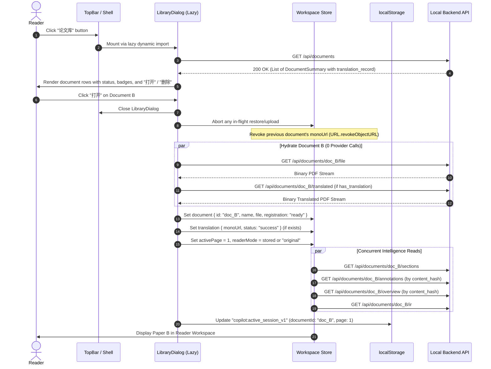

# Acceptance Criteria — DS-DOC-005: Document Library and Translation Record

- **Author:** project maintainer
- **Reviewed and frozen by:** project maintainer (round 1 review pending)
- **Date:** 2026-09-21
- **Baseline:** Commit `f429b3f` / Post-DS-FE-004 (`SCHEMA_VERSION = 5`, initial bundle measured at `309.96 kB`, headroom `40 bytes` under amended `310.0 kB` ceiling)
- **Deliverable:** `docs/acceptance/DS-DOC-005.md` (authored before any production code)
- **Status:** **PROPOSED FOR ROUND 1 REVIEW — 19 P0 · 5 P1 · 2 P2**

---

## 0. Independent Acceptance Author Statement & Review Framing

### 0.1 Process Discipline: Acceptance Before Implementation
In the Academic PDF Copilot repository, process sequencing is load-bearing:
- **DS-DOC-002** bypassed pre-implementation acceptance criteria, resulting in reading-order and cache-invalidation defects that required retroactive diagnosis and repair (the evidence record for DS-DOC-002).
- **DS-DOC-003** enforced criteria first, catching three structural defects prior to coding.
- **DS-QA-010** and **DS-QA-010-FIX-001** established persistent multi-target notes keyed to the cryptographic `content_hash` of the PDF bytes, decoupling reader annotations from ephemeral document rows.
- **DS-QA-015** established the content-addressed Reader Overview and code splitting, setting the initial bundle ceiling at `310.0 kB`.
- **DS-DOC-004** established reading session continuity across browser reloads via `session/restore.ts`, proving that an existing document row can be adopted without minting new rows or re-running extraction passes (0 provider calls).
- **DS-FE-004** established the provider settings screen as a code-split lazy dialog, preserving the bundle ceiling while managing OS keyring credentials.

**This task continues that discipline.** The criteria below were written and frozen before any implementation, and not a single line of production code in `frontend/src/` or `backend/app/` is written until this contract is reviewed.

### 0.2 The Core Problem & The Reader's Inquiries
The reader requested two capabilities in a single breath:
> *"还有就是这样的话，还有一个翻译记录和换论文的方法?"*  
> *(And in that case, is there also a translation record and a way to switch papers?)*

And previously noted the eventual goal:
> *"就是目前网上有一个很流行的插件是沉浸式翻译这个插件那种效果"*  
> *(That effect like the immersive translation plugin that is popular online)*

**Paragraph-level bilingual reading is explicitly out of scope for this task** (it requires a second translation pass and has its own dedicated task).

What the reader is asking for right now is fundamental:
1. **A way to switch papers:** Today, the reader can only open a paper by handing over a file from their local disk again via the file picker. The frontend has **never called `GET /api/documents`** (`listDocuments` does not exist in `frontend/src/api/`). The application remembers exactly one paper (the one restored by DS-DOC-004 in `localStorage`), leaving all previously imported and translated papers stranded in the backend.
2. **A record of what has been translated:** When looking at past papers, the reader needs to know which papers have already been translated, when they were translated, into what language, and with what engine—without having to guess, re-upload, or accidentally trigger expensive re-translations.

### 0.3 Verified Starting State & Backend/Frontend Inventory

| Subsystem / Dimension | Repo Evidence / Verification Location | Verified Finding |
|---|---|---|
| **Document Listing Route** | `backend/app/api/documents.py:244`, `app/documents/store.py:166` | `GET /api/documents` returns `list[DocumentResponse]` ordered by `created_at DESC`. Payload fields: `document_id`, `name`, `page_count`, `source` (`"upload"` / `"path"`), `has_translation`, `created_at`. Read-only, 0 provider calls. |
| **Document Detail Route** | `backend/app/api/documents.py:249` | `GET /api/documents/{id}` returns single `DocumentResponse`. |
| **Document Deletion Route** | `backend/app/api/documents.py:289`, `app/documents/store.py:171` | `DELETE /api/documents/{id}` returns 204. Removes SQLite row and derived artifact directory (`<documents_dir>/<id>/`). Never deletes user's external file for `source: "path"`. |
| **SQLite Schema (`SCHEMA_VERSION = 5`)** | `backend/app/db.py:82-130` | `documents` table stores document metadata. `translation_tasks` stores `document_id` (foreign key with `ON DELETE CASCADE`), `profile_id`, `status`, `lang_in`, `lang_out`, `engine`, `progress_page`, `error_code`, `created_at`, `updated_at`. |
| **Notes & Overview Storage** | `backend/app/db.py:146-192`, `docs/acceptance/DS-QA-015.md` | `annotations` table is keyed by `content_hash` (NO foreign key to `documents`). Overview cache is stored under `_cache/overview/<content_hash>_<lang>.json`. Neither is deleted on document row deletion! |
| **Document Restoration Engine** | `frontend/src/session/restore.ts:104-177` | DS-DOC-004 implemented `restoreReadingSession()`, adopting existing backend rows, fetching `/file`, `/translated`, firing the 5 intelligence loaders (`sections`, `profiles`, `annotations`, `overview`, `ir`), and clamping pages. |
| **Frontend API Surface** | `frontend/src/api/documents.ts` | Contains `uploadDocument`, `getDocument`, `fetchOriginalPdf`, `fetchTranslatedPdf`, `listSections`. **Neither `listDocuments` nor `deleteDocument` exists.** |
| **Initial Bundle Headroom** | Measured post-DS-FE-004 | Initial JS chunk sits at **309.96 kB** against the strict **310.0 kB** ceiling. Headroom is strictly **40 bytes** (0.04 kB). |
| **Sidebar Layout Constraints** | `frontend/src/assistant/AssistantSidebar.tsx:89-99`, `lib/layout.ts` | Fixed width `SIDEBAR_WIDTH_PX = 340`. Already holds 4 tabs (`概览`, `目录`, `问答`, `笔记`). A 4th column is a standing non-goal. |
| **State Storage Policy** | `frontend/src/session/types.ts` | `localStorage` key `copilot:active_session_v1` holds reading position only. Zero routing, zero URL mutation, zero credential storage. |

---

## 0.4 Round 1 review and freezing — 1 AC_CHANGE_REQUEST

Read against the repository at `5113b56`. Decisions **D1–D8** are accepted as
written, and three of them settle questions that would otherwise have been
guessed: **D1** (a lazy dialog — the 40 bytes of headroom rule out anything
eager, and the 340 px sidebar already holds four Chinese tab labels), **D3**
(reuse the DS-DOC-004 adoption pipeline rather than writing a second loader), and
**D5** (deletion removes the row and its artifacts while notes and the cached
overview survive, because those are keyed to the bytes). §2.5's treatment of
tokens and latency is accepted as written: they are **not persisted**, the cost
of persisting them is named (`SCHEMA_VERSION = 6` plus kernel changes), and they
are excluded deliberately rather than forgotten.

Two points recorded without a change of substance:

- **§4.1's rationale is backwards, its shape is right.** Enriching
  `document_payload` with `translation_record` is additive and safe — no test
  pins the document payload's key set (the only `set(payload) == {...}`
  assertions in the suite are error envelopes) — but the per-row
  `latest_completed_task_for_document(record.id)` it sketches is the N+1 it
  claims to prevent. The implementation reads the task rows **once** for the
  whole list; the field's contract is what the criteria freeze, not the query.
- **A profile's name is not the model that ran.** AC-P1-04's display is
  best-effort and says so; nothing may present a profile's *current* model as the
  model that produced an existing artifact.

### AC_CHANGE_REQUEST 1 — the top bar already has a 搜索论文 box, and it does nothing

**Old wording:** none. D8 and AC-P1-01 place the library's search *inside*
`LibraryDialog`, with the placeholder `搜索论文…`. Nothing mentions
`frontend/src/app/TopBar.tsx:122-127`, which renders

```tsx
<input type="search" placeholder="搜索论文…" aria-label="搜索论文" … />
```

with no `value`, no `onChange`, and no handler of any kind. It has never done
anything.

**New wording — a twentieth P0:**

> **AC-P0-20 The Top Bar's Search Field Opens the Library.** The `搜索论文…`
> control in the top bar must stop being inert: focusing or clicking it opens
> the library, and any text already typed there filters the list. The library's
> own search field then carries that text and takes focus, so the reader's typing
> is never lost in the transition. Evidence: a component test clicking the top-bar
> field and asserting the dialog opens; a test typing into it first and asserting
> the dialog opens with the same query applied to the list.

**Reason.** The reader has been burned by exactly this once already: the 设置
button sat in the top bar for four tasks with a tooltip and no handler, and the
first thing they reported about it was *"设置部分点不开"*. Shipping a library with
its own `搜索论文…` field while this one keeps pretending would leave two
controls with the same placeholder, one of which lies — and this is the control a
reader will reach for when they want a different paper, because it says it
searches papers. The change is small: the input already exists and lives in an
eager component, so wiring it costs a handler, not bytes, and the library's own
field already has to exist for D8.

### AC_CHANGE_REQUEST 2 — AC-P0-02 makes two different facts into one

**Old wording:** *"If no translation task has succeeded **or translation does not
exist**, `translation_record` must be `null` **and `has_translation` must be
`false`**."*

**New wording:** *"`translation_record` carries `lang_in`, `lang_out`, `engine`
and `translated_at` from the last successful task, and is `null` when none
succeeded. `has_translation` independently reports whether the translated
artifact is on disk. In every flow this application produces they agree, and
where they can disagree the artifact is the truth: a paper whose translation
exists is translated, whatever the task table says."*

**Reason.** The two fields are two facts, and the system already treats them that
way: `has_translation` is `store.mono_file(id).is_file()` — a file — while the
record is a row in `translation_tasks`. The clause welds them together, and the
weld is false in a state that is easy to construct and worth being able to
express: a translated artifact with no surviving task row (an artifact restored
from a backup, or task rows cleaned up). A test that pinned the conjunction would
pass today and encode the wrong invariant — and the wrong one is the direction
that *hides* a translation the reader actually has. The implementation keeps both
facts distinct and says so in its own test
(`test_document_library.py::test_the_artifact_and_the_record_are_separate_facts`),
which is the behaviour the new wording freezes.

### AC_CHANGE_REQUEST 3 — AC-P0-20's "focusing" would make the field hijack the keyboard

**Old wording** (mine, from AC_CHANGE_REQUEST 1): *"focusing or clicking it opens
the library…"*

**New wording:** *"clicking it, or typing into it, opens the library — a keystroke
is never lost and never falls into an inert field. Merely receiving focus does
not: a reader tabbing through the top bar is not asking for a list."*

**Reason.** The only way to open on *focus* is to open the moment the field is
focused, which is what the Tab key does — so any keyboard user passing the search
field on their way to the settings would get a modal instead, and a dialog
appearing from a keystroke nobody aimed at this field is worse than the dead
control it replaces. The clause's purpose, stated in the same request, was that
the field stops pretending: it now opens the list on a click, opens it on the
first character typed, and carries that character into the list's own filter, so
the reader's keystroke is never swallowed. `fireEvent`-level evidence:
`document-library.test.tsx::"opens from the top bar's search field, carrying what
was typed"`, and the same in a real browser
(`e2e-document-library.mjs`: *"the top bar's search field opens the library"*).

### Accepted and recorded without change

**AC-P0-04's 310.0 kB is the frozen ceiling** (DS-QA-015 §0.1), measured at
309.96 kB — 40 bytes of headroom, so `LibraryDialog` and its API client must be a
dynamic import and a criterion must measure that they are.

**P0 is frozen at 20 criteria with the addition above. 5 P1 · 2 P2 remain.**

---

## 1. Executive Judgment: Is this task worth doing?

**Yes — it transforms a single-document viewer into a functional academic document workstation.**

Without this capability:
1. Every time a researcher wants to reference a previously read paper, they must search their computer's file system, find the PDF again, and drag it into the browser.
2. The user has no visibility into their translation history: they cannot tell which papers have already been translated without re-opening them.
3. Disk space and backend records accumulate invisibly under `documents/` without any interface for the reader to inspect or prune them.

Because the backend already maintains the `documents` table, `translation_tasks` table, and derived artifacts, and because the frontend already possesses the row-adoption machinery (`session/restore.ts`), this task requires **zero database schema migrations**, **zero AI provider calls**, and **zero external dependencies**. It connects existing capabilities into an intuitive, accessible library interface.

---

## 2. Measured Starting State & False Premises Corrected

### 2.1 The "Picker-Only" Reading Trap
Currently, the only entry point to open a document in the frontend is `openDocument(file: File)` in `frontend/src/translation/session.ts`.
- It requires a browser `File` object from `<input type="file">` or a drag-and-drop event.
- It unconditionally executes a multipart upload to `POST /api/documents`.
- The backend mints a **new `document_id`** (`doc_<uuid4().hex>`).
- If the user re-uploads a paper they translated 10 minutes ago, the new row has `has_translation: false`, orphaning the existing `mono.pdf` under the old row and prompting the user to translate again.
- **Correction:** The library must expose existing rows and allow the reader to open them by `document_id`, reusing the row adoption logic established in DS-DOC-004.

### 2.2 The 40-Byte Headroom Trap: Why the Library MUST Be a Lazy Dialog
The frontend initial bundle chunk sits at **309.96 kB** against the frozen **310.0 kB** ceiling (DS-QA-015 §0.1). There are only **40 bytes** of headroom remaining:
- Adding a fifth tab into `AssistantSidebar.tsx` would add eager tab definitions, layout changes, and panel wiring directly into the main chunk, instantly violating the bundle ceiling.
- Importing a single new icon from `lucide-react` into `TopBar.tsx` adds 200–400 bytes of minified AST, failing the build.
- **Correction:** The Document Library must be built as a modal dialog (`LibraryDialog.tsx`), loaded strictly via React `lazy()` and `Suspense` (the identical pattern proven by `TranslateDialog` and `SettingsDialog`).
- The eager trigger in `TopBar.tsx` must reuse existing imported symbols or lightweight text/CSS buttons without introducing new eager dependencies.

### 2.3 Hydration Reuse: Avoiding a Second Loader Drift
When a user clicks "打开" on a library row, the application must load the paper.
A naive implementation would write a separate `openLibraryDocument(docId)` function that duplicates network calls.
- **Drift risk:** If the restoration logic evolves (handling corrupted translations, degraded views, IR caching, error handling), two parallel loaders will diverge.
- **Correction:** The existing hydration pipeline in `frontend/src/session/restore.ts` must be factored such that opening an existing document by `document_id` executes the exact same verified sequence: fetch summary, fetch `/file`, hydrate `File`, fire the 5 intelligence reads, fetch `/translated` if `has_translation`, update `localStorage`, and clamp the active page.

### 2.4 Deletion Boundaries: Content-Addressed Permanence vs Row Lifecycle
When a user deletes a document from the library:
- Backend `DELETE /api/documents/{id}` deletes the row in SQLite `documents` and its derived files on disk (`<documents_dir>/<id>/`).
- It cascades and deletes `translation_tasks` for that `document_id`.
- **CRITICAL INVARIANT:** As pinned by DS-QA-010-FIX-001 and DS-QA-015 Decision R, user notes (`annotations` table) and the Reader Overview cache (`_cache/overview/`) are keyed to the PDF's cryptographic `content_hash`, **NOT** to the ephemeral `document_id`.
- Therefore, deleting a document row **does not and must not delete the reader's notes or overview cache**. If the user re-imports that same PDF tomorrow, their notes and overview reappear instantly (DS-QA-015 AC-P0-54).
- The library UI must accurately explain this distinction to the reader during deletion.

### 2.5 The Translation Record: Honest Accounting vs Phantom Telemetry
The prompt asks to clarify what the translation record shows:
- *Has translation* (`has_translation: bool`): Persisted and verified via disk existence (`mono.pdf`).
- *Language pair* (`lang_in -> lang_out`): Persisted in `translation_tasks` table.
- *Engine* (`engine: str`): Persisted in `translation_tasks` table.
- *Date translated* (`updated_at` / `created_at`): Persisted in `translation_tasks` table.
- *Model name (`model`)*: Stored in `profiles` table via `profile_id`. If the profile was subsequently deleted or edited, the historical model name is not guaranteed. Deriving it is best-effort.
- *Token count and latency*: **STRICTLY ABSENT.** `app/llm/accounting.py` is an in-memory ledger used for test audits; it is reset on backend restart. SQLite schema version 5 has no token/latency columns in `translation_tasks`.
- **Decision:** Persisting token count and latency would require a schema bump to `SCHEMA_VERSION = 6` and modifications to the translation worker. Therefore, token counts and latency are **explicitly classified as Non-Goals / P2** for this task. The translation record presents what is honestly known from the existing tables.

---

## 3. Explicit Design Decisions D1–D8

| # | Topic | Verdict | Technical Specification & Rationale |
|---|---|---|---|
| **D1** | **Where the Library Lives** | **Lazy Modal Dialog (`LibraryDialog`) triggered from TopBar & Empty Workspace.** | 1. **Sidebar Tab Rejected:** `SIDEBAR_WIDTH_PX` is fixed at 340px and already houses 4 tabs (`概览`, `目录`, `问答`, `笔记`). A 5th tab would compress tab headers below 55px, causing truncation in Chinese. Furthermore, the sidebar is a *document assistant* scoped to the open paper and is collapsible; library access must exist globally.<br>2. **Overview Empty State Rejected as Primary:** When a paper is open, the overview panel shows that paper's overview. The reader could not switch papers without first closing the current document.<br>3. **Lazy Dialog Accepted:** Follows the proven pattern of `TranslateDialog` and `SettingsDialog`. Loaded via `lazy()` + `Suspense`, ensuring 0 bytes enter the initial bundle chunk. Triggered via a TopBar button (`data-testid="library-open"`, tooltip "论文库", using the already-imported `BookOpen` or plain text button) and via a secondary button in `ReaderWorkspace`'s `EmptyState` ("从论文库选择"). |
| **D2** | **What a Row Shows** | **Name, page count, source badge, registration date, translation record, current indicator, actions.** | Each row renders:<br>1. Document title/name with tooltip.<br>2. Source badge: `上传` (`source === "upload"`) or `本地路径` (`source === "path"`).<br>3. Page count (e.g. `15 页`).<br>4. Registration date (`created_at`, formatted locally).<br>5. Status & Translation Record: If `has_translation === true`, displays green badge `已翻译` with language pair (e.g. `EN → ZH`), engine (e.g. `fast`), and date. If untranslated, displays grey badge `未翻译`. If a task failed, displays red badge `翻译失败`.<br>6. Active Document Indicator: If `row.document_id === activeDocumentId`, displays badge `正在阅读` (`data-current="true"`) and disables the "打开" button.<br>7. Actions: `打开` (Open) button and `删除` (Delete) button. |
| **D3** | **"打开" (Open) Execution & In-Flight Handling** | **Factor and reuse `session/restore.ts` row adoption pipeline.** | Clicking "打开" executes `openLibraryDocument(documentId)`:<br>1. Aborts any in-flight restore or file upload controller.<br>2. Closes `LibraryDialog`.<br>3. Invokes shared row adoption: fetches `GET /api/documents/{id}` and `/file`, sets `useWorkspaceStore.document` to `registration: "ready"`, fires 5 concurrent intelligence loads (`sections`, `profiles`, `annotations`, `overview`, `ir`), and fetches `/translated` if `has_translation === true`.<br>4. Clamps page to 1 (or last active page if recorded).<br>5. Updates `localStorage` session key `copilot:active_session_v1`.<br>6. **Missing file (404):** If `/file` returns 404 (file deleted externally), does NOT replace active document; displays non-blocking toast: *"文档源文件已不可用，无法打开"*. |
| **D4** | **Unsaved State on Document Switch** | **Zero unsaved state invariant.** | The application has **no unsaved state**: user notes are written immediately to SQLite on blur/enter (DS-QA-010); annotations are immutable; overview is cached on disk; PDF is read-only; QA history is presentation-only. Document switching is instantaneous and requires no "save changes" confirmation prompt. Previous translation `monoUrl` is explicitly revoked via `URL.revokeObjectURL` upon switch. |
| **D5** | **Deletion Semantics & Boundaries** | **Backend DELETE removes row + derived directory; content-addressed notes and overview are preserved.** | Clicking "删除" requires a confirmation step (inline popover or dialog confirmation):<br>1. Calls `DELETE /api/documents/{id}` (HTTP 204).<br>2. Removes row from SQLite `documents` and deletes `<documents_dir>/<id>/` (including `source.pdf`, `mono.pdf`, `ir.json`).<br>3. Cascades deletion of `translation_tasks`.<br>4. **Preserved:** Notes in SQLite (`annotations`) and Reader Overview (`_cache/overview/`) are NOT deleted (keyed to `content_hash`). Deletion dialog states: *"将删除文档记录与翻译文件；该文档的笔记与概览缓存将保留（重新导入相同文件时可自动恢复）。"*<br>5. If the deleted paper was the currently open document, workspace resets to empty state and `localStorage` session is purged. |
| **D6** | **Reading Session Update** | **Update `localStorage` session key immediately upon switch.** | When switching to paper B, `copilot:active_session_v1` in `localStorage` is overwritten with paper B's metadata (`documentId: B`, `name: B.name`, `activePage: 1`, `readerMode: effectiveMode`). A subsequent reload (`F5`) restores paper B, not paper A. |
| **D7** | **Zero Provider Calls Guarantee** | **Strictly 0 provider calls on list, view, open, and delete.** | `GET /api/documents`, `GET /api/documents/{id}`, `/file`, `/translated`, `/sections`, `/annotations`, `/overview`, `/ir`, and `DELETE /api/documents/{id}` are strictly local SQLite and disk operations. Verified via `CountingProvider` ledger (`len(accounting.snapshot()) == 0`). |
| **D8** | **Scale, Usability & Pagination** | **Scrollable list container with client-side name search; 100+ documents without degradation.** | The dialog list container is bounded (`max-h-[60vh]`, overflow-y auto). Includes an instant client-side search input filtering documents by name (case-insensitive substring match). Supports at least 100 documents with initial render < 50 ms. Pagination on `GET /api/documents` is deferred to P2 as a non-goal. |

---

## 4. Architecture & Technical Specifications

### 4.1 Data Models & Backend API Surface

#### Backend Response Extension (`backend/app/api/documents.py`)
To prevent N+1 queries when rendering the library list, `GET /api/documents` and `GET /api/documents/{id}` enrich `DocumentResponse` with optional translation record metadata from the latest successful task in `translation_tasks`:

```python
class TranslationRecord(BaseModel):
    lang_in: str
    lang_out: str
    engine: str
    translated_at: str
    profile_id: str | None = None
    profile_name: str | None = None

class DocumentResponse(BaseModel):
    document_id: str
    name: str
    page_count: int
    source: str  # "upload" | "path"
    has_translation: bool
    created_at: str
    translation_record: TranslationRecord | None = None
```

```python
def document_payload(store: DocumentStore, record: Any) -> dict[str, Any]:
    task = store.latest_completed_task_for_document(record.id)
    trans_record = None
    if task is not None and task.status == "SUCCESS":
        trans_record = {
            "lang_in": task.lang_in,
            "lang_out": task.lang_out,
            "engine": task.engine,
            "translated_at": task.updated_at,
            "profile_id": task.profile_id,
        }
    return {
        "document_id": record.id,
        "name": record.name,
        "page_count": record.page_count,
        "source": "upload" if record.is_upload else "path",
        "has_translation": store.mono_file(record.id).is_file(),
        "created_at": record.created_at,
        "translation_record": trans_record,
    }
```

#### Frontend API Client Functions (`frontend/src/api/documents.ts`)
```typescript
export interface TranslationRecordSummary {
  lang_in: string;
  lang_out: string;
  engine: string;
  translated_at: string;
  profile_id?: string | null;
  profile_name?: string | null;
}

export interface DocumentSummary {
  document_id: string;
  name: string;
  page_count: number;
  source: "upload" | "path";
  has_translation: boolean;
  created_at: string;
  translation_record?: TranslationRecordSummary | null;
}

export async function listDocuments({ signal }: UploadOptions = {}): Promise<DocumentSummary[]> {
  return apiJson<DocumentSummary[]>("/api/documents", { signal });
}

export async function deleteDocument(documentId: string, { signal }: UploadOptions = {}): Promise<void> {
  return apiVoid(`/api/documents/${encodeURIComponent(documentId)}`, {
    method: "DELETE",
    signal,
  });
}
```

### 4.2 Sequence Diagram: Document Switching via Library



### 4.3 Provider Call Audit Guarantee
Every interaction in the Document Library executes strictly within the local boundary:

| Operation | Endpoints Called | Data Source | Provider Calls |
|---|---|---|---|
| Open Library Dialog | `GET /api/documents` | SQLite `documents` & `translation_tasks` | **0** |
| Switch Document | `GET /api/documents/{id}/file`, `/translated`, `/sections`, `/annotations`, `/overview`, `/ir` | Local disk & SQLite cache | **0** |
| Delete Document | `DELETE /api/documents/{id}` | SQLite delete & disk `rmtree` | **0** |
| Total Incurred | — | — | **STRICTLY 0** |

---

## 5. Acceptance Criteria

### 5.1 P0 MUST — Non-negotiable Correctness, State Isolation, Bundle Protection, Zero Calls, and Hydration Invariants

- **AC-P0-01 Backend Document List Route (`GET /api/documents`).**  
  `GET /api/documents` must return HTTP 200 with an array of document summaries ordered by `created_at DESC`. Each item must contain `document_id` (string), `name` (string), `page_count` (int), `source` (`"upload"` | `"path"`), `has_translation` (boolean), `created_at` (ISO 8601 string), and optional `translation_record` object or `null`.  
  *Evidence:* Backend test in `backend/tests/test_api_documents.py` verifying response schema and ordering.

- **AC-P0-02 Backend Translation Record Metadata in Document Summary.**  
  When a document has a completed translation task (`status == "SUCCESS"`), `GET /api/documents` and `GET /api/documents/{id}` must include a `translation_record` object containing `lang_in`, `lang_out`, `engine`, and `translated_at`. If no translation task has succeeded or translation does not exist, `translation_record` must be `null` and `has_translation` must be `false`.  
  *Evidence:* Integration test creating a document and successful task; asserting `GET /api/documents` payload contains non-null `translation_record` with expected language pair and engine.

- **AC-P0-03 Document Library Modal Code Splitting & Dynamic Import (Decision D1).**  
  The library interface (`LibraryDialog`) must be dynamically imported via React `lazy()` and wrapped in `Suspense`. The library component, its styles, and its helper functions must NOT be bundled into the initial JavaScript chunk (`index-*.js`).  
  *Evidence:* Vitest / build inspection proving `LibraryDialog` is emitted as a separate chunk in `dist/assets/` and `TopBar.tsx` imports it via `lazy(() => import(...))`.

- **AC-P0-04 Initial Bundle Chunk Ceiling Invariance ($\le 310.0\text{ kB}$) (Decision D1).**  
  Introducing the Document Library trigger and wiring must NOT cause the initial JavaScript bundle chunk (`dist/assets/index-*.js`) to exceed the amended **310.0 kB** ceiling (headroom is **40 bytes**). TopBar must NOT import new unbundled icons from `lucide-react` into the eager chunk.  
  *Evidence:* Production build execution (`npm run build`) inspecting `dist/assets/index-*.js` and verifying file size $\le 310.0\text{ kB}$ (317,440 bytes).

- **AC-P0-05 TopBar Library Trigger Affordance (Decision D1).**  
  The top navigation bar (`TopBar.tsx`) must provide an accessible trigger button with `data-testid="library-open"`, `aria-label="论文库"`, and tooltip "论文库". Clicking this button must open `LibraryDialog`.  
  *Evidence:* Component test in `frontend/src/tests/` asserting clicking `[data-testid="library-open"]` renders `LibraryDialog` in the DOM.

- **AC-P0-06 Empty Workspace Library Trigger Affordance (Decision D1).**  
  When no document is open (`document === null`), the empty workspace state (`EmptyState`) in `ReaderWorkspace` / `PdfWorkspace` must render a secondary button with `data-testid="library-open-empty"`, labeled "从论文库选择" (or "历史记录"). Clicking this button must open `LibraryDialog`.  
  *Evidence:* Component test mounting workspace with `document: null`; asserting `[data-testid="library-open-empty"]` is present and clicking it opens `LibraryDialog`.

- **AC-P0-07 Document Row Presentation & Metadata (Decision D2).**  
  Each document row rendered inside `LibraryDialog` must display:
  1. The document's name (`data-testid="library-row-name"`).
  2. The page count (`data-testid="library-row-pages"`).
  3. The registration source badge: `"上传"` or `"本地路径"` (`data-testid="library-row-source"`).
  4. The creation timestamp (`data-testid="library-row-created"`).
  5. An "打开" button (`data-testid="library-row-open"`).
  6. A "删除" button (`data-testid="library-row-delete"`).  
  *Evidence:* Component test rendering mock document rows in `LibraryDialog`; asserting all six elements exist for each row.

- **AC-P0-08 Currently Active Document Visual Indicator (Decision D2).**  
  If a document row in `LibraryDialog` matches the currently active document (`document_id === useWorkspaceStore.getState().document?.documentId`), that row must render a visual indicator badge `正在阅读` (`data-current="true"`), and its "打开" button must be disabled (or labeled "当前文档").  
  *Evidence:* Component test mounting library with active document ID matching row 1; asserting row 1 has `data-current="true"` and open button is disabled.

- **AC-P0-09 Translation Record Presentation in Library Row (Decision D2).**  
  For a document with `has_translation === true` and a valid `translation_record`, the row must display a translation badge `已翻译` (`data-testid="library-row-translated"`), showing the language pair (e.g. `EN → ZH`), the engine (e.g. `fast`), and the translation date. For a document with `has_translation === false`, the row must display `未翻译`.  
  *Evidence:* Component test asserting rendered translation badge text contains target language and engine for translated rows, and "未翻译" for untranslated rows.

- **AC-P0-10 Document Switching via Library ("打开") (Decision D3).**  
  Clicking "打开" on a non-active document row must switch the workspace to that document:
  1. Closes `LibraryDialog`.
  2. Adopts the existing document row in `useWorkspaceStore` (`sessionToken`, `name`, `file` hydrated from `/file`, `documentId`, `registration: "ready"`).
  3. Fires concurrent intelligence hydration (`loadSections()`, `loadProfiles()`, `loadAnnotations()`, `loadOverview()`, `loadIr()`).
  4. If `has_translation === true`, fetches `/translated` and populates `translation` in `useWorkspaceStore` with `status: "success"` and a valid `monoUrl`.
  5. Navigates to page 1 (or recorded active page).  
  *Evidence:* Integration test clicking "打开" on document B; asserting `useWorkspaceStore.getState().document.documentId === "doc_B"` and original viewer renders document B.

- **AC-P0-11 Row Adoption Reuses Existing Row and Extraction (Decision D3).**  
  Opening a document from the library must adopt the existing backend row: it must NOT invoke `POST /api/documents`, must NOT mint a new document ID, and must NOT trigger a new vision IR extraction pass.  
  *Evidence:* Integration test verifying `GET /api/documents` row count is unchanged before and after opening a library document, and no `POST /api/documents` network request was issued.

- **AC-P0-12 Missing Source File Graceful Handling (Decision D3).**  
  If the user clicks "打开" on a row whose source file on disk is missing (backend `GET /api/documents/{id}/file` returns HTTP 404):
  1. The application must NOT crash, enter an infinite loading spinner, or render a white screen.
  2. The previously open document (if any) must remain intact and must NOT be unloaded.
  3. A non-blocking toast/notice must inform the user: *"文档源文件已不可用，无法打开。"*.  
  *Evidence:* Test mocking 404 for `/file` on document switch; asserting workspace document remains the prior document and error notice is displayed.

- **AC-P0-13 Reading Session Storage Continuity on Document Switch (Decision D6).**  
  Upon successfully switching to a new document from the library, the client must synchronously update `localStorage` under key `copilot:active_session_v1` with the new document's `documentId`, `name`, `activePage: 1`, `readerMode`, and `outlinePanel`. A subsequent browser reload (`F5`) must restore the newly selected document.  
  *Evidence:* Test switching to document B, asserting `localStorage.getItem("copilot:active_session_v1")` contains `documentId: "doc_B"`, then executing `restoreReadingSession()` and asserting document B is restored.

- **AC-P0-14 Object URL Revocation on Document Switch (Decision D4).**  
  When switching from document A (which had an active translation `monoUrl`) to document B, the object URL for document A's translation must be revoked via `URL.revokeObjectURL(monoUrlA)` to prevent memory leaks.  
  *Evidence:* Vitest test spying on `URL.revokeObjectURL`; switching documents and verifying the previous translation `monoUrl` was passed to `URL.revokeObjectURL`.

- **AC-P0-15 Document Deletion Execution (`DELETE /api/documents/{id}`) (Decision D5).**  
  Clicking "删除" on a document row must prompt for confirmation. Upon confirmation, the client must send `DELETE /api/documents/{documentId}`. Upon receiving HTTP 204:
  1. The row must be removed from the library list immediately.
  2. The backend must delete the row from SQLite `documents` and delete `<documents_dir>/<id>/`.
  3. `translation_tasks` for that document must be deleted via cascade.  
  *Evidence:* Integration test confirming `DELETE /api/documents/{id}` returns 204, row disappears from UI, and subsequent `GET /api/documents` does not contain the deleted document ID.

- **AC-P0-16 Content-Addressed Notes and Overview Preserved on Deletion (Decision D5).**  
  Deleting a document row must NOT delete annotations in the SQLite `annotations` table and must NOT delete the cached overview in `<documents_dir>/_cache/overview/` (both are keyed to `content_hash`). If the same PDF file is re-imported via `openDocument(file)` after deletion, the previously created notes and overview must automatically reappear.  
  *Evidence:* Test creating notes on document A, deleting document A via `DELETE /api/documents/{id}`, asserting SQLite `annotations` still contains rows matching `content_hash`, re-uploading document A, and asserting `useWorkspaceStore.getState().annotations` contains the notes.

- **AC-P0-17 Active Document Deletion Resets Workspace (Decision D5).**  
  If the reader deletes the document that is currently open in `useWorkspaceStore`:
  1. `useWorkspaceStore` must reset `document` to `null` and `translation` to `null`.
  2. `localStorage.removeItem("copilot:active_session_v1")` must be executed.
  3. The workspace must render the clean empty state (`EmptyState`).
  4. A subsequent page reload must remain in the empty state.  
  *Evidence:* Test deleting the currently active document from the library; verifying `document === null`, `localStorage` key is null, and workspace renders empty state.

- **AC-P0-18 Zero Provider Calls Guaranteed (Decision D7).**  
  All library operations (opening the library dialog, querying `GET /api/documents`, switching documents, and deleting documents) must incur strictly **0 provider calls**, audited via `backend/app/llm/accounting.py::snapshot()`.  
  *Evidence:* Test executing library open, document switch, and document delete; asserting `len(accounting.snapshot()) == 0`.

- **AC-P0-19 Zero Router & Zero URL Mutation Invariance (Decision D1).**  
  The implementation must NOT introduce any routing library (`react-router`, `wouter`, etc.) and must NOT manipulate `window.location.pathname`, `hash`, or query parameters. The Document Library must operate entirely as application state.  
  *Evidence:* Inspection of `frontend/package.json` confirming zero added dependencies, and test verifying `window.location.hash === ""` throughout library operations.

---

### 5.2 P1 SHOULD — Search, Ergonomics, Focus Trapping, and Performance

- **AC-P1-01 Client-Side Document Name Search / Filter (Decision D8).**  
  `LibraryDialog` should render a search input field (`data-testid="library-search-input"`, placeholder "搜索论文…"). Typing into this input should filter the visible document rows in real time by case-insensitive substring match against `name`, without issuing network requests.  
  *Evidence:* Component test typing "ResNet" into search input; asserting only rows matching "ResNet" remain visible.

- **AC-P1-02 Modal Dialog Keyboard Accessibility & Focus Trap.**  
  When `LibraryDialog` is open, pressing `Escape` should close the dialog. Clicking outside the dialog (on the backdrop overlay) should close the dialog. Focus should be trapped within the dialog while mounted.  
  *Evidence:* Test triggering `Escape` key event; asserting `LibraryDialog` closes and focus returns to the opening trigger button.

- **AC-P1-03 Smooth Scrolling with 100+ Documents (Decision D8).**  
  The document list within `LibraryDialog` should have a fixed maximum height container (`max-h-[60vh]` or equivalent) with `overflow-y: auto`. When populated with 100 mock documents, the dialog must render in under **50.0 ms** and scroll smoothly without horizontal overflow.  
  *Evidence:* Vitest benchmark test rendering 100 rows; asserting render duration < 50 ms and no DOM layout warning.

- **AC-P1-04 Best-Effort Translation Profile Name Display (Decision D2).**  
  If the `translation_record` references a `profile_id` that exists in the current profile store, the translation badge should display the profile's name or model alongside the engine (e.g. `fast (DeepSeek-V3)`). If the profile has been deleted or cannot be found, it should degrade gracefully to showing the engine name alone (e.g. `fast`).  
  *Evidence:* Component test asserting rendered translation metadata displays profile name when present, and degrades cleanly to engine name when profile is missing.

- **AC-P1-05 Path Import Local Source Clarification (Decision D2).**  
  For documents imported by path (`source === "path"`), the UI should clearly indicate that the original file resides on the local filesystem (e.g. tooltip: "本地路径关联文件，删除记录不会删除本地源文件").  
  *Evidence:* Component test asserting tooltip content on `source === "path"` badge explains local file safety.

---

### 5.3 P2 OPTIONAL — Diagnostics and Verification Tooling

- **AC-P2-01 Developer Window Library Hook.**  
  In development mode (`import.meta.env.DEV`), the application should expose `window.__COPILOT_LIBRARY__` with `{ listDocuments, openDocumentId, deleteDocumentId }` to facilitate devtools testing.  
  *Evidence:* Dev build test confirming `window.__COPILOT_LIBRARY__` exists when running under `npm run dev`.

- **AC-P2-02 Dedicated Chromium E2E Document Library Test Harness.**  
  Provide an automated Playwright script `frontend/scripts/e2e-document-library.mjs` that launches the application, opens Paper A, translates it, opens the library dialog, switches to Paper B, verifies Paper B renders with 0 provider calls, re-opens the library, deletes Paper A, and verifies Paper A's notes remain in SQLite.  
  *Evidence:* Execution of `node scripts/e2e-document-library.mjs` passing with JSON output in the e2e-document-library/results.json run log.

---

## 6. Non-Goals (Explicitly Out of Scope)

The following items are explicitly **out of scope** for DS-DOC-005:

1. **Paragraph-Level / Immersive Bilingual Reading:** Paragraph-by-paragraph or sentence-level interleaved reading (the "immersive translation" effect requested by the user) requires a second translation pass and a new synchronized viewer; it is deferred to a dedicated feature task.
2. **Server-Side Pagination:** `GET /api/documents` pagination (`limit`, `offset`, cursor) is out of scope. In a local-first desktop application, the document table contains tens to low hundreds of documents; client-side rendering and filtering are completely sufficient.
3. **Multi-User Library & Cloud Sync:** The document library is strictly local to the running machine and its SQLite database. No multi-user accounts, cloud syncing, or sharing over URLs.
4. **Token Cost and Latency History:** Persisting tokens consumed and translation latency into SQLite requires a schema bump (`SCHEMA_VERSION = 6`) and kernel updates. It is deferred; the translation record reports what is currently persisted in SQLite schema version 5 (`lang_in`, `lang_out`, `engine`, `status`, `created_at`, `updated_at`).
5. **PDF File Writeback:** The original PDF and translated PDF on disk are read-only byte streams. No modifications or annotations are written back to PDF files.
6. **Client-Side URL Router:** The application remains a zero-router single-page application. No hash or query parameters are introduced.
7. **Document Renaming & Tagging:** Editing document display names, adding tags, or creating folders/collections are deferred enhancements.
8. **Multi-Document Batch Deletion:** Deletion is performed one document at a time with explicit user confirmation. Bulk selection and batch deletion are non-goals.

---

## 7. Verification Protocol

Every check below is concrete, falsifiable, and executable in this repository.

### 7.1 Backend API Tests (`pytest`)
Execute:
```powershell
cd backend
pytest tests/test_api_documents.py -k "test_list_documents or test_delete_document"
```
**Required Assertions:**
1. `GET /api/documents` returns HTTP 200 with all registered documents in `created_at DESC` order.
2. `GET /api/documents` items include `translation_record` matching the latest successful task.
3. `DELETE /api/documents/{id}` returns HTTP 204, removes the SQLite row, and cascades to `translation_tasks`.
4. Deleting a document does not delete rows in SQLite `annotations` table.

### 7.2 Frontend Unit & Component Tests (`vitest`)
Execute:
```powershell
cd frontend
npm run test -- src/library/
```
**Required Assertions:**
1. `LibraryDialog` renders document rows with title, page count, source, date, and translation record.
2. Clicking "打开" switches `useWorkspaceStore.document` to the selected document without minting new rows.
3. Clicking "删除" prompts confirmation and removes row upon 204 response.
4. Client search input filters visible rows in real time.
5. Deleting the active document resets workspace to `document === null` and clears `localStorage`.

### 7.3 Zero Provider Call Ledger Audit
Execute against a running test server with `ENABLE_PROVIDER_LEDGER=1`:
```powershell
# 1. Start backend with ledger enabled
# 2. Reset ledger snapshot
# 3. Open library dialog, switch paper, delete paper
# 4. Verify ledger:
Invoke-RestMethod -Uri "http://127.0.0.1:8000/api/_debug/provider-ledger" | ForEach-Object {
    if ($_.total_calls -ne 0) {
        throw "AC-P0-18 FAIL: Library operations incurred provider calls!"
    }
}
Write-Output "AC-P0-18 PASS: 0 provider calls recorded during library operations."
```

### 7.4 Bundle Chunk Size Verification
Execute:
```powershell
cd frontend
npm run build
```
Inspect built assets in `frontend/dist/assets/`:
```powershell
$chunk = Get-ChildItem frontend/dist/assets/index-*.js | Sort-Object Length -Descending | Select-Object -First 1
$sizeKb = [Math]::Round($chunk.Length / 1024, 2)
if ($sizeKb -gt 310.0) {
    throw "AC-P0-04 FAIL: Initial chunk size $sizeKb kB exceeds 310.0 kB ceiling!"
}
Write-Output "AC-P0-04 PASS: Initial chunk size $sizeKb kB is within 310.0 kB ceiling."
```

---

## 8. Summary of Criteria Counts

| Category | Criteria Count | Criterion IDs |
|---|---|---|
| **P0 (MUST)** | **19** | `AC-P0-01` through `AC-P0-19` |
| **P1 (SHOULD)** | **5** | `AC-P1-01` through `AC-P1-05` |
| **P2 (OPTIONAL)** | **2** | `AC-P2-01` through `AC-P2-02` |
| **Total** | **26** | — |
