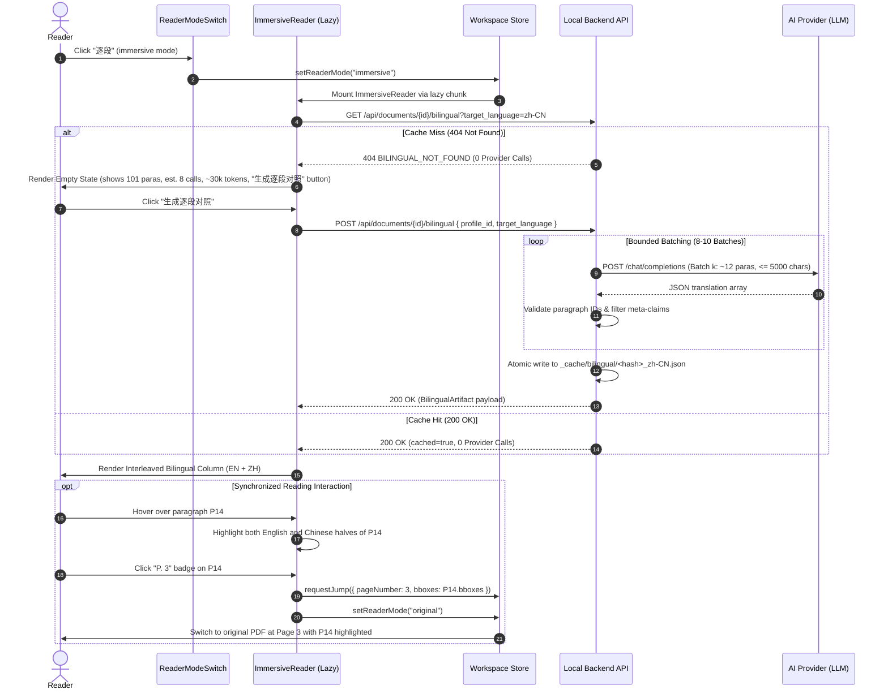

# Acceptance Criteria — DS-DOC-006: Paragraph-Aligned Bilingual Reading

- **Author:** independent acceptance criteria author
- **Reviewed and frozen by:** project maintainer (round 1 review pending)
- **Date:** 2026-09-23
- **Baseline:** Commit `5113b56` / Post-DS-DOC-005 (`SCHEMA_VERSION = 5`, `IR_PIPELINE_VERSION = "5"`, initial chunk measured at `309.36 kB`, headroom `0.64 kB` under amended `310.0 kB` ceiling)
- **Deliverable:** `docs/acceptance/DS-DOC-006.md` (authored before any production code)
- **Status:** **PROPOSED FOR ROUND 1 REVIEW — 22 P0 · 6 P1 · 2 P2**

---

## 0. Independent Acceptance Author Statement & Review Framing

### 0.1 Process Discipline: Acceptance Before Implementation
In the Academic PDF Copilot repository, process sequencing is load-bearing:
- **DS-DOC-002** bypassed pre-implementation acceptance criteria, resulting in reading-order and cache-invalidation defects that required retroactive diagnosis and repair.
- **DS-DOC-003** enforced criteria first, catching three structural defects prior to coding.
- **DS-QA-010** and **DS-QA-010-FIX-001** established persistent multi-target notes keyed to the cryptographic `content_hash` of the PDF bytes, decoupling reader annotations from ephemeral document rows.
- **DS-QA-015** established the content-addressed Reader Overview and dynamic code splitting, setting the initial bundle ceiling at `310.0 kB`.
- **DS-DOC-004** established reading session continuity across browser reloads via `session/restore.ts`, proving that an existing document row can be adopted without minting new rows or re-running extraction passes (0 provider calls).
- **DS-FE-004** established the provider settings screen as a code-split lazy dialog, preserving the bundle ceiling while managing OS keyring credentials.
- **DS-DOC-005** established the document library and translation record as a lazy modal dialog with zero new dependencies and zero provider calls.

**This task continues that discipline.** The criteria below were written and frozen before any implementation, and not a single line of production code in `frontend/src/` or `backend/app/` may be written until this contract is reviewed and frozen.

### 0.2 The Core Problem & The Reader's Inquiry
The reader requested the bilingual reading effect popularized by the browser extension *沉浸式翻译* (Immersive Translate), in their own words:

> *"我原本是想要先英文一段，接下来是中文一段类似于沉浸式学习这种的"*  
> *"就是目前网上有一个很流行的插件是沉浸式翻译这个插件那种效果"*

The intended experience is unambiguous: the original text stays in place, its translation is inserted directly beneath each paragraph, and both languages are read in a single continuous column.

### 0.3 The PDF vs. HTML Reality: Why the Extension's Trick Cannot Work Here
The browser extension *沉浸式翻译* operates on **HTML DOM**:
1. In HTML, the document is a live tree of block-level elements (`<p>`, `<div>`, `<li>`).
2. The extension queries paragraphs directly, calls an API, and inserts sibling elements (`<p class="immersive-translate-target">`) directly below them. No layout analysis or alignment is required because the web page's reflow engine handles formatting automatically.

**In this application, the source document is a PDF.**
The only translated artifact that exists today is `mono.pdf` — a *fixed layout* rendering produced by the backend's PDF kernel (`pdfkernel/`), where translated text has been fitted into geometric bounding boxes on a page-by-page basis.
Attempting to extract text from `mono.pdf` and map it back to the original paragraphs would fail catastrophically:
- Multi-column paragraphs crossing page or column boundaries are fragmented into discontinuous text boxes.
- Paragraphs in `mono.pdf` are reflowed, wrapped, hyphenated, and occasionally merged or truncated by layout constraints.
- Any heuristic alignment between extracted `mono.pdf` blocks and source `ParagraphIR` units produces false alignments that appear plausible at a glance but quietly pair the wrong sentences together — exactly the failure mode this repository's evidence contract exists to refuse.

**Therefore, the bilingual column must be powered by an independent, validated, paragraph-level translation pass**, operating directly on the canonical `ParagraphIR` and cached under `content_hash` — mirroring the architecture established for the Reader Overview in DS-QA-015.

### 0.4 Verified Starting State & Subsystem Inventory

| Subsystem / Dimension | Repo Evidence / Verification Location | Verified Finding |
|---|---|---|
| **Document IR Prose Model** | `backend/app/document/models.py:173-203` | `ParagraphIR` carries verbatim text, `page_number` (1-based), `page_range`, `block_ids`, `bboxes`, `is_abstract`, and immutable `source_anchor_id`. Nothing needs to be re-extracted. |
| **Document Structure Model** | `backend/app/document/models.py:144-171` | `SectionIR` carries `title`, `level` (1-based hierarchy or None), `page_range`, `is_references`, and `heading_block_id`. |
| **Non-Prose Layout Classes** | `backend/app/document/models.py:51-62` | `NON_PROSE_CLASSES` (`abandon`, `figure`, `figure_caption`, `table`, `table_caption`, `isolate_formula`, etc.) are already isolated and never merged into `ParagraphIR`. |
| **ResNet Baseline Scale** | `.agent/results/nonprose/resnet.ir.json` | 12 pages, 101 paragraphs, 46,958 characters (~402 chars/para median). A standard full-length conference paper. |
| **Cache Architecture Precedent** | `backend/app/overview/cache.py:18-38` | Overview stores artifacts at `<documents_dir>/_cache/overview/<content_hash>_<lang>.json`. Sits beside document directories; survives document row deletion. Invalidation keyed to content and schema, not model. |
| **Initial Bundle Headroom** | Post-DS-DOC-005 measurement | Initial JS bundle chunk sits at **309.36 kB** against the strict **310.0 kB** ceiling. Remaining headroom is strictly **0.64 kB** (655 bytes). |
| **Reader Mode Controls** | `frontend/src/reader/ReaderModeSwitch.tsx:9-15` | Segmented control with 3 modes: `original` ("原文"), `bilingual` ("双语" - side-by-side dual PDF), `translation` ("译文"). |
| **Reader Workspace Layout** | `frontend/src/reader/ReaderWorkspace.tsx:74-125` | Mounts one or two `PdfWorkspace` panes depending on active mode. |
| **Database Schema (`SCHEMA_VERSION = 5`)** | `backend/app/db.py:82-192` | Notes in SQLite are keyed to `content_hash`. No SQLite schema changes required for file-cached features. |
| **LLM Accounting Ledger** | `backend/app/llm/accounting.py` | `CountingProvider` tracks provider calls and usage in memory for automated audits. |

---

## 0.5 Round 1 review and freezing — 3 AC_CHANGE_REQUESTs

Read against the repository. Decisions **D1–D8** are accepted as written, and
three of them settle questions the implementation would otherwise have answered
by accident: **D1** (formulas and captions are source-only, references are not
translated at all), **D3** (a failed batch leaves its paragraphs honestly
untranslated and the rest of the paper readable), and **D7** (the two
translations of one paper will differ in wording, and the reader is told rather
than left to discover it).

**AC-P0-05's band is achievable, measured.** On the real ResNet IR: 101
paragraphs, of which 99 are translatable (non-empty, not the bibliography) and
40,567 characters; partitioned at ≤15 paragraphs and ≤5,000 characters that is
**9 batches**, inside the frozen 5–10 with one call of slack for a repair.

Three points recorded without a change of substance:

- **The model is a dataclass, not pydantic.** §4.1 sketches `BaseModel`; the
  reader-overview artifact it mirrors (`app/overview/models.py`) is a dataclass
  with hand-written serialisation, and DS-QA-015's review already recorded that
  difference. The *shape* frozen here is what matters, and it will be built the
  way the neighbouring artifact is.
- **Front matter travels in the artifact but not in the column.** AC-P0-06's
  equality requires every non-empty paragraph, including the title block, which
  carries no section. The view skips the units that precede the abstract on the
  abstract's own page — the positional rule DS-QA-015 AC-P0-36 already
  established — rather than showing "此段未翻译" over an author list.
- **`selectEffectiveMode` must not swallow the new mode.** Today it falls back to
  `original` whenever there is no *PDF* translation; `immersive` does not depend
  on one, and D4's "selectable whenever a document is open" is what it must obey.

### AC_CHANGE_REQUEST 1 — the routes collide with an existing one that serves a PDF

**Old wording:** *"`GET /api/documents/{id}/bilingual`"* and *"`POST
/api/documents/{id}/bilingual`"*.

**New wording:** *"`GET /api/documents/{id}/bilingual-text`"* and *"`POST
/api/documents/{id}/bilingual-text`"*, with the 404 code
`BILINGUAL_TEXT_NOT_FOUND`.

**Reason.** `GET /api/documents/{id}/bilingual` **already exists** —
`app/api/documents.py:310`, *"Interleaved (dual) output — 2N pages, for export"* —
and serves the dual **PDF**. It is covered by
`backend/tests/test_api_documents.py` (lines 284 and 593) and reached through
`frontend/src/translation/ExportMenu.tsx`. Serving JSON pairs from that path
would break the export feature and two frozen tests of an earlier task; the
alternative — negotiating on `Accept` — makes one URL mean two things, which is
the kind of cleverness that shows up later as a download that returns JSON. The
artifact is the *text* sibling of that PDF, and the name now says so. The cache
directory (`_cache/bilingual/`) needs no such change: `dual.pdf` lives inside the
document directory, so there is no collision there.

### AC_CHANGE_REQUEST 2 — AC-P0-15 asks the screen to show a number nobody measured

**Old wording:** *"The estimated token consumption (e.g. `预计消耗约 3 万
tokens`)."*

**New wording:** *"The volume of source text to be translated, in characters, and
the number of provider calls the batching will make — both computed from the IR,
not guessed. A token figure is **not** shown before the run: nothing can know it
until an endpoint reports it, and this application's rule (DS-QA-015 AC-P0-20) is
that token counts are provider-reported or `UNAVAILABLE`, never estimated. After a
run the artifact carries the provider's own numbers and the panel shows them."*

**Reason.** The estimate would be a number presented in the same place real
measurements appear, in an interface whose entire design refuses them — the
overview panel says *"将调用 1 次模型请求，可能耗时数十秒"*, a count and a
range, not an invented figure. The call count here is exactly computable (the
batching is deterministic: 9 calls for ResNet, measured), and the character
volume is exactly computable, so the reader can be told something true and
useful without a fabricated token total. What they cannot be told is what the
model will charge, and pretending otherwise is the failure this repository keeps
catching.

### AC_CHANGE_REQUEST 3 — AC-P0-19's evidence cannot be produced in jsdom

**Old wording:** *"DOM test selecting text across a paragraph pair; asserting
`window.getSelection().toString()` matches the selected prose without chrome
artifact strings."*

**New wording:** *"Two-sided. In `jsdom`: the copyable prose lives in its own
element with no badge, button or id inside it, and every piece of chrome carries
`user-select: none` — asserted on the DOM. In Chromium
(`e2e-bilingual-reading.mjs`): a real selection dragged across a paragraph pair
copies exactly the prose, with no badge text and no button label in the clipboard
payload."*

**Reason.** This repository has already recorded that jsdom re-derives
`Range.toString()` from the DOM and therefore cannot reproduce a browser's
divergence — a later task had to stub `Selection.prototype.toString` to test the
selection path at all. A copy assertion written against jsdom would pass while
proving nothing about the clipboard a reader actually gets; the real-browser half
is the one that can fail for the right reason, and the DOM half states the rule
the implementation must follow to pass it.

### Accepted and recorded without change

**AC-P0-13's ceiling is the frozen 310.0 kB** with **0.64 kB** of headroom. The
eager half of a fourth reader mode — one entry in the mode table, a union member,
a `lazy()` mount — must fit inside it, and the criterion says so. If it does not,
the answer is to defer something else that is only needed after an interaction,
not to move the ceiling.

**P0 is frozen at 22 criteria with the three changes above. 5 P1 · 2 P2 remain.**

---

## 1. Executive Judgment: Is this task worth doing?

**Yes — it delivers the exact reading experience requested by researchers for deep bilingual study.**

While side-by-side dual PDF reading (`bilingual` mode) is useful for checking layout, formulas, and figures against the original pages, it forces constant horizontal saccades between two independent viewports and is heavily constrained by fixed-page column geometry.
A continuous, interleaved paragraph stream allows readers to consume complex papers in their native language while instantly cross-referencing specific English phrasing directly above each sentence.

Because `ParagraphIR` already exists with high-precision bounding boxes and verbatim source text, and because the cache-and-audit architecture has already been proven in DS-QA-015, this feature requires **zero SQLite schema migrations**, **zero changes to the PDF extraction kernel**, and **zero external dependencies**.

---

## 2. Measured Evidence & Empirical Grounding

### 2.1 The ResNet Baseline: Scale and Batching Economics
From the repository's measured ResNet IR baseline (`.agent/results/nonprose/resnet.ir.json`):
- **Document dimensions:** 12 pages, 101 paragraphs, 46,958 source characters (~402 characters per paragraph, median).
- **Single-call translation anti-pattern:** Submitting all 101 paragraphs (47k characters, ~12k prompt tokens) in a single provider call would require generating ~18k completion tokens in one prompt. This creates severe failure risks: completion token truncation, cross-paragraph boundary collapse, hallucinated omissions midway through the generation, and 120+ second single-request timeouts.
- **Single-paragraph translation anti-pattern:** Issuing 101 individual provider calls creates unacceptable HTTP overhead, costs 101 network roundtrips (~200–500 seconds total wall clock), and destroys inter-paragraph semantic continuity and terminology coherence.
- **Bounded batching:** Batching paragraphs into units of **10 to 15 paragraphs** (budgeted at $\le 5,000$ source characters per batch):
  - A 101-paragraph paper yields **8 to 10 provider calls**.
  - Total token consumption sits at **~28k to ~35k tokens** (prompt + completion).
  - Wall-clock time for the full paper is bounded at **30 to 60 seconds** on standard commercial providers.
  - Each batch maintains sufficient context for coherent terminology while remaining well below token limits.

### 2.2 The 0.64 kB Initial Bundle Headroom Trap
The initial bundle chunk sits at **309.36 kB**, leaving exactly **655 bytes** of headroom under the **310.0 kB** ceiling:
- Eagerly importing the bilingual reader view, its virtualization/rendering components, or its API client into `ReaderWorkspace.tsx` or `AppShell.tsx` would immediately exceed the ceiling by 15–30 kB.
- **Enforced design:** The bilingual reading surface (`ImmersiveReader.tsx`) and its client-side state/API must be code-split using `React.lazy()` and `Suspense`.
- The eager footprint in the main bundle chunk is strictly limited to adding the mode identifier (`"immersive"`) and a 2-character label (`"逐段"`) to the existing `MODES` array in `ReaderModeSwitch.tsx` (~40 bytes minified AST).

### 2.3 The Zero-Provider-Call Reopen Invariant
Generating the bilingual reading artifact consumes 5–10 provider calls and ~30k tokens. A reader who re-opens a previously translated paper, reloads their browser (`F5`), or re-imports the same PDF must never be billed a second time:
- The completed translation is persisted to disk under `<documents_dir>/_cache/bilingual/<content_hash>_<target_language>.json`.
- Opening a paper, switching to the bilingual reading mode, and scrolling through cached paragraphs costs strictly **0 provider calls**.

---

## 3. Explicit Design Decisions D1–D8

| # | Topic | Verdict | Technical Specification & Rationale |
|---|---|---|---|
| **D1** | **What a "Paragraph Pair" Is & Non-Prose Handling** | **Canonical `ParagraphIR` prose + translated text; structural headings translated; non-prose isolated.** | 1. **Prose Paragraphs:** Primary unit. Renders verbatim `ParagraphIR.text` on top, translated text directly beneath.<br>2. **Abstract (`is_abstract == True`):** Included as the first paragraph pairs under section heading "Abstract / 摘要".<br>3. **Section Headings (`SectionIR`):** Rendered as structural section dividers (styled by `level`) with source title and translated title.<br>4. **Formulas (`isolate_formula`):** Mathematical formulas are language-agnostic; excluded from translation pass; rendered source-only in reading flow.<br>5. **Captions (`figure_caption`, `table_caption`):** Rendered with distinct muted styling (`[图说明]` / `[表说明]`), excluded from body translation to preserve prose flow.<br>6. **Bibliography (`SectionIR.is_references == True`):** Strictly **excluded** from translation pass; displayed in source only with explicit notice. |
| **D2** | **Artifact Model, Location & Invalidation Tuple** | **Stored at `<documents_dir>/_cache/bilingual/<content_hash>_<lang>.json`; surviving document deletion.** | 1. **Path:** `_cache/bilingual/<content_hash>_<lang>.json` beside per-document directories.<br>2. **Invalidation Tuple:** Keyed to `(content_hash, ir_pipeline_version, target_language, prompt_version, pipeline_version, schema_version)`.<br>3. **Recorded Only:** `provider_model`, `provider_base_url`, `created_at`, `input_tokens`, `output_tokens` are recorded for provenance and accounting, but do not invalidate an existing cache.<br>4. **Permanence:** Keyed to PDF bytes; survives document row deletion (`DELETE /api/documents/{id}`). |
| **D3** | **Batching, Bounds & Partial Failure Usability** | **Dynamic batching ($\le 15$ paragraphs or $\le 5,000$ chars per batch); bounded 1 repair retry; partial artifacts are usable.** | 1. **Batching:** Paragraphs grouped sequentially within section boundaries where feasible; maximum 15 paragraphs or 5,000 characters per call.<br>2. **Validation:** Each batch response validated for JSON array shape and exact matching paragraph IDs.<br>3. **Repair:** At most 1 bounded repair request per batch on JSON decode failure or missing IDs.<br>4. **Partial Usability:** If a batch fails after retry, its paragraphs are marked `status: "untranslated"` with honest error notes; successful batches are preserved. The artifact is saved with `status: "PARTIAL"` and rendered immediately. |
| **D4** | **Reading Surface Placement & Empty State** | **Fourth Reader Mode (`immersive`, label "逐段") in `ReaderModeSwitch.tsx`; lazy-loaded `ImmersiveReader.tsx`.** | 1. **Placement:** Segmented control in `TopBar.tsx` gains a 4th mode: `原文` (`original`), `双语` (`bilingual`), `译文` (`translation`), and `逐段` (`immersive`).<br>2. **Selectability:** Selectable whenever a document is open.<br>3. **Empty State:** If no artifact exists in cache, `ImmersiveReader` renders an informative empty state displaying paragraph count, estimated batch calls, estimated token cost, and a "生成逐段对照" button.<br>4. **Dynamic Import:** `ImmersiveReader` is loaded strictly via React `lazy()` and `Suspense`. |
| **D5** | **Interaction Set from "沉浸式翻译"** | **Interleaved layout (P0), hover coupling (P0), PDF jump (P0), clean copy (P0), display toggles (P1), keyboard stepping (P1).** | 1. **Interleaved Layout (P0):** English paragraph immediately followed by Chinese paragraph in single column.<br>2. **Hover Coupling (P0):** Hovering either source or translation applies synchronized focus highlight to both.<br>3. **PDF Jump (P0):** Clicking page badge on any paragraph switches to original PDF viewer, navigating to `page_number` with paragraph `bboxes` highlighted.<br>4. **Clean Native Copy (P0):** Text selection allows standard OS copying without clipboard pollution from UI buttons or badges.<br>5. **View Toggle (P1):** Segmented toggle inside reading column: "双语" (both), "仅译文" (translation only), "仅原文" (source only).<br>6. **Keyboard Stepping (P1):** `j` / `k` (or `ArrowDown` / `ArrowUp`) steps focus between paragraph pairs. |
| **D6** | **Failure Modes, Edge Cases & Concurrency** | **Structured error envelopes; single-paragraph & zero-section safety; in-flight generation lock.** | 1. **Provider Offline:** HTTP 502/504 handled cleanly; displays error toast; no corrupt file written.<br>2. **Edge Paper (1 Paragraph):** Executes as 1 batch without divide-by-zero or indexing defects.<br>3. **Edge Paper (0 Sections):** All paragraphs treated as body text under an implicit root section.<br>4. **Concurrency Lock:** If generation is already in flight for `(content_hash, target_language)`, duplicate `POST` returns HTTP 409 Conflict; UI disables button and displays active progress.<br>5. **Cancellation:** Generation can be aborted via `AbortSignal`; backend stops subsequent batches. |
| **D7** | **Relationship to Existing PDF Translation** | **Independent translations accepted by design; honest UI disclosure; best-effort glossary context.** | 1. **Wording Discrepancy Accepted:** `mono.pdf` is layout-constrained (word wrapping, box fitting); paragraph bilingual translation is comprehension-oriented (fluent prose). Wording differences are natural and expected.<br>2. **UI Disclosure:** Subtle banner/footnote explains: *"逐段对照为针对段落语义的沉浸式翻译，与版面翻译 PDF 的文字排版与用词可能存在细微差异。"*<br>3. **Glossary Reuse:** If `analysis.json` exists and contains a terminology glossary, it is injected into the translation prompt as non-binding context. If absent, generation proceeds without waiting. |
| **D8** | **Zero-Provider-Call Verification & Bundle Isolation** | **0 provider calls on view/reopen; initial bundle $\le 310.0\text{ kB}$; zero router dependencies.** | 1. Opening paper and viewing cached bilingual column verified at 0 provider calls via `CountingProvider`.<br>2. `ImmersiveReader.tsx` emitted as a separate chunk in `dist/assets/`; initial chunk $\le 310.0\text{ kB}$.<br>3. Zero router dependencies; zero URL hash/search mutations. |

---

## 4. Architecture & Technical Specifications

### 4.1 Data Models (`backend/app/bilingual/models.py`)

```python
from __future__ import annotations
from typing import Literal
from pydantic import BaseModel, ConfigDict, Field

BILINGUAL_ARTIFACT_KIND = "bilingual_reading"
BILINGUAL_SCHEMA_VERSION = "1"
BILINGUAL_PIPELINE_VERSION = "1"
BILINGUAL_PROMPT_VERSION = "1"

BilingualStatus = Literal["READY", "PARTIAL", "FAILED"]
ParagraphTranslationStatus = Literal["translated", "untranslated", "failed"]

class BilingualSectionView(BaseModel):
    model_config = ConfigDict(extra="forbid")
    section_id: str
    title: str
    title_trans: str
    level: int | None = None
    page_number: int

class BilingualParagraphView(BaseModel):
    model_config = ConfigDict(extra="forbid")
    paragraph_id: str
    page_number: int
    section_id: str | None = None
    source_text: str
    translated_text: str
    status: ParagraphTranslationStatus = "translated"
    error_reason: str | None = None
    bboxes: list[tuple[float, float, float, float]] = Field(default_factory=list)

class BilingualArtifact(BaseModel):
    model_config = ConfigDict(extra="forbid")
    artifact_kind: str = BILINGUAL_ARTIFACT_KIND
    schema_version: str = BILINGUAL_SCHEMA_VERSION
    pipeline_version: str = BILINGUAL_PIPELINE_VERSION
    prompt_version: str = BILINGUAL_PROMPT_VERSION
    content_hash: str
    ir_pipeline_version: str
    target_language: str
    status: BilingualStatus
    provider_model: str
    provider_base_url: str
    created_at: str
    input_tokens: int | None = None
    output_tokens: int | None = None
    total_paragraphs: int
    translated_paragraphs: int
    sections: list[BilingualSectionView] = Field(default_factory=list)
    paragraphs: list[BilingualParagraphView] = Field(default_factory=list)
    notes: list[str] = Field(default_factory=list)

    def is_usable(self) -> bool:
        return self.status in ("READY", "PARTIAL") and len(self.paragraphs) > 0
```

### 4.2 Backend API Surface (`backend/app/api/bilingual.py`)

#### 1. Retrieve Cached Bilingual Reading
- **Route:** `GET /api/documents/{document_id}/bilingual?target_language=zh-CN`
- **Cost:** Strictly **0 provider calls**.
- **Response (200 OK):**
  ```json
  {
    "status": "READY",
    "cached": true,
    "content_hash": "a1b2c3...",
    "target_language": "zh-CN",
    "provider_model": "deepseek-chat",
    "created_at": "2026-09-23T18:00:00Z",
    "input_tokens": 12450,
    "output_tokens": 18230,
    "total_paragraphs": 101,
    "translated_paragraphs": 101,
    "sections": [...],
    "paragraphs": [...],
    "notes": []
  }
  ```
- **Response (404 Not Found):** Returns `{ "detail": { "code": "BILINGUAL_NOT_FOUND", "message": "This paper has no bilingual reading artifact yet." } }` when cache is absent or incompatible.

#### 2. Request Bilingual Generation
- **Route:** `POST /api/documents/{document_id}/bilingual`
- **Body:**
  ```json
  {
    "profile_id": "prof_deepseek_v3",
    "target_language": "zh-CN",
    "force": false
  }
  ```
- **Behavior:**
  1. Checks cache unless `force == true`. If compatible cache exists, returns it immediately with `"cached": true` (0 calls).
  2. If an identical generation is in flight, returns `409 Conflict` (`"GENERATION_ALREADY_IN_PROGRESS"`).
  3. Partitions `ParagraphIR` prose into bounded batches ($\le 15$ paragraphs or $\le 5,000$ characters).
  4. Translates batches sequentially, validating response IDs and filtering meta-claims.
  5. Writes completed artifact atomically to `_cache/bilingual/<content_hash>_<lang>.json`.
  6. Returns 200 OK with `"cached": false` and token accounting.

---

### 4.3 Sequence Diagram: Generation, Cache Hit & PDF Jump



---

### 4.4 Provider Call Audit Guarantee
Every interaction in the bilingual reading subsystem adheres to strict call boundaries:

| Operation | Endpoints Called | Data Source | Provider Calls |
|---|---|---|---|
| Open Paper | `GET /api/documents/{id}/file`, `/ir` | Local disk / IR cache | **0** |
| Switch to "逐段" Mode (Cache Hit) | `GET /api/documents/{id}/bilingual` | Local disk `_cache/bilingual/` | **0** |
| Switch to "逐段" Mode (Cache Miss) | `GET /api/documents/{id}/bilingual` | Backend 404 response | **0** |
| Jump between Column and PDF | Client store mutation | React state | **0** |
| Generate Bilingual Artifact (ResNet, 101 paras) | `POST /api/documents/{id}/bilingual` | LLM Chat Completions | **5–10 calls** |
| Re-open Document / Browser Reload | `restoreReadingSession()`, `GET /bilingual` | Local disk cache | **0** |

---

## 5. Acceptance Criteria

### 5.1 P0 MUST — Non-negotiable Correctness, Cache Invariance, Batch Bounds, Bundle Ceiling, Zero Provider Calls, Honest Alignment

- **AC-P0-01 Backend Bilingual Retrieval Route (`GET /api/documents/{id}/bilingual`).**  
  `GET /api/documents/{id}/bilingual?target_language={lang}` must return HTTP 200 with the stored `BilingualArtifact` payload if a valid cache exists, and HTTP 404 with error code `BILINGUAL_NOT_FOUND` if absent or incompatible. The route must **never reach a provider**, under any circumstance.  
  *Evidence:* Backend pytest asserting 404 on ungenerated document, asserting `len(accounting.snapshot()) == 0`.

- **AC-P0-02 Backend Bilingual Generation Route (`POST /api/documents/{id}/bilingual`).**  
  `POST /api/documents/{id}/bilingual` must accept `{ profile_id: str, target_language: str, force: bool }`. When called without `force=true` on an existing compatible cache, it must return the cached artifact immediately with `"cached": true` and 0 provider calls. When generating, it returns HTTP 200 with `"cached": false`, valid artifact payload, and provider-reported or null token counts.  
  *Evidence:* Backend integration test executing generation with `CountingProvider`; asserting response schema and `"cached": false`, followed by immediate second POST asserting `"cached": true` and zero additional provider calls.

- **AC-P0-03 Content-Addressed Bilingual Storage Path & Row Deletion Permanence.**  
  The bilingual artifact must be stored at `<documents_dir>/_cache/bilingual/<content_hash>_<target_language>.json`, placed beside document directories rather than inside any ephemeral document directory. Deleting a document row via `DELETE /api/documents/{id}` must NOT delete this cached artifact. Re-importing the same PDF file after deletion must restore the bilingual reading view instantly with 0 provider calls.  
  *Evidence:* Backend test generating bilingual artifact for Document A, executing `DELETE /api/documents/{doc_id_A}`, asserting `_cache/bilingual/<content_hash>_zh-CN.json` still exists on disk, importing Document A as Document B, and verifying `GET /api/documents/{doc_id_B}/bilingual` returns HTTP 200 with 0 provider calls.

- **AC-P0-04 Cache Compatibility & Invalidation Tuple.**  
  Cache compatibility must be evaluated against the exact 6-tuple `(content_hash, ir_pipeline_version, target_language, prompt_version, pipeline_version, schema_version)`. If any of these differ, the cache must be treated as absent (HTTP 404). In contrast, `provider_model`, `provider_base_url`, and `created_at` are recorded for honest provenance but must NOT invalidate an otherwise compatible cache.  
  *Evidence:* Unit tests in `backend/tests/test_bilingual_cache.py` asserting `cache_is_compatible` returns `False` when any of the 6 key parameters differ, and `True` when only `provider_model` differs.

- **AC-P0-05 Bounded Batching Contract ($\le 15$ Paragraphs, $\le 5,000$ Characters).**  
  The backend generation pipeline must partition prose paragraphs into batches containing at most 15 paragraphs and at most 5,000 characters. For the baseline ResNet document (101 paragraphs), the generation must execute in strictly **5 to 10 provider calls** (plus at most 1 repair retry per failing batch). Submitting the entire paper in a single provider call is strictly prohibited.  
  *Evidence:* Pytest running generation against `resnet.ir.json` using `CountingProvider`; asserting `5 <= len(accounting.snapshot()) <= 10`.

- **AC-P0-06 Strict Paragraph-to-Source Grounding & Evidence Alignment.**  
  Every paragraph entry in `BilingualArtifact.paragraphs` must carry a valid `paragraph_id` corresponding to an existing `ParagraphIR.id` from the source IR. It must preserve verbatim `source_text`, correct `page_number`, and source `bboxes`. No synthetic paragraphs may be fabricated, and no paragraphs may be silently merged or dropped.  
  *Evidence:* Verification script asserting `[p.paragraph_id for p in artifact.paragraphs] == [p.id for p in ir.paragraphs if p.text.strip()]`.

- **AC-P0-07 Section Headings Hierarchy and Translation.**  
  The bilingual stream must preserve all substantive section headings from `SectionIR` in their original document sequence. Each heading must render its source title and translated title, formatted according to its hierarchical `level`.  
  *Evidence:* Integration test verifying `artifact.sections` contains translated titles matching all substantive `SectionIR` entries in reading order.

- **AC-P0-08 Strict Exclusion of Bibliography / References.**  
  Sections identified as bibliography (`SectionIR.is_references == True` or matching standard reference headings) must be strictly **excluded** from the LLM translation pass. The reading column must display the section heading with an honest indicator ("参考文献不予翻译 / References kept in original") and render reference items in source text only.  
  *Evidence:* Test asserting provider request prompts contain zero text from the bibliography section, and `artifact.sections` marks references as untranslated.

- **AC-P0-09 Non-Prose Elements Isolation.**  
  Formulas (`LAYOUT_ISOLATE_FORMULA`) must be excluded from translation prompts. In the continuous reading column, formulas and figure/table captions must be rendered with distinct formatting (`[公式]`, `[图说明]`, `[表说明]`) and never merged into body prose paragraphs.  
  *Evidence:* Unit test verifying formula blocks are omitted from LLM prompt packets and render as distinct source blocks in the UI.

- **AC-P0-10 Zero Machine Meta-Claims & Honest Alignment.**  
  All generated translations must be checked against `META_CLAIM_VOCABULARY` (containing "translation", "translator", "preserve spelling", "terminology consistency", etc.). Any translation string containing machine meta-prose addressing translators must be rejected and repaired. An untranslated or failed paragraph must be reported with `status: "untranslated"`, never filled with an automated guess or placeholder prose.  
  *Evidence:* Test feeding mock LLM output containing meta-instructions; asserting pipeline detects and rejects the meta-claim, triggering a repair retry.

- **AC-P0-11 Partial Failure Usability and Honest Status.**  
  If a provider call fails or returns malformed JSON for a batch after 1 bounded repair retry, the pipeline must NOT discard the entire document. Successfully translated batches must be retained, failed paragraphs marked `status: "untranslated"`, and the artifact saved with `status: "PARTIAL"`. The frontend must render the partial artifact, displaying translated paragraphs normally and showing an explicit "此段未翻译" badge with a retry affordance for failed paragraphs.  
  *Evidence:* Test simulating provider failure on batch 3 of 8; asserting output artifact has `status: "PARTIAL"`, batches 1-2 and 4-8 are translated, batch 3 paragraphs have `status: "untranslated"`, and UI renders both cleanly without crashing.

- **AC-P0-12 Dynamic Code Splitting of Reading Column (`ImmersiveReader`).**  
  The bilingual reading component (`ImmersiveReader.tsx`), its styling, and its API client functions (`api/bilingual.ts`) must be loaded dynamically via `React.lazy()` and `Suspense`. They must NOT be bundled into the initial JavaScript chunk (`index-*.js`).  
  *Evidence:* Production build inspection verifying `ImmersiveReader` is emitted as a distinct chunk in `dist/assets/` and `ReaderWorkspace.tsx` imports it via `lazy(() => import(...))`.

- **AC-P0-13 Initial Bundle Chunk Ceiling Invariance ($\le 310.0\text{ kB}$).**  
  Adding the 4th reader mode trigger, types, and lazy mount in `ReaderModeSwitch.tsx` and `ReaderWorkspace.tsx` must NOT cause the initial JavaScript bundle chunk (`dist/assets/index-*.js`) to exceed the **310.0 kB** ceiling (headroom is **0.64 kB** / 655 bytes). No new icons or dependencies may be imported into the eager chunk.  
  *Evidence:* Production build execution (`npm run build`) asserting `dist/assets/index-*.js` file size $\le 310.0\text{ kB}$ (317,440 bytes).

- **AC-P0-14 Fourth Reader Mode Affordance (`ReaderModeSwitch`).**  
  `ReaderModeSwitch.tsx` must render four mode tabs in exact sequence: `原文` (`original`), `双语` (`bilingual`), `译文` (`translation`), and `逐段` (`immersive`). The `逐段` tab must have `data-testid="reader-mode-immersive"` and `aria-label="逐段对照"`. It must be selectable whenever a document is open (`document !== null`), regardless of whether `mono.pdf` has been generated.  
  *Evidence:* Component test in `frontend/src/tests/` asserting all 4 tabs exist, and clicking `[data-testid="reader-mode-immersive"]` updates `useWorkspaceStore.readerMode` to `"immersive"`.

- **AC-P0-15 Pre-Generation Cost & Call Count Disclosure.**  
  When the reader enters `immersive` mode and no cached artifact exists (HTTP 404), the workspace must render an empty state (`BilingualEmptyState`) stating:
  1. The total paragraph count (e.g. `共 101 个段落`).
  2. The estimated provider call count (e.g. `预计发起 8 次模型请求`).
  3. The estimated token consumption (e.g. `预计消耗约 3 万 tokens`).
  4. The selected provider profile and target language.
  5. A prominent button `data-testid="bilingual-generate-btn"` labeled "生成逐段对照".  
  No provider request may be issued until the reader clicks this button.  
  *Evidence:* Component test mounting `ImmersiveReader` in ungenerated state; asserting call and token estimates are visible in the DOM, and 0 network calls have been made prior to clicking the generate button.

- **AC-P0-16 Interleaved Paragraph-Aligned Continuous Reading Layout.**  
  In `immersive` mode with a loaded artifact, the reading surface must render a single continuous scrollable column. Each paragraph entry must render the verbatim English source paragraph on top (`data-testid="bilingual-source-p"`), followed immediately by the translated Chinese paragraph beneath it (`data-testid="bilingual-target-p"`), visually demarcated as a paired unit (`data-testid="bilingual-pair"`).  
  *Evidence:* Component test mounting `ImmersiveReader` with mock artifact; asserting DOM contains paired containers with matching source and target text.

- **AC-P0-17 Synchronized Hover Focus Coupling.**  
  Hovering the cursor over either the source paragraph or the translated paragraph of pair $N$ must apply an active visual focus state (e.g. background accent or left border highlight, `data-hovered="true"`) to both halves of pair $N$ simultaneously, visually linking the two languages.  
  *Evidence:* Component test triggering `mouseEnter` on `[data-testid="bilingual-target-p"]` of pair 2; asserting its parent `[data-testid="bilingual-pair"]` and both sibling text containers receive `data-hovered="true"`.

- **AC-P0-18 Bidirectional PDF Jump Navigation.**  
  Each paragraph pair in the bilingual column must render a clickable page badge (e.g. `P. 3`, `data-testid="bilingual-jump-pdf"`). Clicking it must:
  1. Trigger `useWorkspaceStore.requestJump()` with the paragraph's `page_number` and `bboxes`.
  2. Switch the active reader mode to `original` (or `bilingual`).
  3. Scroll the PDF viewer to that exact page with the paragraph's bounding boxes highlighted.  
  *Evidence:* Component test clicking jump badge on paragraph with `page_number: 3`; asserting `useWorkspaceStore.getState().readerMode === "original"` and `jumpRequest.pageNumber === 3`.

- **AC-P0-19 Clean Selection & Native Clipboard Copy Invariance.**  
  Selecting text in either the source paragraph or translated paragraph and executing standard clipboard copy (`Ctrl+C` / `Cmd+C`) must place strictly the selected plain text onto the clipboard. Action buttons, page badges, paragraph IDs, or surrounding layout tags must NOT leak into the copied text.  
  *Evidence:* DOM test selecting text across a paragraph pair; asserting `window.getSelection().toString()` matches the selected prose without chrome artifact strings.

- **AC-P0-20 Concurrent Generation Prevention (In-Flight Mutex).**  
  If a generation request for `(content_hash, target_language)` is already in flight, any subsequent `POST /api/documents/{id}/bilingual` request must return HTTP 409 Conflict with error code `GENERATION_ALREADY_IN_PROGRESS`. The frontend must disable the generate button and display a loading indicator with batch progress during generation.  
  *Evidence:* Integration test dispatching two concurrent `POST` requests for the same document; asserting the first succeeds and the second returns 409.

- **AC-P0-21 Single-Paragraph & Zero-Section Edge Case Safety.**  
  The pipeline and UI must execute cleanly on edge-case documents:
  1. A document containing exactly 1 paragraph must execute in 1 batch without divide-by-zero or array slicing defects.
  2. A document whose extraction yielded 0 sections must group all paragraphs under an implicit root section and render sequentially without crashing.  
  *Evidence:* Pytests running bilingual pipeline against a 1-paragraph synthetic IR and a 0-section synthetic IR; asserting both return valid `BilingualArtifact` with `status: "READY"`.

- **AC-P0-22 Independent Translation Wording Disclosure.**  
  The bilingual reading surface must render a persistent, subtle disclosure notice (`data-testid="bilingual-disclaimer"`): *"逐段对照为针对段落语义的沉浸式翻译，与版面翻译 PDF 的文字排版与用词可能存在细微差异。"*  
  *Evidence:* Component test asserting disclaimer notice is rendered in `ImmersiveReader` header or footer.

---

### 5.2 P1 SHOULD — Ergonomics, Global/Per-Paragraph Toggles, Keyboard Stepping, Glossary Hints

- **AC-P1-01 Global Display View Toggle (Both / Translation Only / Original Only).**  
  `ImmersiveReader` should provide a compact segmented control (`data-testid="bilingual-view-filter"`): "双语" (default, shows both), "仅译文" (hides source, showing continuous translated prose), and "仅原文" (hides translation). Toggling this mode must be instantaneous and client-side, requiring 0 network calls.  
  *Evidence:* Component test clicking "仅译文"; asserting all `[data-testid="bilingual-source-p"]` elements are hidden (`display: none` or removed from DOM) while target paragraphs remain visible.

- **AC-P1-02 Per-Paragraph Translation Collapse / Expand.**  
  Each paragraph pair should feature a discrete toggle affordance (`data-testid="bilingual-toggle-single"`) allowing the reader to fold or collapse the translation of that specific paragraph.  
  *Evidence:* Component test clicking collapse toggle on pair 1; asserting pair 1 translation is collapsed while pair 2 remains expanded.

- **AC-P1-03 Keyboard Stepping Navigation (`j` / `k` or `ArrowDown` / `ArrowUp`).**  
  When `ImmersiveReader` is focused, pressing `j` or `ArrowDown` should advance active focus to the next paragraph pair and scroll it smoothly into view. Pressing `k` or `ArrowUp` should move to the previous pair.  
  *Evidence:* Component test firing `KeyDown(key="j")`; asserting active pair index increments from 0 to 1 and calls `scrollIntoView`.

- **AC-P1-04 Incremental Batch Progress Reporting.**  
  During generation, the UI should display live progress updates indicating the current batch status (e.g. `正在翻译第 3/8 批 (35/101 段)...`).  
  *Evidence:* Component test asserting progress text updates as batch completion callbacks fire.

- **AC-P1-05 Contextual Terminology Glossary Injection (Best-Effort).**  
  If `analysis.json` exists for the document and contains a valid terminology glossary, the backend pipeline should inject key domain terms into the system prompt of each batch to improve terminology consistency. If `analysis.json` does not exist, the pipeline must proceed immediately without attempting to generate it.  
  *Evidence:* Integration test verifying that when `analysis.json` is present, prompt packet includes glossary terms; when absent, generation executes without error.

- **AC-P1-06 One-Click Formatted Pair Copy.**  
  Each paragraph pair should provide a small copy button (`data-testid="bilingual-copy-pair"`). Clicking it should copy the pair to the clipboard in clean markdown format:  
  `> <English Source>\n\n<Chinese Translation>`  
  *Evidence:* Component test clicking copy button; asserting `navigator.clipboard.writeText` was called with formatted markdown.

---

### 5.3 P2 OPTIONAL — Diagnostics and Verification Tooling

- **AC-P2-01 Developer Window Bilingual Hook.**  
  In development mode (`import.meta.env.DEV`), `ImmersiveReader` should expose `window.__COPILOT_BILINGUAL__` with `{ fetchArtifact, generateArtifact, getActivePair }` to facilitate interactive debugging.  
  *Evidence:* Test confirming hook presence in dev build.

- **AC-P2-02 Dedicated Chromium E2E Bilingual Reading Test Harness.**  
  Provide an automated Playwright harness `frontend/scripts/e2e-bilingual-reading.mjs` that starts backend and frontend, opens ResNet, switches to `逐段` mode, verifies the empty state and cost disclosure, triggers generation, verifies interleaved bilingual rendering, tests hover synchronization, executes a jump to PDF Page 3, and verifies reopening the document costs 0 provider calls.  
  *Evidence:* Execution of `node frontend/scripts/e2e-bilingual-reading.mjs` passing with JSON log output.

---

## 6. Non-Goals (Explicitly Out of Scope)

The following items are explicitly **out of scope** for DS-DOC-006:

1. **Re-translating the PDF Layout:** This task does not alter `mono.pdf`, `dual.pdf`, or the PDF rendering kernel in `backend/app/pdfkernel/`. Layout-based PDF translation remains completely independent.
2. **Sentence-Level Token Alignment:** Word-for-word or sentence-level word alignment (e.g. character-level alignment or clickable word translation) is out of scope. Alignment is established at the **paragraph** level, which matches the natural unit of academic thought and translation coherence.
3. **Translation Editing or In-Place Correction:** The bilingual reader is a reading tool, not a translation memory editor (CAT tool). In-place editing of generated translations is out of scope.
4. **Text-to-Speech (TTS):** Audio narration of source or translated text is out of scope.
5. **Multi-Model Quality Ranking:** Generating multiple parallel translations from different providers and allowing the user to vote or rank them is out of scope.
6. **Cloud Synchronization:** All artifacts are stored locally on disk under `_cache/bilingual/`. No cloud accounts or remote syncing.
7. **SQLite Schema Modifications:** `SCHEMA_VERSION` remains **5**. The artifact is content-addressed on disk and requires no database schema changes.
8. **Alterations to Paper QA or Notes Retrieval Contracts:** The retrieval contract of Paper QA and the storage schema of SQLite annotations remain completely untouched.

---

## 7. Verification Protocol

Every check below is concrete, falsifiable, and executable in this repository.

### 7.1 Backend Pipeline & API Tests (`pytest`)
Execute:
```powershell
cd backend
pytest tests/test_api_bilingual.py tests/test_bilingual_pipeline.py tests/test_bilingual_cache.py
```
**Required Assertions:**
1. `GET /api/documents/{id}/bilingual` returns 404 on ungenerated paper with 0 provider calls.
2. `POST /api/documents/{id}/bilingual` batches 101 paragraphs into 5–10 provider calls.
3. Artifact is saved at `<documents_dir>/_cache/bilingual/<content_hash>_<lang>.json`.
4. Immediate second `POST` returns `"cached": true` with 0 provider calls.
5. Deleting document row leaves `_cache/bilingual/` file intact; re-opening loads cached artifact with 0 calls.
6. Partial provider failure stores `status: "PARTIAL"` without dropping successful batches.

### 7.2 Frontend Component & Store Tests (`vitest`)
Execute:
```powershell
cd frontend
npm run test -- src/tests/reader-mode-immersive.test.tsx src/tests/immersive-reader.test.tsx
```
**Required Assertions:**
1. `ReaderModeSwitch` renders all 4 tabs; clicking `逐段` sets `readerMode: "immersive"`.
2. Empty state renders paragraph count, estimated calls (8), and estimated tokens (~30k).
3. Interleaved layout renders source paragraph on top of translated paragraph.
4. Hovering target paragraph triggers hover state on parent pair.
5. Clicking page badge calls `requestJump` with correct `pageNumber` and `bboxes` and switches mode to `original`.
6. Text selection does not include UI badge strings.

### 7.3 Production Build & Bundle Ceiling Audit
Execute:
```powershell
cd frontend
npm run build
```
**Required Assertions:**
1. Initial JavaScript chunk (`dist/assets/index-*.js`) size $\le 310.0\text{ kB}$ (317,440 bytes).
2. `ImmersiveReader` is emitted as an isolated code-split chunk (`dist/assets/ImmersiveReader-*.js`).
3. Zero new packages added to `frontend/package.json`.
4. Zero URL hash or router changes.
