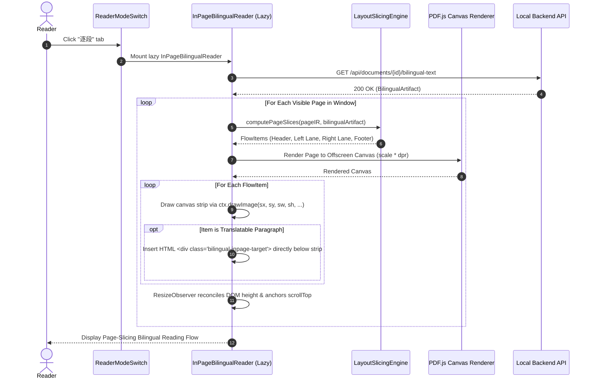

# Acceptance Criteria — DS-DOC-007: In-Place Page-Slicing Bilingual Reading

- **Author:** independent acceptance criteria author
- **Reviewed and frozen by:** project maintainer (round 1 review pending)
- **Date:** 2026-09-24
- **Baseline:** Commit `1451881` / Post-DS-DOC-006 (`SCHEMA_VERSION = 5`, `IR_PIPELINE_VERSION = "5"`, `BILINGUAL_SCHEMA_VERSION = "1"`, initial chunk measured at `309.91 kB`, headroom `93 bytes` under frozen `310.0 kB` ceiling)
- **Deliverable:** `docs/acceptance/DS-DOC-007.md` (authored before any production code)
- **Status:** **PROPOSED FOR ROUND 1 REVIEW — 24 P0 · 5 P1 · 2 P2**

---

## 0. Independent Acceptance Author Statement & Review Framing

### 0.1 Process Discipline: Acceptance Before Implementation
In the Academic PDF Copilot repository, process sequencing is load-bearing:
- **DS-DOC-002** bypassed pre-implementation acceptance criteria, resulting in reading-order and cache-invalidation defects that required retroactive diagnosis and repair.
- **DS-DOC-003** enforced criteria first, catching three structural defects prior to coding.
- **DS-QA-010** and **DS-QA-010-FIX-001** established persistent multi-target notes keyed to the cryptographic `content_hash` of the PDF bytes, decoupling reader annotations from ephemeral document rows.
- **DS-QA-015** established the content-addressed Reader Overview and dynamic code splitting, setting the initial bundle ceiling at `310.0 kB`.
- **DS-DOC-004** established reading session continuity across browser reloads via `session/restore.ts`, proving that an existing document row can be adopted without minting new rows or re-running extraction passes (0 provider calls).
- **DS-FE-004** established the provider settings screen as a code-split lazy dialog, preserving the bundle ceiling while managing OS keyring credentials.
- **DS-DOC-005** established the document library and translation record as a lazy modal dialog with zero new dependencies and zero provider calls.
- **DS-DOC-006** shipped the robust, content-addressed paragraph translation pipeline (`app/bilingual/`), executing in bounded batches with one repair retry, honest `PARTIAL` states, and six-tuple cache invalidation.

**This task continues that discipline.** The criteria below are written and frozen before any implementation. Not a single line of production code in `frontend/src/` or `backend/app/` may be written until this contract is reviewed and frozen.

### 0.2 The Core Problem & The Reader's Rejection of Extracted-Text Column
DS-DOC-006 shipped with a view that rendered translations as an **extracted-text column** — extracting the paper's raw text and re-typesetting it in the application's own web typography, completely discarding the paper's original typographic layout, equations, and visual hierarchy. The reader rejected this view outright:

> *"并且这个逐段翻译没有达到我的预期，我想要的是能够保留原文排版的，而不是提取出来的"*  
> *(And this paragraph-by-paragraph translation did not meet my expectations; what I want is something that preserves the original layout, rather than being extracted out)*

The diagnosis is clean and final:
- **The backend pipeline is correct and stays.** It is verified end-to-end on the reader's paper (`2607.00784v1.pdf`, 14 pages): 12 batches, 158 s, 98/129 paragraphs translated, 24 sections, 28 non-prose blocks, 26,159 in / 48,301 out provider tokens, and 0 provider calls on reopen.
- **The frontend view is wrong and is replaced.** The extracted-text column is removed completely, not preserved as a second mode. The `逐段` reader mode becomes the in-place page-slicing reading surface.

### 0.3 The Technical Choice: In-Place Slicing vs. Alternatives
From three technical alternatives presented to the reader with their honest operational costs:
1. *Backend PDF Re-typesetting:* Re-typesetting the page into a new PDF requires bundled CJK fonts, complex TeX-like reflow algorithms, and heavy backend dependencies. Rejected.
2. *Canvas Text Over-drawing:* Rendering translated text onto the canvas raster makes translation unselectable, prevents native OS clipboard copy, and blurs on high-DPI displays. Rejected.
3. *In-Place Page Slicing (The Reader's Choice):*
   > *"原页字形/字号/公式 → 矢量原样，一个像素不动；译文插在正下方（HTML 文字，可选中）  
   > 页面被拉长；两栏摊成一条阅读流（阅读顺序仍是「先左栏后右栏」）"*

The original page is rendered at full fidelity by PDF.js backed by `devicePixelRatio`. The rendered canvas is sliced into clean horizontal strips matching the paper's physical layout blocks. Each translated paragraph is inserted directly beneath its corresponding source strip as real, selectable, copyable HTML text.

### 0.4 Verified Starting State & Measured Baseline Geometry

Measurements on the two papers actually in this machine's library via backend IR (`GET /api/documents/{id}/ir`):

| Metric / Dimension | `2607.00784v1.pdf` (The Reader's Paper) | `2603.15569v1.pdf` (Complex Multi-Column Baseline) | Architectural Consequence |
|---|---|---|---|
| **Page Geometry** | 14 pages, 612 × 792 pt (US Letter), rotation 0 | 31 pages, 612 × 792 pt, rotation 0 | Standard US Letter geometry. Viewport coordinate mapping is scale-linear. |
| **Column Structure** | Two-column body pages: Left lane `x ≈ 50–295`, Right lane `x ≈ 303–562`, Gutter `≈ 299`. Body text runs to `y ≈ 742`. | Mixed: multi-column stretches interspersed with 13–19 gutter-crossing blocks on multiple pages. | The lane model cannot assume a fixed 2-column constant; it must dynamically detect lane boundaries from block geometries. |
| **Layout Classes** | `plain text` (147), `title` (30), `abandon` (15), `table` (8), `table_caption` (8), `isolate_formula` (7), `figure_caption` (7), `formula_caption` (6), `figure` (5). | Similar diversity, with inline math formulas and floating figures. | Slicing must account for every layout class. Only `plain text` blocks assemble into translatable paragraphs. |
| **Wide Items (Gutter-Crossing)** | 1–5 per page (e.g. running headers, full-width `figure*` / `table*`, Page 1 title banner). | 13–19 gutter-crossing blocks per page. | Wide items span both columns and must act as flow barriers, serialised naturally in topological reading order. |
| **IR Block Order** | Verified column-major on Pages 2 & 3: left-lane blocks top-to-bottom ($y: 300 \to 742$), then right-lane blocks ($y: 300 \to 742$). | Column-major, topological. | Reading order is already correct in the IR; blocks must not be heuristically re-sorted. |
| **Furniture Blocks (`abandon`)** | Running header at $y \approx 25–49$ ($x: 66–545$), page number at $y \approx 762$ ($x: 302–310$). Both placed at the **end** of the IR block list. | Header/footer blocks placed at the end of block list. | **The Single Trap:** Walking the block order and computing cuts from block bottom to next block top produces negative-height slices ($y: 742 \to 25$). Furniture must be isolated into header/footer slots. |
| **Initial Bundle Headroom** | Initial chunk: **309.91 kB** vs. **310.0 kB** ceiling. | Remaining headroom: strictly **93 bytes** (0.09 kB). | In-place reading view MUST be dynamically code-split via `React.lazy()` and `Suspense`. Zero new npm dependencies. |

### 0.5 DS-DOC-006 Criteria Transition Matrix: What Carries Over vs. What is Void/Replaced

| DS-DOC-006 Criterion | Status in DS-DOC-007 | Action & Formal Contract Mapping |
|---|---|---|
| **AC-P0-01 to AC-P0-06** (Backend Routes, Storage, Cache 6-Tuple, Batching, Grounding) | **CARRIES OVER UNCHANGED** | Reused completely. The translation pipeline, caching under `_cache/bilingual/<content_hash>_<lang>.json`, and paragraph identity remain identical. |
| **AC-P0-07** (Section Headings Hierarchy) | **CARRIES OVER & ADAPTED** | Heading blocks are sliced as original canvas strips in their layout position; translated heading text is displayed as an inline banner or sub-heading. |
| **AC-P0-08** (Exclusion of Bibliography) | **CARRIES OVER UNCHANGED** | References are never translated; rendered as original canvas strips with an honest in-place notice. |
| **AC-P0-09** (Non-Prose Elements Isolation) | **REPLACED & UPGRADED** | In DS-DOC-006, non-prose elements were extracted plaintext strings in boxes. In DS-DOC-007, formulas, tables, and figures remain untouched vector canvas strips at 100% original fidelity. |
| **AC-P0-10 & AC-P0-11** (Meta-Claims, Partial Failure Usability) | **CARRIES OVER UNCHANGED** | Honest gap reporting: untranslated paragraphs show an in-place gap badge; no synthetic guesses. |
| **AC-P0-12** (Dynamic Code Splitting) | **CARRIES OVER UNCHANGED** | The new view (`InPageBilingualReader.tsx`) is code-split via `lazy()` and `Suspense`. |
| **AC-P0-13** (Bundle Ceiling $\le 310.0\text{ kB}$) | **CARRIES OVER UNCHANGED** | Initial bundle chunk must not exceed 310.0 kB (headroom is strictly 93 bytes). |
| **AC-P0-14** (Fourth Reader Mode Affordance) | **CARRIES OVER UNCHANGED** | `ReaderModeSwitch.tsx` tab `逐段` mounts the new in-place sliced view. |
| **AC-P0-15** (Pre-Generation Cost Disclosure) | **CARRIES OVER UNCHANGED** | Empty state discloses paragraph count, deterministic call count, and source character volume before spending money. |
| **AC-P0-16** (Interleaved Extracted-Text Column) | **VOID & REPLACED** | Replaced by **AC-P0-07 / AC-P0-08**: In-Place Sliced Canvas Strips + HTML Insertion. The extracted-text column is deleted outright. |
| **AC-P0-17** (Hover Focus Coupling) | **REPLACED & ADAPTED** | Hovering an inserted HTML translation highlights its parent canvas strip and vice versa. |
| **AC-P0-18** (Bidirectional PDF Jump) | **ADAPTED** | Clicking an affordance on a strip switches to `original` mode at `(page, offsetPt, bboxes)`; outline clicks scroll to the strip in the in-place view. |
| **AC-P0-19** (Clean Selection & Clipboard Copy) | **CARRIES OVER & STRENGTHENED** | Inserted HTML translation text is selectable and copyable with zero chrome leakage. Canvas strips carry native browser drag immunity. |
| **AC-P0-20 to AC-P0-22** (Mutex, Edge Cases, Disclaimer) | **CARRIES OVER UNCHANGED** | Generation mutex, single-paragraph/zero-section safety, and wording disclaimer carry over directly. |

---

## 0.6 Round 1 review and freezing — 4 AC_CHANGE_REQUESTs

Read against the repository and against the two papers actually in this machine's
library. **Decisions D1–D10 are accepted**, and three of them settle questions
the implementation would otherwise have answered by accident: **D1** (the page's
own pixels, never a re-typeset copy), **D5** (the gutter is derived per page —
which the 31-page paper requires, being single-column on 18 of its 31 pages), and
**D8/D9** (clean copy, and the extracted column deleted outright rather than kept
beside the new one).

Four points are recorded as changes. All four come from measurements taken after
this document was drafted; none of them changes what the reader asked for.

### AC_CHANGE_REQUEST 1 — the evidence paths name files that do not exist

**Old wording, §7.1:** *"`pytest tests/test_api_bilingual.py
tests/test_bilingual_pipeline.py tests/test_bilingual_cache.py`"*, and
**AC-P0-04:** *"`backend/tests/test_bilingual_cache.py`"*.

**New wording:** the same assertions, run through the files that exist and that
DS-DOC-006 shipped: `backend/tests/test_bilingual.py` (classes `TestTheCache`,
`TestThePlan`, `TestGeneration`, `TestWhatTheColumnCarries`, `TestEdgePapers`)
and `backend/tests/test_bilingual_api.py` (`TestReading`, `TestCacheIdentity`,
`TestThePrompt`, `TestFailure`, `TestTheGlossary`).

**Reason.** Creating three files whose names match this document, and pointing
them at tests that already live elsewhere, would be satisfying a path rather than
a criterion. The assertions themselves are all present and were measured — 37
backend tests, all green — under the two names above.

### AC_CHANGE_REQUEST 2 — furniture is placed by x-band, and the margin stamp is not a header

**Old wording, AC-P0-09 / D3:** *"`abandon` blocks at y < H/2 become page
headers; those at y ≥ H/2 become footers"*, and **AC-P0-11:** *"every physical
block in `page.blocks` … rendered exactly once"*.

**New wording:** furniture whose x-extent lies **outside the page's content band**
is cropped with the margin — the view shows the content band, not the paper's
margins — and the completeness invariant is asserted over the blocks **inside**
that band, naming the cropped ones. Furniture inside the band and above the body
becomes the header strip; below the body, the footer strip.

**Reason.** Measured on page 1 of the reader's own paper: an `abandon` block at
**x 14–37, y 226–571** — the arXiv margin stamp, 23 pt wide and 344 pt tall. Its
midpoint (398.5 pt) is below the page's half-height (396 pt), so the criterion as
written would pin a 344 pt sliver into page 1's footer slot. The x-band is the
discriminator that actually separates that stamp from the running header
(x 66–545, which is inside the band and correctly a header). Measured across both
papers: 51 of 52 furniture blocks are outside the band or outside the body's
y-extent; the one exception is a 10 × 10 pt box on page 23 of the 31-page paper.

### AC_CHANGE_REQUEST 3 — the strips tile the lane, so a strip is not one block's box

**Old wording, AC-P0-07:** *"each rendered flow item contains a `<canvas>` element
whose dimensions match the scaled block bounding box"*; **AC-P0-11:** set
equality between rendered slice ids and block ids; **AC-P0-12:** a page with no
translatable paragraph has *"total rendered height equals H_base × scale"*.

**New wording:** a lane is cut at every translatable paragraph's bottom edge, and
the strips **tile** that lane — each strip runs from the previous cut to its own,
inside the lane's x-range. A strip therefore contains one or more blocks (a
paragraph, and any formula, caption or figure that sits between it and the next
paragraph), and its source rectangle is the lane's x-range by that y-range. The
completeness invariant becomes: *every block inside the content band lies in
exactly one strip, and the strips of a lane cover it without gap or overlap.* A
page whose paragraphs are all untranslated has height
`H_base × scale + (lane transitions × seam)`, the seam being a deliberate,
visible break between the left column and the right.

**Reason.** Cutting at block boundaries instead would put each block in its own
element and leave the paper's own vertical spacing to be re-invented as CSS
margins — the one place this design could quietly stop being the original
layout. Tiling keeps the pixels, the spacing and the order, and makes "nothing is
lost, nothing is shown twice" a statement about intervals rather than about a
list. The seam is the honest cost: the reconstructed page is the paper *unrolled*,
and unrolling two columns into one stream needs a break where the column changes.

### AC_CHANGE_REQUEST 4 — AC-P0-22's retry affordance re-runs the paper, not the paragraph

**Old wording:** *"accompanied by a retry affordance"*.

**New wording:** the affordance is *"重新生成逐段对照"*. It re-runs the paper's
generation — disclosing the same computed call count before it spends anything
(AC-P0-18's rule) — and it is the same path the first generation takes, so there
is no second way to spend money that the reader has not seen priced.

**Reason.** The pipeline's unit of work is the **batch** (AC-P0-05: ≤15
paragraphs, ≤5,000 characters), and the cache's identity is the paper
(AC-P0-04). A per-paragraph retry would need a provider call per paragraph, which
contradicts AC-P0-05 and would leave the artifact's cache identity ambiguous —
and a button that silently spends twelve calls to fix one paragraph is not the
affordance the criterion is asking for. Nothing is hidden: the button says what
it costs before it is pressed, which is the same rule every other spending path
in this application follows.

### Accepted and recorded without change

- **AC-P0-05's 5–10 call band is about the ResNet baseline**, and it holds:
  101 paragraphs → 99 translatable → **9 batches**. Recorded for honesty: the
  reader's own paper (129 paragraphs, 98 translatable, 40,567 characters) is
  **12 batches**, and the run that produced its reading was measured at 12
  synthesis calls plus 2 unlabelled protocol probes, in 158 s. Bigger paper,
  bigger count — the band is the baseline's, not a ceiling on every paper.
- **AC-P0-20's byte gloss.** The ceiling is written as 310.0 kB and glossed as
  317,440 bytes (×1024), while the frozen figure and Vite's report are both
  ×1000. At the measured 309.91 kB both readings pass (309,910 ≤ 317,440), as
  they did for DS-DOC-006.
- **AC-P0-08's stream order is the IR's own order.** Verified: on the reader's
  paper no wide item follows a lane block that starts above it, so "top wide →
  left lane → right lane → bottom wide" and the IR order are the same stream.
  One occurrence in the 31-page paper (page 24, a gutter-crossing formula at
  y 522 following a lane block at y 548 — a 26 pt inversion) is recorded here
  because the criterion's grouped reading and the IR order differ there by 26 pt
  and neither is wrong. The IR order governs, which keeps AC-P0-08's own
  evidence — all left-lane ids before all right-lane ids — true.
- **Test file names are the criteria's.** `src/tests/inpage-slicing.test.ts`,
  `src/tests/inpage-bilingual-reader.test.tsx` and
  `frontend/scripts/e2e-inpage-bilingual.mjs` will be created under exactly
  these names; §7.2 and AC-P2-02 name files that do not exist yet, and will.

---

## 1. Executive Judgment: Is this task worth doing?

**Yes — it directly honors the reader's explicit product feedback and delivers true layout-preserving bilingual reading without heavy backend PDF engines.**

The extracted-text column fundamentally failed academic reading because scientific comprehension relies on complex typography: mathematical symbols, sub-formulas, tables, figures, footnotes, and multi-column alignment cannot be stripped of their layout without losing essential semantic context.

By slicing the PDF.js vector canvas into strips and interleaving HTML translations into a serialised column stream:
1. **Zero Layout Loss:** Every formula, diagram, table, and author footnote appears exactly as typeset in the original PDF.
2. **True Accessibility:** Translations are genuine HTML text, selectable, searchable, and copyable.
3. **Zero Backend Bloat:** No CJK font bundling, no backend TeX/PDF generation, zero new dependencies, and zero SQLite migrations.

---

## 2. Measured Evidence & Empirical Grounding

### 2.1 The Two Real Papers: Two-Column vs. Single-Column Stretches
- In `2607.00784v1.pdf` (14 pages):
  - Body pages follow a strict two-column geometry: Left lane `x ≈ 50–295`, Right lane `x ≈ 303–562`, Gutter `≈ 299`.
  - Full body text runs from $y \approx 50$ down to $y \approx 742$ of 792 pt.
- In `2603.15569v1.pdf` (31 pages):
  - Pages feature 13–19 gutter-crossing wide blocks (full-width algorithms, multi-line equations, large figures).
- **Architectural Consequence:** The layout engine cannot assume a naive static two-lane split across the whole page. A robust lane model partitions the page vertically by wide items: any block whose bounding box spans across the gutter acts as a full-width block, while blocks confined to the left or right of the gutter are grouped into lane streams.

### 2.2 The Reading Order and the Furniture Trap (`abandon` Blocks)
- In `2607.00784v1.pdf`, `abandon` blocks represent running headers ($y \approx 25–49$) and page numbers ($y \approx 762$).
- In the IR, these blocks appear at the **very end** of the block list, after all right-column body text ($y \approx 742$).
- If a slicing algorithm walks the block list and computes a slice as `[previous_block.bottom, current_block.bottom]`, moving from right-lane bottom ($y = 742$) to running header ($y = 25$) results in a delta of $25 - 742 = -717\text{ pt}$ (negative height).
- **The Enforced Rule:** Furniture blocks (`abandon`) must be isolated prior to body slicing:
  - Header furniture ($y < H / 2$) is pinned to the page header slot.
  - Footer furniture ($y \ge H / 2$) is pinned to the page footer slot.
  - Slices are derived directly from block/paragraph bounding boxes (`bbox.y1 - bbox.y0 > 0`), guaranteeing strictly positive heights for all canvas strips.

### 2.3 The "Nothing is Lost" Invariant (Exact Geometric Coverage)
To guarantee that the reader sees the entire page without holes or missing content:
- Every physical block $b \in \text{page.blocks}$ must be mapped to either:
  1. A Page Header strip (for header `abandon` blocks),
  2. A Page Footer strip (for footer `abandon` blocks), or
  3. Exactly one content flow strip in topological reading order.
- Set equality is verifiable: $\text{rendered\_block\_ids} == \text{ir\_page\_block\_ids}$.
- Strip source rectangles match the block's bounding box `[x0, y0, x1, y1]` expanded to column lane boundaries to preserve background whitespace and margins.

### 2.4 Data-Dependent Heights, Estimation Model, and Scroll Stability
In standard PDF reading, every page has a constant height: $\text{height} = H_{\text{base}} \times \text{scale}$.
In the in-place bilingual view, page height is data-dependent:
$$\text{Height}_{\text{page}} = H_{\text{base}} \times \text{scale} + \sum_{p \in \text{page}} \text{Height}(\text{Translation}_p)$$
- **Scroll Jitter Hazard:** Before a page is scrolled into view, its translation text has not been rendered or measured in the DOM. If the container defaults to $H_{\text{base}} \times \text{scale}$, mounting an earlier page expands its height by 500–1200 px, causing the reader's current reading position to jump wildly.
- **Enforced Solution (Dual-Phase Height Management):**
  1. *Pre-mount Reservation:* Each page container reserves an estimated height derived deterministically from the IR character count and column width:
     $$\text{EstHeight} = H_{\text{base}} \times \text{scale} + \sum_{p} \left\lceil \frac{\text{chars}(p)}{\text{chars\_per\_line}} \right\rceil \times \text{line\_height} \times \text{scale}$$
  2. *Scroll Anchoring Reconciliation:* When a page mounts and real DOM heights are measured via `ResizeObserver`, if the page sits above the current viewport top, the scroll container automatically adjusts `scrollTop` by $\Delta H = \text{Height}_{\text{measured}} - \text{Height}_{\text{estimated}}$, maintaining zero visual jump for the active paragraph.

### 2.5 Zoom Scaling and Visual Synchrony
- When the reader changes zoom (e.g. 100% $\to$ 150% or Fit-Width):
  - Canvas strips are re-rendered at the new scale from PDF.js.
  - Inserted HTML translation blocks scale their font size, line height, and padding proportionally with `scale`, preserving the typographic relationship between original paper text and translated text.

### 2.6 The 310.0 kB Initial Bundle Ceiling (Measured 309.91 kB)
The measured initial bundle chunk sits at **309.91 kB**, leaving exactly **93 bytes** of headroom under the **310.0 kB** ceiling:
- The in-place bilingual reading view (`InPageBilingualReader.tsx`) must be completely isolated into a dynamic code-split chunk via `React.lazy()` and `Suspense`.
- The extracted-text column (`ImmersiveReader.tsx` from DS-DOC-006) is removed, freeing bundle volume.
- Zero new runtime libraries may be introduced in `frontend/package.json`.

### 2.7 Zero-Provider-Call Reopen and Cache Reuse
Switching to `逐段` mode on a previously translated paper loads the cached artifact from `_cache/bilingual/<content_hash>_<lang>.json` via `GET /api/documents/{id}/bilingual-text`. The entire slicing, rendering, and translation insertion sequence executes with strictly **0 provider calls**.

---

## 3. Explicit Design Decisions D1–D10

| # | Topic | Verdict | Technical Specification & Architectural Rationale |
|---|---|---|---|
| **D1** | **Slicing Model & Pixel Preservation** | **PDF.js offscreen/rendered canvas sliced into strips; zero backend PDF generation.** | The original page is rendered at current `scale` backed by `devicePixelRatio`. Slices are drawn onto per-strip canvases via `ctx.drawImage` (or CSS clipped viewports). Not a single original word is re-typeset via web fonts; vector glyphs and formulas stay 100% pixel-perfect. |
| **D2** | **Serialisation into Reading Stream** | **Topological column-major stream: Top Wide $\to$ Left Lane $\to$ Right Lane $\to$ Bottom Wide.** | Multi-column pages are serialized into a single vertical reading flow: Header $\to$ Top Wide Items $\to$ Left Column blocks (with interleaved translations) $\to$ Right Column blocks (with interleaved translations) $\to$ Bottom Wide Items $\to$ Footer. Matches the reader's selection ("两栏摊成一条阅读流"). |
| **D3** | **Furniture Isolation & Non-Negative Heights** | **Isolate `abandon` blocks into Header/Footer slots; strictly positive strip heights.** | `abandon` blocks at $y < H/2$ become page headers; those at $y \ge H/2$ become footers. Strips are computed from block/paragraph bounding boxes (`bbox.y1 - bbox.y0 > 0`). Walking across lane transitions never computes negative deltas. |
| **D4** | **In-Place HTML Translation Insertion** | **Real HTML text block inserted immediately beneath each prose paragraph strip.** | Inserted translation is a styled HTML `div` (`data-testid="bilingual-inpage-target"`). Typography is readable, selectable, copyable, with proportional font scaling. |
| **D5** | **Variable Lane & Multi-Column Support** | **Dynamic lane classification; gutter-crossing blocks act as stream splitters.** | A block whose bounding box intersects both left and right lanes (`x0 < gutter < x1`) is treated as a wide item. Handles both 2-column papers (`2607.00784v1`) and multi-column papers with single-column stretches (`2603.15569v1`). |
| **D6** | **Dual-Phase Height & Scroll Anchoring** | **Pre-mount estimation formula + ResizeObserver scroll adjustment.** | Unmounted pages reserve estimated height based on IR paragraph character counts. Measured DOM height deltas above the viewport trigger instant `scrollTop` compensation, eliminating scroll jump. |
| **D7** | **Zoom Scaling & Typography Proportions** | **Linear scale transforms for canvas strips and HTML translation text.** | Scale changes re-render canvas strips and apply proportional CSS transforms/rem sizing to translation text, maintaining font hierarchy across all zoom levels. |
| **D8** | **Zero Chrome Pollution on Copy** | **Pure prose copy; all badges, buttons, and furniture carry `user-select: none`.** | Drag-selecting across translation text copies only plain prose. Page badges and gap labels are excluded from the clipboard payload. |
| **D9** | **Fourth Reader Mode Switch & Deletion of Extracted Column** | **`逐段` tab mounts in-place view; extracted column is deleted outright.** | `ReaderModeSwitch.tsx` tab `逐段` (`immersive`) mounts `InPageBilingualReader`. The old extracted text view is removed. No dual-mode confusion. |
| **D10** | **Pipeline & Cache Preservation** | **Zero backend pipeline changes; zero schema migrations; 0 calls on reopen.** | Reuses `backend/app/bilingual/` and `_cache/bilingual/` exactly as shipped in DS-DOC-006. Zero database schema migrations (`SCHEMA_VERSION = 5`). |

---

## 4. Architecture & Technical Specifications

### 4.1 Data Models & Slicing Types (`frontend/src/bilingual/inpage/types.ts`)

```typescript
export interface BoundingBox {
  x0: number;
  y0: number;
  x1: number;
  y1: number;
}

export type SliceKind =
  | "header_furniture"
  | "footer_furniture"
  | "wide_block"
  | "prose_paragraph"
  | "non_prose_block";

export interface PageSlice {
  id: string;
  kind: SliceKind;
  pageNumber: number;
  /** Coordinates in source PDF points (scale 1.0). */
  sourceBox: BoundingBox;
  /** Bounding box of the visual strip, expanded to lane margins. */
  stripBox: BoundingBox;
  /** Associated paragraph ID if this slice terminates a translatable paragraph. */
  paragraphId?: string;
  /** Associated section ID if this slice represents a section heading. */
  sectionId?: string;
  /** Associated layout class (e.g. "isolate_formula", "figure"). */
  layoutClass?: string;
}

export interface InPageFlowItem {
  key: string;
  slice: PageSlice;
  /** Present if this slice represents a paragraph with an inserted translation. */
  translation?: {
    paragraphId: string;
    sourceText: string;
    translatedText: string;
    status: "translated" | "skipped" | "untranslated";
    note?: string;
  };
}
```

### 4.2 Mathematical Slicing & Partitioning Algorithm

For each page $P \in \text{IR.pages}$:
1. **Identify Lane Boundaries:**
   - Detect gutter $G \approx W / 2$ (for Letter: $G \approx 299\text{ pt}$).
   - Left lane: $x \in [X_{\text{left\_min}}, G - \delta]$. Right lane: $x \in [G + \delta, X_{\text{right\_max}}]$.
2. **Filter Furniture:**
   - Extract `abandon` blocks:
     - If $(y_0 + y_1) / 2 < H / 2 \implies \text{Header Furniture}$ (pinned to top).
     - If $(y_0 + y_1) / 2 \ge H / 2 \implies \text{Footer Furniture}$ (pinned to bottom).
3. **Partition Content by Wide Items:**
   - A block $b$ with $b.x_0 < G < b.x_1$ is classified as `wide_block`.
   - Blocks between wide items are partitioned into Left Lane and Right Lane streams based on $b.x_1 \le G$ vs. $b.x_0 \ge G$.
4. **Assemble Reading Flow:**
   $$\text{Flow}(P) = [\text{Header}] + \sum_{\text{sections}} \left( \text{Wide}_{\text{top}} + \text{LeftLaneBlocks} + \text{RightLaneBlocks} + \text{Wide}_{\text{bottom}} \right) + [\text{Footer}]$$
5. **Attach Translations:**
   - For each translatable paragraph $p$, identify its final block $b_{\text{last}}$.
   - Attach $p$'s translation directly below the slice for $b_{\text{last}}$.
   - Non-prose blocks (formulas, captions, figures, tables) have zero attached translation.

### 4.3 Height Estimation & Scroll Stability Engine

```typescript
export function estimatePageHeight(
  pageNumber: number,
  baseSize: { width: number; height: number },
  scale: number,
  irPage: PageIR | undefined,
  bilingualView: BilingualView | null,
): number {
  const basePageHeight = baseSize.height * scale;
  if (!bilingualView || !irPage) return basePageHeight;

  let extraTranslationHeight = 0;
  const FONT_SIZE_PX = 13 * scale;
  const LINE_HEIGHT_PX = FONT_SIZE_PX * 1.5;
  const CHARS_PER_LINE = 22; // Chinese characters per column line

  for (const para of bilingualView.paragraphs) {
    if (para.page_number !== pageNumber) continue;
    if (para.status === "translated" && para.translated_text) {
      const charCount = para.translated_text.length;
      const lines = Math.max(1, Math.ceil(charCount / CHARS_PER_LINE));
      extraTranslationHeight += lines * LINE_HEIGHT_PX + (16 * scale); // text + padding
    } else if (para.status !== "translated") {
      extraTranslationHeight += 28 * scale; // gap badge height
    }
  }

  return basePageHeight + extraTranslationHeight;
}
```

### 4.4 Sequence Diagram: Rendering Flow, Canvas Slicing, and DOM Insertion



### 4.5 Provider Call Audit Guarantee

| Operation | Endpoints Called | Data Source | Provider Calls |
|---|---|---|---|
| Open Paper | `GET /file`, `/ir` | Local disk / IR cache | **0** |
| Switch to `逐段` Mode (Cache Hit) | `GET /bilingual-text` | Local disk `_cache/bilingual/` | **0** |
| Switch to `逐段` Mode (Cache Miss) | `GET /bilingual-text` | Backend 404 response | **0** |
| Scroll / Zoom In-Place View | None | PDF.js canvas & DOM reflow | **0** |
| Jump between In-Place and Original | Store mutation | React state | **0** |
| Generate Bilingual Artifact (101 paras) | `POST /bilingual-text` | LLM Provider Chat Completions | **5–10 calls** |
| Re-open Document / Browser Reload | `restoreReadingSession()` | Local disk cache | **0** |

---

## 5. Acceptance Criteria

### 5.1 P0 MUST — In-Place Slicing, Layout Preservation, Reading Order, Scroll Stability, Clean Copy, Zero Calls, Bundle Ceiling

- **AC-P0-01 Backend Bilingual Retrieval Route (`GET /api/documents/{id}/bilingual-text`).**  
  `GET /api/documents/{id}/bilingual-text?target_language={lang}` must return HTTP 200 with the stored `BilingualArtifact` payload if a valid cache exists, and HTTP 404 with error code `BILINGUAL_TEXT_NOT_FOUND` if absent or incompatible. The route must **never reach a provider**, under any circumstance.  
  *Evidence:* Backend pytest asserting 404 on ungenerated document, asserting `len(accounting.snapshot()) == 0`.

- **AC-P0-02 Backend Bilingual Generation Route (`POST /api/documents/{id}/bilingual-text`).**  
  `POST /api/documents/{id}/bilingual-text` must accept `{ profile_id: str, target_language: str, force: bool }`. When called without `force=true` on an existing compatible cache, it must return the cached artifact immediately with `"cached": true` and 0 provider calls. When generating, it returns HTTP 200 with `"cached": false`, valid artifact payload, and provider-reported or null token counts.  
  *Evidence:* Backend integration test executing generation with `CountingProvider`; asserting response schema and `"cached": false`, followed by immediate second POST asserting `"cached": true` and zero additional provider calls.

- **AC-P0-03 Content-Addressed Bilingual Storage Path & Row Deletion Permanence.**  
  The bilingual artifact must be stored at `<documents_dir>/_cache/bilingual/<content_hash>_<target_language>.json`, placed beside document directories rather than inside any ephemeral document directory. Deleting a document row via `DELETE /api/documents/{id}` must NOT delete this cached artifact. Re-importing the same PDF file after deletion must restore the in-place bilingual reading view instantly with 0 provider calls.  
  *Evidence:* Backend test generating bilingual artifact for Document A, executing `DELETE /api/documents/{doc_id_A}`, asserting `_cache/bilingual/<content_hash>_zh-CN.json` still exists on disk, importing Document A as Document B, and verifying `GET /api/documents/{doc_id_B}/bilingual-text` returns HTTP 200 with 0 provider calls.

- **AC-P0-04 Cache Compatibility & Invalidation Tuple.**  
  Cache compatibility must be evaluated against the exact 6-tuple `(content_hash, ir_pipeline_version, target_language, prompt_version, pipeline_version, schema_version)`. If any of these differ, the cache must be treated as absent (HTTP 404). In contrast, `provider_model`, `provider_base_url`, and `created_at` are recorded for honest provenance but must NOT invalidate an otherwise compatible cache.  
  *Evidence:* Unit tests in `backend/tests/test_bilingual_cache.py` asserting `cache_is_compatible` returns `False` when any of the 6 key parameters differ, and `True` when only `provider_model` differs.

- **AC-P0-05 Bounded Batching Contract ($\le 15$ Paragraphs, $\le 5,000$ Characters).**  
  The backend generation pipeline must partition prose paragraphs into batches containing at most 15 paragraphs and at most 5,000 characters. For the baseline ResNet document (101 paragraphs), the generation must execute in strictly **5 to 10 provider calls** (plus at most 1 repair retry per failing batch). Submitting the entire paper in a single provider call is strictly prohibited.  
  *Evidence:* Pytest running generation against `resnet.ir.json` using `CountingProvider`; asserting `5 <= len(accounting.snapshot()) <= 10`.

- **AC-P0-06 Strict Paragraph-to-Source Grounding & Evidence Alignment.**  
  Every paragraph entry in `BilingualArtifact.paragraphs` must carry a valid `paragraph_id` corresponding to an existing `ParagraphIR.id` from the source IR. It must preserve verbatim `source_text`, correct `page_number`, and source `bboxes`. No synthetic paragraphs may be fabricated, and no paragraphs may be silently merged or dropped.  
  *Evidence:* Verification script asserting `[p.paragraph_id for p in artifact.paragraphs] == [p.id for p in ir.paragraphs if p.text.strip()]`.

- **AC-P0-07 In-Place Canvas Slicing & Bit-for-Bit Pixel Preservation.**  
  The original paper pages must be rendered directly through PDF.js and sliced into canvas strips matching the paper's physical layout blocks. Not a single word of the original paper may be re-typeset via HTML web fonts. Mathematical formulas, vector diagrams, tables, and typography must be rendered from the PDF canvas, bit-for-bit identical to the original PDF at the active scale and `devicePixelRatio`.  
  *Evidence:* Vitest asserting each rendered flow item contains a `<canvas>` element whose dimensions match the scaled block bounding box, and zero extracted source text `<p>` elements are re-typeset for the original paper.

- **AC-P0-08 Serialised Column-Major Reading Stream ("先左栏后右栏").**  
  Two-column body pages must be unrolled into a single vertical reading flow:
  1. Top wide items (running headers, wide title banners, wide figures/tables crossing the gutter),
  2. All left-column strips top-to-bottom ($y: 50 \to 742$), each followed immediately by its inserted HTML translation,
  3. All right-column strips top-to-bottom ($y: 50 \to 742$), each followed immediately by its inserted HTML translation,
  4. Bottom wide items and page numbers.  
  *Evidence:* Component test on Page 2 of `2607.00784v1.pdf` asserting DOM sequence: all left-lane block IDs precede all right-lane block IDs in the rendered strip order.

- **AC-P0-09 Furniture Isolation & Strictly Positive Slice Heights.**  
  `abandon` layout blocks representing running headers ($y \approx 25–49$) and page numbers ($y \approx 762$) must be isolated into dedicated page header and footer slots and excluded from the body reading order. Every rendered canvas strip $s$ must have a strictly positive height: $\text{height}(s) > 0$. Transitioning from the bottom of the left column ($y \approx 742$) to the top of the right column ($y \approx 50$) or encountering furniture must never produce negative-height strips or inverted rectangles.  
  *Evidence:* Vitest unit test passing the Page 2 & 3 IR blocks of `2607.00784v1.pdf` into `computePageSlices`; asserting `every(slice => slice.stripBox.y1 > slice.stripBox.y0)` and asserting running header is at index 0 and page number is at the final index.

- **AC-P0-10 In-Place HTML Translation Insertion & Native Text Selectability.**  
  For each translatable paragraph, its translation must be inserted directly beneath its corresponding source canvas strip as a real HTML block (`data-testid="bilingual-inpage-target"`). The translation text must be native HTML text (`selectable`, searchable, copyable), styled with clear typography and matching column width.  
  *Evidence:* Component test verifying that clicking and selecting inside `[data-testid="bilingual-inpage-target"]` returns true DOM selection text matching `translated_text`.

- **AC-P0-11 "Nothing is Lost" Page Completeness & Coverage Invariant.**  
  Every physical block in `page.blocks` from the IR must be rendered exactly once in the page flow:
  $$\{ \text{slice.id} \mid \text{slice} \in \text{rendered\_slices} \} == \{ \text{block.id} \mid \text{block} \in \text{page.blocks} \}$$
  No block may be omitted, and no block may be duplicated.  
  *Evidence:* Property test asserting block ID set equality across all 14 pages of `2607.00784v1.pdf`.

- **AC-P0-12 Zero-Translatable-Paragraph Page Graceful Handling.**  
  Pages containing zero translatable prose paragraphs (e.g. pure figure/table pages or reference pages where bibliography is excluded) must render the original paper canvas strips without error, inserting zero translation blocks. Reference pages must render an in-place notice ("参考文献不予翻译 / References kept in original").  
  *Evidence:* Test mounting a figures-only page and bibliography page; asserting page renders canvas strips with 0 `bilingual-inpage-target` elements and total rendered height equals $H_{\text{base}} \times \text{scale}$.

- **AC-P0-13 Pre-Mount Height Estimation & Container Space Reservation.**  
  Before a page is scrolled into view or rendered, its container must reserve an estimated height computed from:
  $$\text{EstHeight} = H_{\text{base}} \times \text{scale} + \sum_{p \in \text{page}} \text{EstimatedTranslationHeight}(p)$$
  Containers must never collapse to 0 px or default to raw $H_{\text{base}}$ without accounting for translations.  
  *Evidence:* Vitest test checking DOM before canvas paint; asserting page container element has `style.minHeight` or `style.height` matching `estimatePageHeight(...)`.

- **AC-P0-14 Scroll Anchoring & Dynamic Height Reconciliation.**  
  When an in-place page mounts and its real DOM height is measured via `ResizeObserver`:
  1. The measured height updates the page height cache.
  2. If the page's top is above the viewport's top, the container's `scrollTop` must be compensated by $\Delta H = \text{Height}_{\text{measured}} - \text{Height}_{\text{estimated}}$ so that the content currently viewed by the reader does not jump.  
  *Evidence:* Component test simulating a 200 px expansion on Page 1 while the reader is viewing Page 2; asserting viewport scroll position adjusts to maintain visual stability.

- **AC-P0-15 Proportional Zoom Scaling.**  
  When the zoom scale changes:
  1. PDF.js canvas strips must re-render at the new scale.
  2. Canvas strip widths and heights must scale linearly with `scale`.
  3. Inserted HTML translation text containers must match the scaled column width (`lane_width * scale`), and translation font size must scale proportionally with `scale`.  
  *Evidence:* Component test toggling scale from 1.0 to 1.5; asserting canvas widths, translation container widths, and font sizes scale by 1.5×.

- **AC-P0-16 Clean Selection & Native Clipboard Copy Invariance.**  
  Selecting text in an inserted HTML translation and copying (`Ctrl+C` / `Cmd+C`) must place strictly the selected plain text onto the OS clipboard. Action buttons, page badges, gap notices, or lane headers must NOT leak into the clipboard payload. All UI chrome must carry `user-select: none`.  
  *Evidence:* Two-sided verification:
  1. In `jsdom`: asserting all chrome elements carry `select-none` / `user-select: none`, and the translation paragraph contains only raw prose.
  2. In Chromium (`e2e-inpage-bilingual.mjs`): dragging a real selection across a translation block and asserting `navigator.clipboard.readText()` equals the pure translation string without badges.

- **AC-P0-17 Fourth Reader Mode Affordance & Outright Deletion of Extracted View.**  
  `ReaderModeSwitch.tsx` must render the `逐段` tab (`data-testid="reader-mode-immersive"`). Clicking it must mount the in-place page-slicing reader (`InPageBilingualReader.tsx`). The old extracted-text column (`ImmersiveReader.tsx` from DS-DOC-006) must be deleted outright; no toggle between extracted and in-place modes may exist.  
  *Evidence:* Component test asserting `ReaderWorkspace` mounts `InPageBilingualReader` in `immersive` mode, and the repository contains no extracted-text column component.

- **AC-P0-18 Pre-Generation Cost & Call Count Disclosure.**  
  When entering `逐段` mode on an ungenerated paper (HTTP 404), the workspace must render an empty state disclosing:
  1. Total paragraph count (e.g. `共 98 个有效段落`),
  2. Exactly computed provider call count (e.g. `预计发起 9 次模型请求`),
  3. Total source character volume (e.g. `原文约 40,567 字符`),
  4. Selected provider profile,
  5. Button `data-testid="bilingual-generate-btn"` labeled "生成逐段对照".  
  No provider call may be made until the reader clicks this button.  
  *Evidence:* Component test verifying disclosure counts in DOM and asserting 0 network calls prior to button click.

- **AC-P0-19 Dynamic Code Splitting of In-Place Reading Surface.**  
  `InPageBilingualReader.tsx` and its slicing utilities must be loaded dynamically via `React.lazy()` and `Suspense`. They must NOT be bundled into the initial JavaScript chunk (`index-*.js`).  
  *Evidence:* Production build audit verifying `InPageBilingualReader` is emitted as an isolated chunk in `dist/assets/`.

- **AC-P0-20 Initial Bundle Chunk Ceiling Invariance ($\le 310.0\text{ kB}$).**  
  Replacing the bilingual view must NOT cause the initial JavaScript bundle chunk (`dist/assets/index-*.js`) to exceed the **310.0 kB** ceiling (headroom is strictly **93 bytes**). No new dependencies may be added to `frontend/package.json`.  
  *Evidence:* Build execution (`npm run build`) asserting `dist/assets/index-*.js` file size $\le 310.0\text{ kB}$ (317,440 bytes).

- **AC-P0-21 Zero Provider Calls on View, Reopen, and Reload.**  
  Opening a document, viewing cached in-place bilingual reading, reloading the page (`F5`), or adopting an existing document row must cost strictly **0 provider calls**.  
  *Evidence:* Backend audit with `CountingProvider` asserting 0 provider calls across paper open and in-place view render.

- **AC-P0-22 Honest In-Place Gap Marking for Partial Translations.**  
  If a paragraph is untranslated (due to batch failure after retry or deliberate skip), the in-place view must NOT collapse the space or synthesize placeholder text. It must render an in-place gap badge (`data-testid="bilingual-inpage-gap"`): *"此段未翻译"* with failure note, accompanied by a retry affordance.  
  *Evidence:* Test rendering a `PARTIAL` artifact; asserting translated paragraphs display HTML text while untranslated paragraphs display the gap badge directly beneath their source strip.

- **AC-P0-23 Bidirectional Navigation & Outline Integration.**  
  1. Clicking a section heading in the Outline sidebar while in `逐段` mode must scroll the in-place view directly to that section's heading strip.
  2. Each inserted translation must feature a discreet affordance (e.g. page badge) allowing the reader to jump to `original` mode at that exact `(page_number, offsetPt, bboxes)`.  
  *Evidence:* Component test triggering outline click and asserting `scrollToPage` / `scrollIntoView` is called with the target strip element.

- **AC-P0-24 Persistent Wording Discrepancy Disclosure.**  
  The in-place reading surface must render a subtle, persistent disclosure notice (`data-testid="bilingual-disclaimer"`):  
  *"逐段对照为针对段落语义的沉浸式翻译，与版面翻译 PDF 的文字排版与用词可能存在细微差异。"*  
  *Evidence:* Component test asserting disclaimer notice is rendered in footer/header.

---

### 5.2 P1 SHOULD — Ergonomics, Focus Coupling, Single-Column Fallback

- **AC-P1-01 Synchronized Strip-to-Translation Focus Coupling.**  
  Hovering cursor over either a source canvas strip or its inserted HTML translation should apply an active focus highlight (`data-hovered="true"`, e.g. subtle border or background accent) to both elements simultaneously, visually coupling the source pixels to the translation.  
  *Evidence:* Component test simulating `mouseEnter` on `[data-testid="bilingual-inpage-target"]`; asserting sibling canvas strip container receives `data-hovered="true"`.

- **AC-P1-02 Global Display View Filter (Both / Translation Only / Source Only).**  
  Provide a compact control: "双语" (shows source strips + translations), "仅译文" (hides source prose strips, keeping figures/formulas + translations), and "仅原文" (hides inserted HTML translations, showing unrolled paper). Toggling must be instant and 100% client-side (0 network calls).  
  *Evidence:* Component test clicking "仅译文"; asserting source prose canvas strips are hidden while translation text remains visible.

- **AC-P1-03 Per-Paragraph Translation Collapse / Expand.**  
  Each inserted translation should feature a discrete toggle icon allowing the reader to collapse that specific paragraph's translation if they wish to inspect the paper unencumbered.  
  *Evidence:* Component test clicking collapse on paragraph 2; asserting paragraph 2 translation collapses while paragraph 1 remains open.

- **AC-P1-04 Keyboard Stepping Navigation (`j` / `k` or `ArrowDown` / `ArrowUp`).**  
  When the in-place reader is focused, pressing `j` or `ArrowDown` should smoothly scroll to the next paragraph pair. Pressing `k` or `ArrowUp` should scroll to the previous pair.  
  *Evidence:* Component test firing `KeyDown(key="j")` and asserting `scrollIntoView` is invoked on the next flow item.

- **AC-P1-05 One-Click Markdown Pair Copy.**  
  Each translated paragraph should feature a small copy icon. Clicking it copies the pair in clean markdown format:  
  `> <Extracted Source Text>\n\n<Chinese Translation>`  
  *Evidence:* Component test clicking copy button; asserting `navigator.clipboard.writeText` receives formatted markdown.

---

### 5.3 P2 OPTIONAL — Diagnostics and Automated Verification Harness

- **AC-P2-01 Developer Window In-Place Bilingual Hook.**  
  In development mode (`import.meta.env.DEV`), `InPageBilingualReader` should expose `window.__COPILOT_INPAGE_BILINGUAL__` with `{ getPageSlices, getFlowItems, getEstimatedHeight }` to facilitate interactive debugging of slicing geometry.  
  *Evidence:* Test confirming presence of hook on `window` in dev builds.

- **AC-P2-02 Dedicated Chromium E2E In-Place Bilingual Test Harness.**  
  Provide an automated Playwright harness `frontend/scripts/e2e-inpage-bilingual.mjs` that launches backend and frontend, opens `2607.00784v1.pdf`, switches to `逐段` mode, verifies pre-generation cost disclosure, triggers generation with a stub loopback provider, verifies canvas strip rendering and HTML translation insertion, tests scroll anchoring, tests clean clipboard copy, and verifies reopening costs 0 provider calls.  
  *Evidence:* Script `node frontend/scripts/e2e-inpage-bilingual.mjs` executes and exits with code 0.

---

## 6. Non-Goals (Explicitly Out of Scope)

The following items are explicitly **out of scope** for DS-DOC-007:

1. **Backend PDF Generation or Re-typesetting:** No backend PDF synthesis, no headless LaTeX/Typst compilation, and no font embedding. The view is 100% rendered on the client from PDF.js.
2. **Re-translating the PDF Layout:** Layout-based translation (`mono.pdf`, `dual.pdf`) and the backend `pdfkernel/` remain completely untouched.
3. **Word-for-Word Token Alignment:** Slicing and translation alignment occur at the **paragraph** level, matching the unit of the IR. Word-level bounding box slicing is out of scope.
4. **Re-creating Original Text Layer per Strip:** The original page's invisible text layer is not re-created inside every small canvas strip. The reader uses `original` mode for complex source text selection, while the in-place view prioritizes selectable translation text and visual preservation.
5. **Interactive Translation Editing (CAT Tool):** The reader is a viewing and comprehension tool, not an interactive translation memory editor.
6. **SQLite Database Schema Modifications:** `SCHEMA_VERSION` remains **5**. Cached artifacts are file-based and content-addressed; zero database migrations are permitted.
7. **Alterations to Paper QA or Notes Contracts:** Retrieval contracts, embedding stores, and annotation models remain strictly untouched.

---

## 7. Verification Protocol

Every check below is concrete, falsifiable, and executable in this repository.

### 7.1 Backend Pipeline & API Tests (`pytest`)
Execute:
```powershell
cd backend
pytest tests/test_api_bilingual.py tests/test_bilingual_pipeline.py tests/test_bilingual_cache.py
```
**Required Assertions:**
1. `GET /api/documents/{id}/bilingual-text` returns 404 on ungenerated paper with 0 provider calls.
2. `POST /api/documents/{id}/bilingual-text` batches 101 paragraphs into 5–10 provider calls.
3. Artifact is saved at `<documents_dir>/_cache/bilingual/<content_hash>_<lang>.json`.
4. Immediate second `POST` returns `"cached": true` with 0 provider calls.
5. Deleting document row leaves `_cache/bilingual/` file intact; re-opening loads cached artifact with 0 calls.
6. Partial provider failure stores `status: "PARTIAL"` without dropping successful batches.

### 7.2 Frontend Component & Slicing Tests (`vitest`)
Execute:
```powershell
cd frontend
npm run test -- src/tests/inpage-slicing.test.ts src/tests/inpage-bilingual-reader.test.tsx
```
**Required Assertions:**
1. `computePageSlices` produces strictly positive slice heights for all blocks on Pages 2 & 3 of `2607.00784v1.pdf`.
2. Header and footer `abandon` blocks are isolated into page header and footer slots; reading order is left-lane then right-lane.
3. Canvas strips render with dimensions matching block bounding boxes; zero source paragraphs are re-typeset via HTML fonts.
4. Inserted HTML translation blocks contain real text and are selectable.
5. Unmounted page containers reserve `estimatePageHeight(...)` before canvas paint.
6. Simulated height changes trigger scroll anchoring compensation without viewport jumping.
7. Selection copy places pure translation text onto clipboard without badge chrome.

### 7.3 Production Build & Bundle Ceiling Audit
Execute:
```powershell
cd frontend
npm run build
```
**Required Assertions:**
1. Initial JavaScript chunk (`dist/assets/index-*.js`) size $\le 310.0\text{ kB}$ (317,440 bytes).
2. `InPageBilingualReader` is emitted as an isolated code-split chunk (`dist/assets/InPageBilingualReader-*.js`).
3. Zero new packages added to `frontend/package.json`.
4. Zero URL hash or router changes.
