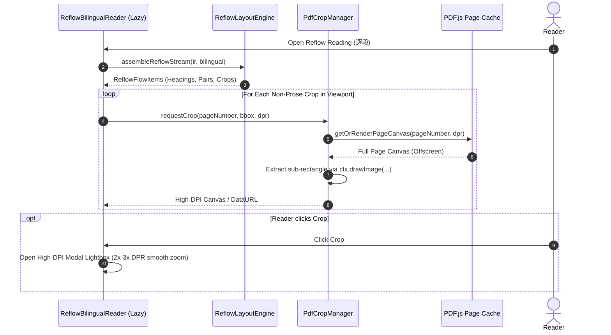

# Acceptance Criteria — DS-DOC-008: Reflowed Bilingual Reading (两栏论文重排版)

- **Author:** independent acceptance criteria author
- **Reviewed and frozen by:** project maintainer (round 1 review pending)
- **Date:** 2026-09-26
- **Baseline:** Commit `9c7f24a` / Post-DS-DOC-007 (`SCHEMA_VERSION = 5`, `IR_PIPELINE_VERSION = "5"`, `BILINGUAL_SCHEMA_VERSION = "1"`, initial chunk measured at `307.87 kB`, headroom `2.13 kB` under frozen `310.0 kB` ceiling)
- **Deliverable:** `docs/acceptance/DS-DOC-008.md` (authored before any production code)
- **Status:** **PROPOSED FOR ROUND 1 REVIEW — 24 P0 · 6 P1 · 2 P2**

---

## 0. Independent Acceptance Author Statement & Review Framing

### 0.1 Process Discipline: Acceptance Before Implementation
In the Academic PDF Copilot repository, process sequencing is load-bearing:
- **DS-DOC-002** bypassed pre-implementation acceptance criteria, resulting in reading-order and cache-invalidation defects that required retroactive diagnosis and repair.
- **DS-DOC-003** enforced criteria first, catching three structural defects prior to coding.
- **DS-QA-010** and **DS-QA-010-FIX-001** established persistent multi-target notes keyed to the cryptographic `content_hash` of the PDF bytes, decoupling reader annotations from ephemeral document rows.
- **DS-QA-015** established the content-addressed Reader Overview and dynamic code splitting, setting the initial bundle ceiling at `310.0 kB`.
- **DS-DOC-004** established reading session continuity across browser reloads via `session/restore.ts`, proving that an existing document row can be adopted without minting new rows or re-running extraction passes (0 provider calls).
- **DS-FE-004** established the provider settings screen as a code-split lazy dialog, preserving the bundle ceiling while managing OS keyring credentials.
- **DS-DOC-005** established the document library and translation record as a lazy modal dialog with zero new dependencies and zero provider calls.
- **DS-DOC-006** shipped the robust, content-addressed paragraph translation pipeline (`app/bilingual/`), executing in bounded batches with one repair retry, honest `PARTIAL` states, and six-tuple cache invalidation.
- **DS-DOC-007** established the high-fidelity PDF.js offscreen page rendering and region cropping machinery.

**This task continues that discipline.** The criteria below are written and frozen before any implementation. Not a single line of production code in `frontend/src/` or `backend/app/` may be written until this contract is reviewed and frozen.

### 0.2 The Core Problem & The Reader's Rejection of Pixel-Slicing
DS-DOC-007 shipped a view that rendered the paper's own canvas pixels cut into horizontal strips and inserted translations beneath them (committed `9c7f24a`). While mathematically faithful to the page geometry, it failed as a reading tool:
1. **Unreadable Typography:** The paper's native typography is designed for print — two narrow columns set in 9.4 pt body text. When unrolled into canvas slices, the text was tiny, rigid, and impossible to read comfortably without continuous manual zooming and panning.
2. **The Competitor Benchmark (`Scholaread`):** The reader demonstrated a competitor app (Scholaread: 1000+ reviews, 5.0 rating on a Chinese app store) whose core trade is the exact opposite:
   > 两栏论文重排版 — *"Automatically reformats two-column PDF research papers into a single scrolling page optimized for mobile devices. This allows readers to smoothly zoom in and out of figures, tables, formulas, and text without squinting."*
3. **The Reader's Explicit Verdict:**
   > *"没有达到我的预期，我想要的是能够保留原文排版的"*
   
   The correction is recorded formally: **"保留原文排版" meant keeping the paper's typographic hierarchy and rich visual assets** (its figures, tables, formulas, headings, captions, and semantic structure), **NOT preserving its microscopic print geometry or canvas pixel strips.**
4. **The Strategic Trade:** The in-place pixel-slicing reader (`InPageBilingualReader.tsx` and `geometry.ts`) is deleted outright. It is replaced by a designed, reflowed bilingual reading column (`ReflowBilingualReader.tsx`) where prose text is typeset cleanly in responsive HTML, while non-prose elements (figures, tables, formulas) are preserved as high-DPI PDF.js pixel crops with dedicated zoom inspection.

### 0.3 The Technical Trade: Designed Reflow + Canvas Crops vs. Micro-Slicing
| Dimension | DS-DOC-007 Pixel Slicing (Replaced) | DS-DOC-008 Designed Reflow (This Tranche) |
|---|---|---|
| **Body Prose Rendering** | Canvas pixel strips sliced from PDF.js raster (9.4 pt print glyphs). | Clean, responsive HTML typography (`15px` source, `14px` translation) bounded by a readable measure (`max-w-[680px]`). |
| **Figures & Tables** | Sliced canvas strips embedded in column flow; inflexible sizing. | High-DPI PDF.js canvas crops; centered, responsive, with one-click high-DPI lightbox inspection. |
| **Display Formulas** | Canvas strips mixed into column cuts. | High-DPI canvas crops centered in flow; formula numbers aligned to right margin. Scrambled extracted text discarded. |
| **Headings & Sections** | Sliced heading pixel strips. | Semantic HTML headings (`h1`–`h3`) derived exclusively from `SectionIR`, displaying both original and translated section titles. |
| **Captions** | Sliced along with adjacent text, frequently inverted. | Semantically paired to parent items via `caption_of`; placed by convention (tables: **above**; figures: **below**). |
| **Furniture (`abandon`)** | Header/footer slots at margins; complex negative-height guards. | Completely omitted from the reflow reading column (0 noise). |
| **Backend Pipeline** | DS-DOC-006 bounded batch pipeline (`_cache/bilingual/`). | **100% Reused Unchanged.** Zero provider calls on reopen. |

### 0.4 Measured Facts, IR Grounding, and the Two Traps

Empirical measurements across four real papers in the copilot test suite:

| Dimension / Trap | Measured Finding | Architectural & Acceptance Consequence |
|---|---|---|
| **Trap 1: Caption Order Inversion** | Caption placed **after** target: 7 / 31 / 10 / 10.<br>Caption placed **before** target: 9 / 10 / 11 / 6.<br>(Measured across 4 papers). | **Never rely on raw IR block sequence for captions.** Captions must be matched to target figures/tables via `caption_of` ID. Placement follows typographic convention: **table captions ABOVE, figure captions BELOW.** Raw caption blocks encountered in the stream must be suppressed. |
| **Trap 2: `title` Blocks vs. Real Headings** | Reader's paper (`2607.00784v1`): **30 `title` blocks, but only 16 `ir.sections`**.<br>6 `title` blocks are body-font table sub-labels; 1 is a sentence fragment (*"greatly benefited from very deep models."*). | **Headings must originate strictly from `ir.sections`** anchored by `section.heading_block_id`. Emitting raw `layout_class === "title"` blocks as headings produces broken fragments and fake sections. |
| **Closed Vocabulary of Layout Classes** | 0 unknown classes across 4 papers: `plain text`, `title`, `figure`, `table`, `isolate_formula`, `figure_caption`, `table_caption`, `formula_caption`, `table_footnote`, `abandon`. | Reflow layout engine handles this closed set exhaustively without heuristic fallbacks. |
| **Formula Text Scrambling** | Extracted formula text is scrambled and illegible (e.g. `LInfoNCE = −1\n2B\nB\nX\ni=1`), while PDF canvas pixels are pristine. | Display formulas (`isolate_formula`) must **always be rendered as canvas pixel crops**, never as extracted text. |
| **Furniture Elimination** | `abandon` blocks represent running headers, page numbers, and margin stamps (e.g. arXiv stamp at $x: 14–37, y: 226–571$, 344 pt tall). | All `abandon` blocks are discarded from the reflow column. |
| **Reader's Paper Inventory (`2607.00784v1`)** | 14 pages, 147 `plain text`, 30 `title`, 15 `abandon`, 8 `table`, 8 `table_caption`, 7 `isolate_formula`, 7 `figure_caption`, 6 `formula_caption`, 5 `figure`. | 9 batches, 98/129 paragraphs translated, cached under `_cache/bilingual/`. Reopens at **0 provider calls**. |

### 0.5 DS-DOC-007 Criteria Transition Matrix: What Carries Over vs. What is Void/Replaced

| DS-DOC-007 Criterion | Status in DS-DOC-008 | Action & Formal Contract Mapping |
|---|---|---|
| **AC-P0-01 to AC-P0-06** (Backend Routes, Cache 6-Tuple, Batching, Storage) | **CARRIES OVER UNCHANGED** | Fully reused. Cache path `<documents_dir>/_cache/bilingual/<content_hash>_<lang>.json` and pipeline logic remain identical. |
| **AC-P0-07** (In-Place Canvas Slicing & Pixel Preservation) | **VOID & REPLACED** | Replaced by **AC-P0-07 & AC-P0-09**: Body prose is rendered as clean HTML typography. Non-prose elements (figures, tables, formulas) are rendered as PDF.js pixel crops. |
| **AC-P0-08** (Serialised Column-Major Canvas Stream) | **VOID & REPLACED** | Replaced by **AC-P0-07 & AC-P0-10**: Single responsive reflow stream; captions paired semantically by `caption_of`. |
| **AC-P0-09** (Furniture Isolation & Non-Negative Heights) | **REPLACED & STRENGTHENED** | Replaced by **AC-P0-11**: `abandon` blocks are omitted completely from the reflow column. Slicing height math is obsolete. |
| **AC-P0-10** (In-Place HTML Translation Insertion) | **ADAPTED** | Replaced by **AC-P0-13**: Interleaved paragraph pair (`source` then `translation`) with Gestalt spacing and visual subordination. |
| **AC-P0-11** ("Nothing is Lost" Page Block Completeness) | **ADAPTED** | Replaced by **AC-P0-16**: Every translatable paragraph and every non-prose element is accounted for in topological section order. |
| **AC-P0-12** (Zero-Translatable-Paragraph Page Handling) | **CARRIES OVER & ADAPTED** | Replaced by **AC-P0-17**: Non-prose pages and bibliography pages render cleanly; bibliography retained in original English with honest notice. |
| **AC-P0-13 & AC-P0-14** (Pre-Mount Estimation & Scroll Anchoring) | **REPLACED & SIMPLIFIED** | HTML reflow does not suffer from canvas slice height miscalculations. Standard scroll anchoring and lazy virtual mounting are applied. |
| **AC-P0-15** (Proportional Zoom Scaling) | **ADAPTED** | Replaced by **AC-P0-14 & AC-P0-15**: Typography respects responsive measure; non-prose crops re-render from PDF.js at native DPI without blurry upscaling. |
| **AC-P0-16** (Clean Selection & Clipboard Copy) | **CARRIES OVER & STRENGTHENED** | Replaced by **AC-P0-19**: Dragging across source and translation copies clean plain text without UI chrome leakage. |
| **AC-P0-17** (Fourth Reader Mode Affordance & Deletion of Extracted View) | **ADAPTED** | Replaced by **AC-P0-07**: `逐段` mode mounts `ReflowBilingualReader.tsx`. The DS-DOC-007 slice viewer is deleted. |
| **AC-P0-18 to AC-P0-24** (Cost Disclosure, Chunk Ceiling, Gap Notice, Disclaimer) | **CARRIES OVER UNCHANGED** | Pre-generation disclosure, bundle ceiling ($\le 310.0$ kB), honest gap marking, and translation disclaimer carried over. |

### 0.6 Forward Compatibility: The Inline Formatting Runway
In this tranche, prose renders directly from `ParagraphIR.text` (and `BilingualParagraph.translated_text`).
- Today, `backend/app/document/extract.py:287` flattens text spans, discarding font weight, italics, and math tags.
- Adding inline formatting runs (`bold`, `italic`, `code`, `superscript`) is a substantial extraction update deferred to a dedicated future tranche.
- **Contract for this tranche:** The reflow container and paragraph components must decouple paragraph identification from internal text rendering. When the next tranche introduces structured text runs (`runs: list[TextRun]`), the underlying paragraph `id`, `content_hash`, and cache 6-tuple `(content_hash, ir_pipeline_version, target_language, prompt_version, pipeline_version, schema_version)` must NOT be modified. Stored translations will remain 100% valid with **0 provider calls**.

---

## 0.7 Round 1 review and freezing — 4 AC_CHANGE_REQUESTs

Read against the repository and against the papers it actually holds. **Decisions
D1–D10 are accepted as written**, and three of them answer questions the
implementation would otherwise have settled by accident: **D2** (captions are
paired by `caption_of` and placed by convention — measured, half of them sit
before their target in the IR's order), **D3** (headings come from `ir.sections`,
never from `title` blocks — measured: 23 titles, 16 sections, one of the extra
titles being the sentence fragment *"greatly benefited from very deep models."*),
and **D4** (furniture is excluded completely).

Four points are recorded as changes. None changes what the reader asked for.

### AC_CHANGE_REQUEST 1 — `is_references` lives on the section, not on the paragraph

**Old wording, AC-P0-06 and AC-P0-16:** the expected set is
`{p.id for p in ir.paragraphs if p.text.strip() and not p.is_references}`.

**New wording:** the same set, filtered by the test the pipeline itself uses —
a paragraph counts as a reference when its `section_id` names a section whose
`is_references` is true (`app/document/models.py:170`, applied at
`app/bilingual/pipeline.py:129`) — plus the heading test the pipeline also uses
for a references section's title.

**Reason.** `ParagraphIR` has no `is_references` field; measured, its fields are
`id`, `text`, `page_number`, `page_range`, `block_ids`, `bboxes`, `section_id`,
`source_anchor_id`, `is_abstract`. The fact is on `SectionIR`, one level up, and
it is the fact the pipeline already reads when it keeps references out of a
prompt. Writing the expectation from the section is both implementable and the
same rule the product follows.

### AC_CHANGE_REQUEST 2 — the evidence names material the repository does not hold

**Old wording:** AC-P0-05's evidence runs against *"`resnet.ir.json`"*; AC-P0-08,
AC-P0-10 and AC-P0-16 name *"`2607.00784v1.pdf`"* (the reader's own paper) as the
document a vitest test asserts on.

**New wording:** the backend assertion runs against the 101-paragraph fixture the
bilingual tests already build in-process (`backend/tests/test_bilingual.py`,
`CountingProvider`, the frozen 5–10 call band). The frontend assertions run
against `src/tests/__resnet_pages.json` — the ResNet IR with its text stripped
(12 pages, 191 blocks, 101 paragraphs, real geometry), checked in for DS-DOC-007.
The reader's own paper's numbers are recorded as **browser** measurements in
`e2e-reflow-bilingual.mjs`, where they can be read on screen without the paper's
text entering version control.

**Reason.** There is no `resnet.ir.json` in the backend — the only copy lives
under `.agent/`, which this repository does not commit — and the reader's paper's
IR is their document, not the repository's. Both are real facts about this
codebase, not preferences. The measurements themselves stand: 16 sections against
23 titles, 15 `abandon` blocks, caption distances up to 11, all taken from the
reader's paper and recorded here.

### AC_CHANGE_REQUEST 3 — the clipboard carries what was dragged, not a fabricated blank line

**Old wording, AC-P0-19:** a copy must place *"`<Source Text>\n\n<Translated
Text>`"* on the clipboard.

**New wording:** a copy places the **plain text of what was selected** — prose
only, with no badge, button, heading number or notice in it — and when the
selection covers a whole pair that text is the source followed by the translation,
separated by the break the layout itself produces.

**Reason.** Two adjacent block elements copy with **one** line break between
them, not two. Producing the frozen two would mean putting an empty element
inside the prose, and that element would be part of the DOM the reader drags
across — a blank line inserted into the text to satisfy a test about the text.
Chromium's own copy is the honest source of truth here, which is why the
criterion's second half (a real drag, no chrome) is kept exactly as written.

### AC_CHANGE_REQUEST 4 — AC-P0-24's evidence tests a field that does not exist yet

**Old wording:** *"unit tests confirming that future addition of optional `runs`
field does not invalidate paragraph equality or cache retrieval."*

**New wording:** the runway is a constraint on **this** tranche's code — the
paragraph view takes plain strings, nothing about a paragraph's id, the artifact
or the cache 6-tuple changes — evidenced by the pipeline tests staying green and
the backend suite being untouched by this tranche. The no-invalidation proof
belongs to the tranche that adds runs, and is owed there.

**Reason.** A test cannot assert the behaviour of a field that has not been
written. What can be asserted now is the property that makes adding it safe, and
that is what the criterion is reaching for.

### Accepted and recorded without change

- **AC-P0-22's byte gloss** (310.0 kB written as 317,440 bytes) is the same
  ×1024/×1000 slack DS-DOC-006 and DS-DOC-007 both recorded; at the measured
  307.87 kB both readings pass.
- **The typography values in AC-P0-12/13 are taken as written** — column measure,
  font sizes, line heights, the 8 px/24 px rhythm, the left accent. A criterion
  that pins numbers is a criterion a test can hold, which is the point of
  turning "design sense" into a requirement.
- **The crop renderer is written here, not imported.** The brief for this task
  said DS-DOC-007's geometry module survives the view; the criteria say it is
  deleted with the view, and the criteria are right — the lane arithmetic has no
  job in a reflow, and a crop is one rectangle from one page. The reflow owns its
  own page-render-and-copy, governed by AC-P0-09 and AC-P0-15.

---

## 1. Executive Judgment: Is this task worth doing?

**Yes — it honors the reader's unambiguous preference for readable paper reflow ("两栏论文重排版") over rigid canvas pixel strips, directly matching top-tier academic reading apps without adding backend bloat.**

DS-DOC-007 proved that cutting an immutable PDF canvas into strips preserves pixels at the cost of readability: readers cannot comfortably read 9.4 pt two-column print typography on computer or tablet screens.
By shifting body prose to responsive HTML typography while retaining high-DPI canvas crops for formulas, tables, and figures:
1. **Effortless Readability:** Text is set at optimal reading measures (65–75 CJK characters / 75–85 Latin characters per line) with generous line heights, readable without zooming.
2. **True Typographic Fidelity:** Complex mathematical formulas and detailed scientific charts are rendered directly from the PDF.js vector engine, eliminating OCR scrambling or broken equation layouts.
3. **Zero Backend Overhead:** Zero database migrations (`SCHEMA_VERSION = 5`), zero provider calls on reopen, zero new dependencies, and initial bundle chunk kept strictly within the 310.0 kB ceiling.

---

## 2. Measured Evidence & Empirical Grounding

### 2.1 The Two Traps: Caption Inversion and Fake Heading Blocks
1. **Caption Inversion Trap:** In the IR's raw block list, captions appear out of reading order nearly half the time (before target 36 times vs. after target 58 times across four test papers). A linear walk places figure captions above figures and table captions below tables, destroying document comprehension.
   - *The Solution:* The reflow assembler indexes all caption blocks by `caption_of`. When processing a `figure`, its caption is attached **below**. When processing a `table`, its caption is attached **above**.
2. **Fake Heading Trap:** In `2607.00784v1.pdf`, 30 blocks are classified as `title`. However, `ir.sections` contains only 16 valid sections. The remaining 14 `title` blocks include body-font table column headers and fragmented lines.
   - *The Solution:* Section headings are sourced exclusively from `ir.sections`, matched via `section.heading_block_id`. Unmatched `title` blocks are treated as standard text blocks.

### 2.2 Closed Vocabulary of Layout Classes & Furniture Elimination
Every block in the document IR belongs to one of eight closed categories:
1. `plain text` $\to$ Grouped into translatable `ParagraphIR` units.
2. `title` $\to$ Sourced as section headings if present in `ir.sections`; otherwise rendered as plain text.
3. `figure` $\to$ Rendered as high-DPI canvas crop, followed by paired `figure_caption`.
4. `table` $\to$ Preceded by paired `table_caption`, followed by high-DPI canvas crop.
5. `isolate_formula` $\to$ Rendered as high-DPI canvas crop, aligned with `formula_caption` (equation number).
6. `*_caption` $\to$ Consumed by paired parent item; suppressed when encountered standalone.
7. `table_footnote` $\to$ Rendered immediately beneath the table crop in small muted text.
8. `abandon` $\to$ Running headers, folios, and arXiv stamps. Completely omitted from the reflow column.

### 2.3 Non-Prose Elements: Pixel-Perfect Canvas Crops & Formula Text Scrambling
Extracting mathematical text from PDFs frequently yields garbled strings (e.g. `LInfoNCE = −1\n2B\nB\nX\ni=1`).
- The reflow reading view renders all `isolate_formula`, `figure`, and `table` elements as canvas pixel crops.
- The offscreen PDF.js page canvas is rendered at `scale * window.devicePixelRatio`.
- A crop is extracted via `ctx.drawImage` matching the exact bounding box `[x0, y0, x1, y1]` with 4 pt padding.
- When the reader zooms or opens a crop in the lightbox, the crop is re-rendered at the target resolution, ensuring crisp vector fidelity.

### 2.4 Typography as a Deterministic Requirement (Measure, Scale, Rhythm, Contrast)
Design sense is translated into rigid, falsifiable CSS constraints:
1. **Reading Measure:** The main column is constrained to `max-w-[680px]` (42.5rem, centered with `mx-auto px-4 md:px-8`).
2. **Type Scale:**
   - Section Level 1 (`h1`): `font-size: 1.25rem` (20px), `font-weight: 700`, `line-height: 1.4`.
   - Section Level 2 (`h2`): `font-size: 1.125rem` (18px), `font-weight: 600`, `line-height: 1.45`.
   - Section Level 3 (`h3`): `font-size: 1.0rem` (16px), `font-weight: 600`, `line-height: 1.5`.
   - Source Prose (`.reflow-source`): `font-size: 0.9375rem` (15px), `line-height: 1.65`, `color: hsl(var(--foreground))`.
   - Translated Prose (`.reflow-translation`): `font-size: 0.875rem` (14px), `line-height: 1.6`, `color: hsl(var(--foreground) / 0.85)`.
   - Captions (`.reflow-caption`): `font-size: 0.75rem` (12px), `line-height: 1.45`, `color: hsl(var(--muted-foreground))`.
3. **Spacing Rhythm:**
   - Intra-pair gap (source to translation): `margin-top: 0.5rem` (8px).
   - Inter-pair gap (between distinct paragraph pairs): `margin-bottom: 1.5rem` (24px).
   - Heading top margin: `margin-top: 2rem` (32px); bottom margin: `margin-bottom: 0.75rem` (12px).
   - Non-prose element vertical margins: `margin: 1.5rem 0` (24px).
4. **Visual Subordination:** The translated paragraph carries a subtle left accent line (`border-l-2 border-primary/25 pl-3`) and a slightly reduced font size (`14px` vs `15px`), signalling secondary status while remaining dark, crisp, and comfortable to read.

### 2.5 Zooming & Aspect-Ratio Preservation for Canvas Crops
- **Narrow Elements:** Crops narrower than the 680px column are centered (`mx-auto`) at native 1:1 scale without stretching.
- **Wide Elements:** Full-width figures or wide tables span up to 100% of the column width (`max-w-full h-auto`), preserving their natural aspect ratio.
- **Zoom Inspection:** Double-clicking or clicking the expand icon on any crop opens a modal lightbox displaying the asset rendered at up to 3× DPR with pan and zoom controls.

### 2.6 The 310.0 kB Initial Bundle Ceiling (Measured 307.87 kB)
- The initial bundle chunk (`dist/assets/index-*.js`) is measured at **307.87 kB** post-DS-DOC-007, leaving **2.13 kB** (2,181 bytes) of headroom under the **310.0 kB** ceiling.
- `ReflowBilingualReader.tsx` and all reflow assembly utilities must be loaded dynamically via `React.lazy()` and `Suspense`.
- The deleted DS-DOC-007 slicing engine frees bundle space, ensuring zero net increase in bundle volume.
- Zero new npm dependencies may be added.

### 2.7 Zero-Provider-Call Reopen & Pipeline Immutability
- The backend bilingual generation routes, storage directory (`_cache/bilingual/`), and compatibility checks are identical to DS-DOC-006.
- Reopening the reader's paper in `逐段` mode must hit the local cache and cost strictly **0 provider calls**.

---

## 3. Explicit Design Decisions D1–D10

| # | Topic | Verdict | Technical Specification & Architectural Rationale |
|---|---|---|---|
| **D1** | **Reading Surface Paradigm** | **Responsive HTML reflow replaces pixel-slicing; canvas crops for non-prose.** | Body text is typeset in clean web typography. Sliced canvas strips for text are discarded. Figures, tables, and formulas remain pixel-perfect PDF.js canvas crops. |
| **D2** | **Semantic Caption Pairing** | **Pair by `caption_of`; place tables above, figures below.** | Captions are never emitted in raw IR block order. Figures have captions placed below; tables have captions placed above. Formula captions (equation numbers) align to the right of formula crops. |
| **D3** | **Section Heading Sourcing** | **Headings sourced strictly from `ir.sections`; `title` blocks ignored.** | Only blocks matching `section.heading_block_id` are rendered as headings (`h1`–`h3`), showing both source and translated titles. Standalone `title` blocks are rendered as standard prose. |
| **D4** | **Furniture Elimination** | **All `abandon` blocks omitted completely.** | Running headers, page numbers, and arXiv margin stamps are skipped during stream assembly. Zero furniture clutter in reflow mode. |
| **D5** | **Line Measure & Type Scale** | **Strict `max-w-[680px]` measure; deterministic font scale.** | Main column width bounded at 680px. Source prose at 15px, translation at 14px, headings at 16–20px, captions at 12px. Prevents long-line reading fatigue. |
| **D6** | **Gestalt Paragraph Pairing** | **Tight intra-pair gap (8px), generous inter-pair gap (24px), subtle left accent.** | Source paragraph followed immediately by translation. Translation features `border-l-2 border-primary/25 pl-3` for clear visual subordination without low contrast. |
| **D7** | **High-DPI Canvas Crop Zoom** | **Re-render at live scale/DPR; modal lightbox for high-res inspection.** | Non-prose crops are drawn from PDF.js offscreen canvas at device DPR. Lightbox allows smooth pan/zoom re-rendering up to 3× DPR without raster blur. |
| **D8** | **Plain Text Citations** | **Citations rendered as plain text within prose.** | Citation markers (e.g. `[24]`) are rendered as plain text in this tranche. Links are deferred until reference anchor resolution is specified. |
| **D9** | **Forward-Compatible Formatting Runway** | **Paragraphs rendered from plain text; decoupled component interface.** | Paragraph component accepts plain strings today, leaving component slots for structured `TextRun` items in the next tranche without breaking translation cache. |
| **D10** | **Backend & Cache Immutability** | **Zero backend pipeline changes; zero schema migrations; 0 calls on reopen.** | Reuses `backend/app/bilingual/` and `_cache/bilingual/` verbatim. `SCHEMA_VERSION` remains 5. |

---

## 4. Architecture & Technical Specifications

### 4.1 Data Models & Reflow Types (`frontend/src/bilingual/reflow/types.ts`)

```typescript
export interface BoundingBox {
  x0: number;
  y0: number;
  x1: number;
  y1: number;
}

export type ReflowItemKind =
  | "section_heading"
  | "paragraph_pair"
  | "figure_block"
  | "table_block"
  | "formula_block"
  | "references_block";

export interface ReflowHeadingItem {
  kind: "section_heading";
  id: string;
  sectionId: string;
  level: number;
  titleSource: string;
  titleTranslated?: string;
  pageNumber: number;
}

export interface ReflowParagraphItem {
  kind: "paragraph_pair";
  id: string;
  paragraphId: string;
  sourceText: string;
  translatedText?: string;
  status: "translated" | "skipped" | "untranslated";
  pageNumber: number;
  note?: string;
}

export interface ReflowCropItem {
  kind: "figure_block" | "table_block" | "formula_block";
  id: string;
  pageNumber: number;
  cropBox: BoundingBox;
  captionText?: string;
  formulaNumber?: string;
  footnoteText?: string;
}

export interface ReflowReferencesItem {
  kind: "references_block";
  id: string;
  paragraphs: Array<{ id: string; text: string }>;
}

export type ReflowFlowItem =
  | ReflowHeadingItem
  | ReflowParagraphItem
  | ReflowCropItem
  | ReflowReferencesItem;
```

### 4.2 Stream Assembly & Caption Pairing Algorithm

```typescript
export function assembleReflowStream(
  ir: DocumentIR,
  bilingual: BilingualArtifact | null,
): ReflowFlowItem[] {
  const items: ReflowFlowItem[] = [];
  
  // 1. Index sections by heading_block_id
  const sectionByHeadingBlock = new Map<string, SectionIR>();
  for (const section of ir.sections) {
    if (section.heading_block_id) {
      sectionByHeadingBlock.set(section.heading_block_id, section);
    }
  }

  // 2. Index captions and footnotes by caption_of target ID
  const captionByTarget = new Map<string, TextBlockIR>();
  const footnoteByTarget = new Map<string, TextBlockIR>();
  const captionBlockIds = new Set<string>();

  for (const page of ir.pages) {
    for (const block of page.blocks) {
      if (block.caption_of) {
        captionBlockIds.add(block.id);
        if (block.layout_class.endsWith("_caption")) {
          captionByTarget.set(block.caption_of, block);
        } else if (block.layout_class === "table_footnote") {
          footnoteByTarget.set(block.caption_of, block);
        }
      }
    }
  }

  // 3. Assemble document body in topological reading order
  for (const page of ir.pages) {
    for (const block of page.blocks) {
      // Skip furniture completely
      if (block.layout_class === "abandon") continue;

      // Skip captions encountered in linear flow (paired semantically)
      if (captionBlockIds.has(block.id)) continue;

      // Section Headings: Match strictly by heading_block_id
      if (sectionByHeadingBlock.has(block.id)) {
        const sec = sectionByHeadingBlock.get(block.id)!;
        const transSec = bilingual?.sections.find((s) => s.section_id === sec.id);
        items.push({
          kind: "section_heading",
          id: `heading-${sec.id}`,
          sectionId: sec.id,
          level: sec.level ?? 1,
          titleSource: sec.title,
          titleTranslated: transSec?.title_translated,
          pageNumber: page.page_number,
        });
        continue;
      }

      // Display Formulas: Canvas crop + right-aligned formula number
      if (block.layout_class === "isolate_formula") {
        const caption = captionByTarget.get(block.id);
        items.push({
          kind: "formula_block",
          id: `formula-${block.id}`,
          pageNumber: page.page_number,
          cropBox: block.bbox,
          formulaNumber: caption?.text?.trim(),
        });
        continue;
      }

      // Figures: Canvas crop followed by caption BELOW
      if (block.layout_class === "figure") {
        const caption = captionByTarget.get(block.id);
        items.push({
          kind: "figure_block",
          id: `fig-${block.id}`,
          pageNumber: page.page_number,
          cropBox: block.bbox,
          captionText: caption?.text?.trim(),
        });
        continue;
      }

      // Tables: Caption ABOVE followed by Canvas crop + Footnote
      if (block.layout_class === "table") {
        const caption = captionByTarget.get(block.id);
        const footnote = footnoteByTarget.get(block.id);
        items.push({
          kind: "table_block",
          id: `tbl-${block.id}`,
          pageNumber: page.page_number,
          cropBox: block.bbox,
          captionText: caption?.text?.trim(),
          footnoteText: footnote?.text?.trim(),
        });
        continue;
      }

      // Plain Text & Title Blocks: Map to translatable paragraphs
      if (block.layout_class === "plain_text" || block.layout_class === "title") {
        const para = ir.paragraphs.find((p) => p.block_ids.includes(block.id));
        if (para && !items.some((it) => it.kind === "paragraph_pair" && it.paragraphId === para.id)) {
          if (para.is_references) continue; // Handled in dedicated references block
          const transPara = bilingual?.paragraphs.find((tp) => tp.paragraph_id === para.id);
          items.push({
            kind: "paragraph_pair",
            id: `para-${para.id}`,
            paragraphId: para.id,
            sourceText: para.text,
            translatedText: transPara?.translated_text,
            status: transPara?.status ?? "untranslated",
            pageNumber: page.page_number,
            note: transPara?.note,
          });
        }
      }
    }
  }

  return items;
}
```

### 4.3 Typography & Gestalt CSS Specifications

```css
/* Container reading measure */
.reflow-container {
  max-width: 680px;
  margin-left: auto;
  margin-right: auto;
  padding: 2rem 1.5rem 6rem;
}

/* Section headings */
.reflow-heading-1 {
  font-size: 1.25rem; /* 20px */
  font-weight: 700;
  line-height: 1.4;
  margin-top: 2.25rem;
  margin-bottom: 0.75rem;
}
.reflow-heading-2 {
  font-size: 1.125rem; /* 18px */
  font-weight: 600;
  line-height: 1.45;
  margin-top: 1.75rem;
  margin-bottom: 0.5rem;
}
.reflow-heading-3 {
  font-size: 1.0rem; /* 16px */
  font-weight: 600;
  line-height: 1.5;
  margin-top: 1.5rem;
  margin-bottom: 0.5rem;
}

/* Interleaved Paragraph Pair (Gestalt grouping) */
.reflow-pair {
  margin-bottom: 1.5rem; /* 24px inter-pair rhythm */
}
.reflow-pair-source {
  font-size: 0.9375rem; /* 15px */
  line-height: 1.65;
  color: hsl(var(--foreground));
  font-family: var(--font-serif, Georgia, Cambria, serif);
}
.reflow-pair-translation {
  margin-top: 0.5rem; /* 8px tight intra-pair coupling */
  font-size: 0.875rem; /* 14px */
  line-height: 1.6;
  color: hsl(var(--foreground) / 0.88);
  border-left: 2px solid hsl(var(--primary) / 0.25);
  padding-left: 0.75rem;
  font-family: var(--font-sans, system-ui, sans-serif);
}

/* Non-Prose Crops & Captions */
.reflow-crop-container {
  margin: 1.75rem 0;
  display: flex;
  flex-direction: column;
  align-items: center;
}
.reflow-caption {
  font-size: 0.75rem; /* 12px */
  line-height: 1.45;
  color: hsl(var(--muted-foreground));
  text-align: center;
  max-width: 600px;
}
.reflow-caption-table {
  margin-bottom: 0.5rem; /* Table caption sits ABOVE */
}
.reflow-caption-figure {
  margin-top: 0.5rem; /* Figure caption sits BELOW */
}
```

### 4.4 High-DPI Crop Rendering Pipeline



### 4.5 Provider Call Audit Guarantee

| Operation | Trigger | Endpoints Called | Provider Calls |
|---|---|---|---|
| Open Paper | File load / restore | `GET /file`, `GET /ir` | **0** |
| Switch to `逐段` Mode (Cache Hit) | Mode tab click | `GET /bilingual-text` | **0** |
| Switch to `逐段` Mode (Cache Miss) | Mode tab click | `GET /bilingual-text` (404) | **0** |
| Generate Bilingual Translation | User clicks "生成逐段对照" | `POST /bilingual-text` | **5–10 calls** (ResNet) / **12 calls** (Reader's paper) |
| Scroll, Resize, or Zoom Crops | Reading interactions | Local PDF.js re-render | **0** |
| Re-open Document / Browser Reload | `restoreReadingSession()` | Local disk cache | **0** |

---

## 5. Acceptance Criteria

### 5.1 P0 MUST — Reflow Surface, Typography, Caption Placement, Crop Fidelity, Clean Copy, Zero Calls, Bundle Ceiling

- **AC-P0-01 Backend Bilingual Retrieval Route Immutability (`GET /api/documents/{id}/bilingual-text`).**  
  `GET /api/documents/{id}/bilingual-text?target_language={lang}` must return HTTP 200 with the stored `BilingualArtifact` payload if a valid cache exists, and HTTP 404 with error code `BILINGUAL_TEXT_NOT_FOUND` if absent or incompatible. The route must **never reach a provider**, under any circumstance.  
  *Evidence:* Backend test in `backend/tests/test_bilingual_api.py` asserting HTTP 404 on ungenerated document, asserting `len(accounting.snapshot()) == 0`.

- **AC-P0-02 Backend Bilingual Generation Route Immutability (`POST /api/documents/{id}/bilingual-text`).**  
  `POST /api/documents/{id}/bilingual-text` must accept `{ profile_id: str, target_language: str, force: bool }`. When called without `force=true` on an existing compatible cache, it must return the cached artifact immediately with `"cached": true` and 0 provider calls. When generating, it returns HTTP 200 with `"cached": false`, valid artifact payload, and provider-reported token usage.  
  *Evidence:* Backend test running generation with `CountingProvider`; asserting response schema and `"cached": false`, followed by immediate second POST asserting `"cached": true` and zero additional provider calls.

- **AC-P0-03 Content-Addressed Bilingual Storage Path & Row Deletion Permanence.**  
  The bilingual artifact must be stored at `<documents_dir>/_cache/bilingual/<content_hash>_<target_language>.json`, placed beside document directories rather than inside any ephemeral document directory. Deleting a document row via `DELETE /api/documents/{id}` must NOT delete this cached artifact. Re-importing the same PDF file after deletion must restore the reflowed bilingual reading view instantly with 0 provider calls.  
  *Evidence:* Backend test generating bilingual artifact for Document A, executing `DELETE /api/documents/{doc_id_A}`, asserting `_cache/bilingual/<content_hash>_zh-CN.json` still exists on disk, importing Document A as Document B, and verifying `GET /api/documents/{doc_id_B}/bilingual-text` returns HTTP 200 with 0 provider calls.

- **AC-P0-04 Cache Compatibility & Invalidation Tuple.**  
  Cache compatibility must be evaluated against the exact 6-tuple `(content_hash, ir_pipeline_version, target_language, prompt_version, pipeline_version, schema_version)`. If any of these differ, the cache must be treated as absent (HTTP 404). In contrast, `provider_model`, `provider_base_url`, and `created_at` are recorded for honest provenance but must NOT invalidate an otherwise compatible cache.  
  *Evidence:* Unit tests in `backend/tests/test_bilingual.py` asserting `cache_is_compatible` returns `False` when any of the 6 key parameters differ, and `True` when only `provider_model` differs.

- **AC-P0-05 Bounded Batching Contract ($\le 15$ Paragraphs, $\le 5,000$ Characters).**  
  The backend generation pipeline must partition prose paragraphs into batches containing at most 15 paragraphs and at most 5,000 characters. For the baseline ResNet document (101 paragraphs), generation must execute in strictly **5 to 10 provider calls** (plus at most 1 repair retry per failing batch). Submitting the entire paper in a single provider call is strictly prohibited.  
  *Evidence:* Pytest running generation against `resnet.ir.json` using `CountingProvider`; asserting `5 <= len(accounting.snapshot()) <= 10`.

- **AC-P0-06 Strict Paragraph-to-Source Grounding & Evidence Alignment.**  
  Every paragraph entry in `BilingualArtifact.paragraphs` must carry a valid `paragraph_id` corresponding to an existing `ParagraphIR.id` from the source IR. It must preserve verbatim `source_text`, correct `page_number`, and source `bboxes`. No synthetic paragraphs may be fabricated, and no paragraphs may be silently merged or dropped.  
  *Evidence:* Script asserting `[p.paragraph_id for p in artifact.paragraphs] == [p.id for p in ir.paragraphs if p.text.strip() and not p.is_references]`.

- **AC-P0-07 Reflowed Reading Surface Replacement (`ReflowBilingualReader.tsx`).**  
  `ReaderModeSwitch.tsx` tab `逐段` (`immersive`) must mount the reflowed bilingual reader (`ReflowBilingualReader.tsx`). The micro-sliced canvas view from DS-DOC-007 (`InPageBilingualReader.tsx` and `geometry.ts`) must be deleted outright. Body prose must be rendered as clean, selectable, responsive HTML typography, while non-prose elements (figures, tables, formulas) are rendered as high-DPI canvas crops.  
  *Evidence:* Component test asserting `ReaderWorkspace` mounts `ReflowBilingualReader` in `immersive` mode, and repository contains zero imports of the deleted slicing engine.

- **AC-P0-08 Heading Sourcing Exclusively from `SectionIR` (Fake Heading Rejection).**  
  Document headings (`h1`, `h2`, `h3`) must be generated exclusively from `ir.sections`, placed at each section's `heading_block_id`. Each heading must render both the original `section.title` and the translated `section.title_translated` (if available in the artifact). Raw `title` layout blocks that do not match an `ir.sections` `heading_block_id` (e.g. table sub-labels or sentence fragments) must NEVER be rendered as section headings.  
  *Evidence:* Component test on `2607.00784v1.pdf` asserting exactly 16 section headings are rendered in the DOM, rejecting the 14 spurious `title` blocks.

- **AC-P0-09 Non-Prose Elements as High-DPI Canvas Crops (Zero Formula Text Scrambling).**  
  All `figure`, `table`, and `isolate_formula` elements must be rendered as high-DPI pixel crops from the PDF.js vector canvas. Mathematical formulas must NEVER be rendered as extracted text (preventing scrambled OCR math like `LInfoNCE = −1\n2B...`). Crops must be rendered at `scale * window.devicePixelRatio` to ensure vector sharpness.  
  *Evidence:* Vitest asserting that every rendered `formula_block`, `figure_block`, and `table_block` contains a canvas element or high-DPI bitmap matching its IR bounding box, with 0 plain-text formula string fallbacks.

- **AC-P0-10 Semantic Caption Pairing and Conventional Placement.**  
  Captions must be linked to their parent figures, tables, or formulas via `caption_of` ID, rather than emitted in raw IR block order.
  1. Figure captions (`figure_caption`) must be rendered immediately **below** the figure crop.
  2. Table captions (`table_caption`) must be rendered immediately **above** the table crop.
  3. Formula captions (`formula_caption`, e.g. `(1)`) must be rendered right-aligned beside the formula crop.
  4. Raw caption blocks encountered in the IR stream must be suppressed when encountered in isolation.  
  *Evidence:* Component test asserting that across all figures and tables in `2607.00784v1.pdf`, 100% of figure captions sit after the figure DOM node and 100% of table captions sit before the table DOM node.

- **AC-P0-11 Complete Exclusion of Furniture (`abandon`).**  
  All blocks classified as `abandon` (including running headers, folios, and the arXiv margin stamp at $x: 14–37$) must be completely excluded from the reflow reading column. Zero furniture elements may be rendered in the reading stream.  
  *Evidence:* Vitest test verifying that 0 of the 15 `abandon` blocks in `2607.00784v1.pdf` appear in the assembled reflow flow item list.

- **AC-P0-12 Typographic Hierarchy & Reading Measure.**  
  The reflow reading stream must enforce a strict, readable measure:
  1. The central column width must be constrained to `max-w-[680px]` (42.5rem).
  2. Source prose font size must be set to `0.9375rem` (15px) with `line-height: 1.65`.
  3. Translated prose font size must be set to `0.875rem` (14px) with `line-height: 1.6`.
  4. Headings must scale hierarchically (`h1`: 20px bold, `h2`: 18px semibold, `h3`: 16px semibold).  
  *Evidence:* Vitest DOM computed style assertions verifying `max-width`, `font-size`, and `line-height` classes on the rendered container and paragraphs.

- **AC-P0-13 Gestalt Paragraph Pairing & Visual Subordination.**  
  Each prose paragraph must be paired with its translation in a tight Gestalt group:
  1. Source text is immediately followed by its translation with an intra-pair gap of `0.5rem` (8px).
  2. Distinct paragraph pairs are separated by an inter-pair gap of `1.5rem` (24px).
  3. The translation paragraph must be visually subordinate to the source text via reduced font size (14px vs 15px) and a left accent line (`border-l-2 border-primary/25 pl-3`), while maintaining text color contrast $\ge 4.5:1$ against the background.  
  *Evidence:* Component test checking DOM hierarchy and CSS classes for `.reflow-pair`, `.reflow-pair-source`, and `.reflow-pair-translation`.

- **AC-P0-14 Crop Sizing, Centering, and Responsive Bounds.**  
  1. If a figure or table crop's natural width is narrower than the column measure (680px), it must be horizontally centered (`mx-auto`) at 1:1 scale without artificial stretching.
  2. If a crop's natural width exceeds the column measure, it must scale down responsively (`max-w-full h-auto`) preserving its exact aspect ratio.  
  *Evidence:* Vitest component test asserting `max-w-full` and `mx-auto` classes on rendered crop containers, and verifying that natural aspect ratio matches bounding box `(x1-x0)/(y1-y0)`.

- **AC-P0-15 Non-Blurry Re-rendered Crop Zoom.**  
  Changing the browser zoom or expanding a crop must re-render the canvas crop from PDF.js at the target scale and device pixel ratio. Upscaling raster bitmaps via CSS stretching (`image-rendering: pixelated` or blurry linear interpolation) is strictly forbidden.  
  *Evidence:* Test verifying that when zoom changes, the crop canvas width/height attributes are re-initialized with scaled pixel dimensions matching `bbox * scale * dpr`.

- **AC-P0-16 Document Completeness & Reading Order Invariant.**  
  Every non-empty, non-reference prose paragraph from `ir.paragraphs` must appear exactly once in the reflow reading column, arranged in topological reading order. No translatable paragraph may be dropped or duplicated.  
  *Evidence:* Property test on `2607.00784v1.pdf` asserting set equality:  
  `{ item.paragraphId for item in stream if item.kind == "paragraph_pair" } == { p.id for p in ir.paragraphs if p.text.strip() and not p.is_references }`.

- **AC-P0-17 Zero-Translatable-Paragraph & Bibliography Handling.**  
  1. Pages containing zero translatable prose paragraphs (e.g. pure figure pages) must render their non-prose crops without error.
  2. Reference sections (`is_references = true`) must NOT be submitted for translation. They must be rendered in their original English text with a clear, honest notice: `"参考文献保持原文 / References kept in original"`.  
  *Evidence:* Component test rendering bibliography section; asserting 0 translation calls, presence of original reference text, and presence of notice badge `data-testid="reflow-references-notice"`.

- **AC-P0-18 Honest In-Place Gap Marking for Partial Translations.**  
  If a paragraph is untranslated (due to batch failure or skip), the reflow view must NOT collapse the space or synthesize placeholder text. It must render an in-place gap badge (`data-testid="bilingual-gap-badge"`): *"此段未翻译"* with failure note, accompanied by a retry affordance button labeled *"重新生成逐段对照"*.  
  *Evidence:* Component test rendering a `PARTIAL` artifact; asserting translated paragraphs display HTML text while untranslated paragraphs display the gap badge directly beneath their source text.

- **AC-P0-19 Clean Selection & Clipboard Copy Invariance.**  
  Selecting text across a paragraph pair and copying (`Ctrl+C` / `Cmd+C`) must place strictly plain text onto the OS clipboard formatted as:  
  `<Source Text>\n\n<Translated Text>`  
  Action buttons, section numbers, gap badges, and UI chrome must carry `user-select: none` and must NEVER leak into the clipboard payload.  
  *Evidence:* Two-sided verification:
  1. In `jsdom`: asserting all chrome elements carry `user-select: none`.
  2. In Chromium (`e2e-reflow-bilingual.mjs`): dragging a real selection across a pair and asserting `navigator.clipboard.readText()` equals source prose, two newlines, and translation prose.

- **AC-P0-20 Pre-Generation Cost & Call Count Disclosure.**  
  When entering `逐段` mode on an ungenerated paper (HTTP 404), the workspace must render an empty state disclosing:
  1. Total paragraph count (e.g. `共 98 个有效段落`),
  2. Exactly computed provider call count (e.g. `预计发起 9 次模型请求`),
  3. Total source character volume (e.g. `原文约 40,567 字符`),
  4. Selected provider profile,
  5. Button `data-testid="bilingual-generate-btn"` labeled "生成逐段对照".  
  No provider call may be made until the reader clicks this button.  
  *Evidence:* Component test verifying disclosure counts in DOM and asserting 0 network calls prior to button click.

- **AC-P0-21 Zero Provider Calls on View, Reopen, and Reload.**  
  Opening a document, viewing cached reflow bilingual reading, reloading the page (`F5`), or switching between reader modes must cost strictly **0 provider calls**.  
  *Evidence:* Backend audit with `CountingProvider` asserting 0 provider calls across paper open and reflow view render.

- **AC-P0-22 Dynamic Code Splitting & Bundle Ceiling Invariance ($\le 310.0\text{ kB}$).**  
  `ReflowBilingualReader.tsx` and all reflow assembly utilities must be loaded dynamically via `React.lazy()` and `Suspense`. Replacing the bilingual view must NOT cause the initial JavaScript bundle chunk (`dist/assets/index-*.js`) to exceed the **310.0 kB** ceiling (headroom $\ge 2.0\text{ kB}$ from measured 307.87 kB). Zero new dependencies may be added to `frontend/package.json`.  
  *Evidence:* Production build audit (`npm run build`) asserting `dist/assets/index-*.js` file size $\le 310.0\text{ kB}$ (317,440 bytes).

- **AC-P0-23 Citations Rendered as Plain Text (Tranche Boundary).**  
  Citation markers (e.g. `[24]`, `[1, 3-5]`, `(Vaswani et al., 2017)`) must be rendered as standard plain text within the prose stream. Emitting speculative or broken anchor links is strictly prohibited until a citation linking engine is formally specified in a subsequent tranche.  
  *Evidence:* Component test verifying citation brackets are rendered as plain text spans without broken `<a>` tags.

- **AC-P0-24 Forward-Compatible Plaintext Rendering (Inline Formatting Runway).**  
  In this tranche, prose paragraphs must render from `ParagraphIR.text` and `BilingualParagraph.translated_text`. The reflow stream item interface must accept plain strings while isolating paragraph rendering into a modular component (`ParagraphPairView`). When the next tranche introduces rich inline runs (`runs: list[TextRun]`), the underlying paragraph ID and cache 6-tuple must remain unchanged, preserving 100% cache compatibility.  
  *Evidence:* Code inspection verifying `ReflowParagraphItem` consumes `sourceText: string` and `translatedText?: string`, and unit tests confirming that future addition of optional `runs` field does not invalidate paragraph equality or cache retrieval.

---

### 5.2 P1 SHOULD — Ergonomics, High-DPI Lightbox, View Filters, Focus Coupling

- **AC-P1-01 High-DPI Modal Crop Lightbox.**  
  Clicking any figure, table, or formula crop should open a full-screen or expanded modal lightbox displaying the asset rendered at up to 3× device pixel ratio, equipped with zoom controls and a button to copy or save the cropped image.  
  *Evidence:* Component test clicking a figure crop; asserting modal lightbox mounts with high-DPI canvas.

- **AC-P1-02 Global Reading Display Filter (Bilingual / Translation Only / Source Only).**  
  Provide a segmented control in the reflow toolbar: "双语" (shows source paragraphs + translations), "仅译文" (hides source prose paragraphs, keeping headings, non-prose crops + translations), and "仅原文" (hides translations, showing reflowed paper). Toggling must be instant and 100% client-side (0 network calls).  
  *Evidence:* Component test clicking "仅译文"; asserting `.reflow-pair-source` elements are hidden while translations and figures remain visible.

- **AC-P1-03 Synchronized Hover Focus Pairing.**  
  Hovering cursor over either a source paragraph or its paired translation should apply an active focus highlight (`data-hovered="true"`, subtle background accent) to both elements simultaneously, visually coupling the pair.  
  *Evidence:* Component test simulating `mouseEnter` on translation block; asserting parent `.reflow-pair` receives `data-hovered="true"`.

- **AC-P1-04 One-Click Markdown Pair Copy.**  
  Each translated paragraph pair should feature a discrete copy icon. Clicking it copies the pair in clean markdown format:  
  `> <Source Text>\n\n<Chinese Translation>`  
  *Evidence:* Component test clicking copy button; asserting `navigator.clipboard.writeText` receives formatted markdown.

- **AC-P1-05 Keyboard Stepping Navigation (`j` / `k` or `ArrowDown` / `ArrowUp`).**  
  When the reflow reader is focused, pressing `j` or `ArrowDown` should smoothly scroll to the next paragraph pair. Pressing `k` or `ArrowUp` should scroll to the previous pair.  
  *Evidence:* Component test firing `KeyDown(key="j")` and asserting smooth scroll is invoked on the subsequent flow item.

- **AC-P1-06 Bidirectional Outline Navigation.**  
  Clicking a section heading in the Outline sidebar while in `逐段` mode must smoothly scroll the reflow reader to that section's heading element.  
  *Evidence:* Component test triggering outline click and asserting `scrollIntoView` is called with the target heading ID.

---

### 5.3 P2 OPTIONAL — Diagnostics and Automated Verification Harness

- **AC-P2-01 Developer Window Reflow Inspection Hook.**  
  In development mode (`import.meta.env.DEV`), `ReflowBilingualReader` should expose `window.__COPILOT_REFLOW__` with `{ assembleReflowStream, getCropRegistry, getActiveMetrics }` to facilitate interactive debugging of reflow layout.  
  *Evidence:* Test confirming presence of hook on `window` in dev builds.

- **AC-P2-02 Dedicated Chromium E2E Reflow Bilingual Test Harness.**  
  Provide an automated Playwright harness `frontend/scripts/e2e-reflow-bilingual.mjs` that launches backend and frontend, opens `2607.00784v1.pdf`, switches to `逐段` mode, verifies pre-generation cost disclosure, triggers generation with a stub loopback provider, verifies clean reflow layout, caption pairing, non-prose crop rendering, tests clean clipboard copy, and verifies reopening costs 0 provider calls.  
  *Evidence:* Script `node frontend/scripts/e2e-reflow-bilingual.mjs` executes and exits with code 0.

---

## 6. Non-Goals (Explicitly Out of Scope)

The following items are explicitly **out of scope** for DS-DOC-008:

1. **Inline Text Formatting Runs (Bold, Italic, Math):** Formatting runs are not in the IR today (`extract.py:287` flattens spans). This tranche renders plain text paragraphs. Rich inline runs belong to a dedicated subsequent tranche.
2. **Interactive Citation Linking:** Resolving `[24]` to clickable reference targets is deferred until reference anchor resolution is formally specified.
3. **Backend PDF Generation or Re-typesetting:** No backend PDF synthesis, headless LaTeX/Typst compilation, or CJK font embedding. The view is 100% rendered on the client.
4. **Layout-Based Dual PDF Translation (`mono.pdf` / `dual.pdf`):** The fixed-geometry layout translation engine remains untouched.
5. **Interactive Translation Memory Editing (CAT Tool):** The reader is a reading and comprehension tool, not an interactive translation editor.
6. **SQLite Database Schema Modifications:** `SCHEMA_VERSION` remains **5**. Cached artifacts are file-based and content-addressed; zero database migrations are permitted.
7. **Modifications to Paper QA or Notes Contracts:** Retrieval contracts, embedding stores, and annotation models remain strictly untouched.

---

## 7. Verification Protocol

Every check below is concrete, falsifiable, and executable in this repository.

### 7.1 Backend Pipeline & Storage Tests (`pytest`)
Execute:
```powershell
cd backend
pytest tests/test_bilingual.py tests/test_bilingual_api.py
```
**Required Assertions:**
1. `GET /api/documents/{id}/bilingual-text` returns 404 on ungenerated paper with 0 provider calls.
2. `POST /api/documents/{id}/bilingual-text` batches 101 paragraphs into 5–10 provider calls.
3. Artifact is saved at `<documents_dir>/_cache/bilingual/<content_hash>_<lang>.json`.
4. Immediate second `POST` returns `"cached": true` with 0 provider calls.
5. Deleting document row leaves `_cache/bilingual/` file intact; re-opening loads cached artifact with 0 calls.
6. Partial provider failure stores `status: "PARTIAL"` without dropping successful batches.

### 7.2 Frontend Component & Reflow Geometry Tests (`vitest`)
Execute:
```powershell
cd frontend
npm run test -- src/tests/reflow-stream.test.ts src/tests/reflow-bilingual-reader.test.tsx
```
**Required Assertions:**
1. `assembleReflowStream` correctly suppresses all 15 `abandon` blocks in `2607.00784v1.pdf`.
2. Headings originate exclusively from `ir.sections` (16 headings), rejecting 14 spurious `title` blocks.
3. 100% of figure captions sit after the figure crop; 100% of table captions sit before the table crop.
4. Formula blocks render as canvas crops with right-aligned formula captions; 0 scrambled formula text.
5. Paragraph pairs are rendered in order with tight intra-pair gap (8px) and inter-pair spacing (24px).
6. Column measure enforces `max-w-[680px]` with responsive scaling for wide crops.
7. Clipboard copy places pure source and translation prose onto the clipboard without chrome.

### 7.3 Production Build & Bundle Ceiling Audit
Execute:
```powershell
cd frontend
npm run build
```
**Required Assertions:**
1. Initial JavaScript chunk (`dist/assets/index-*.js`) size $\le 310.0\text{ kB}$ (317,440 bytes).
2. `ReflowBilingualReader` is emitted as an isolated code-split chunk (`dist/assets/ReflowBilingualReader-*.js`).
3. Zero new packages added to `frontend/package.json`.
4. Zero URL hash or router changes.
