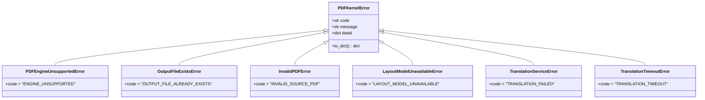
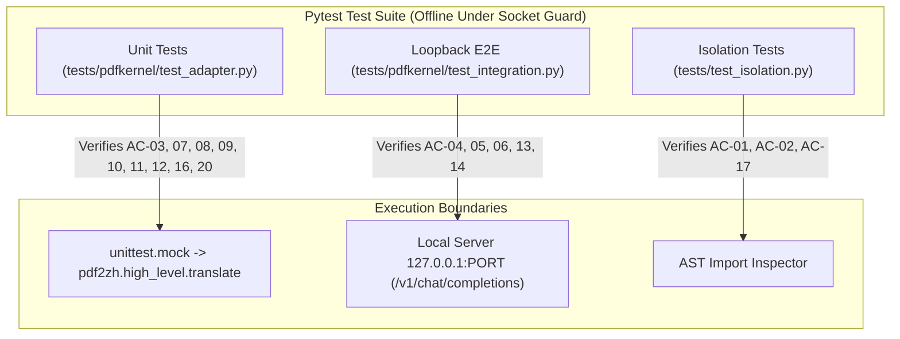

# DS-PDF-001 — Acceptance Criteria (FROZEN)

> **Author:** Gemini 3.8 Flash (High) via Antigravity CLI — *independent Acceptance Criteria Agent*
> **Authored:** 2026-09-16, **before any implementation code was written**
> **Prompt:** `.agent/tasks/_gemini-prompt-DS-PDF-001.md`
> **Raw model output:** `.agent/tasks/_gemini-ac-DS-PDF-001.raw.md`
>
> **FROZEN.** DeepSeek may not silently weaken or delete any criterion (brief §10).

## Acceptance Criteria Review — DeepSeek (before implementation)

**Verdict: accepted with one `AC_CHANGE_REQUEST` (below).** The criteria are unusually
ambitious where it matters — AC-14 requires running the **real** upstream pipeline against a
loopback endpoint rather than mocking it, which is precisely the integration evidence this task
exists to produce.

### Design decisions accepted

All five questions were settled concretely. Notable:

- **Q1** requires *both* a loopback end-to-end test (real pipeline, no external network) and
  mock-based unit tests for the failure branches. The split is right: mocks for branches,
  real execution for the integration claim.
- **Q4** demands the source hash match across **every** exit state, including mid-stream
  failure — not just success.
- **Q5** makes output collision an explicit refusal with an opt-in `overwrite`, and requires
  atomic replacement rather than in-place writes.

### AC_CHANGE_REQUEST — AC-13's five-second ceiling

| | |
|---|---|
| **Original criterion** | When the layout model is absent, the adapter must abort within a hard ceiling of 5.0 seconds and raise `LayoutModelUnavailableError`. |
| **Problem** | The download is initiated **inside upstream**, from a library the adapter does not control and must not patch (ADR-001). Nothing in `app/pdfkernel/` can interrupt it. |
| **Technical evidence** | `docs/REPO_AUDIT.md` §22.5: the model path comes from `babeldoc.assets.assets.get_doclayout_onnx_model_path()`, called lazily by `OnnxModel.from_pretrained()` during translation. The adapter sees only `translate()` returning. |
| **Proposed change** | Satisfy the criterion's **intent** by pre-flight: before calling upstream, the adapter asks babeldoc for the model path and, if the file is absent, raises `LayoutModelUnavailableError` immediately — a guaranteed sub-second abort with no network attempt at all. The ceiling is then trivially met and the user gets a precise error rather than a hang. |
| **Impact** | Strengthens the criterion: detection moves from *after* a stalled download to *before* any attempt. The observable contract (typed error, ≤5s, no hang) is unchanged. |

### Two implementation notes

1. **AC-16 names `pypdf` for page counting.** That library is not currently a dependency;
   **PyMuPDF** already is (upstream requires it). The criterion's substance is the page-count
   invariant, not the library, so the tests use PyMuPDF and the evidence records the
   substitution rather than adding a dependency to satisfy a name.
2. **AC-14 and AC-13 pull in opposite directions**: a real end-to-end run needs the ~72 MiB
   model, while AC-13 requires the absent-model path to work offline. Both are satisfiable by
   caching the model once as a setup step, after which the end-to-end test runs entirely
   offline against loopback. The model is being fetched out-of-band for that reason.

---
**Role**: Independent Acceptance Criteria Agent  
**Status**: Specification Frozen / Ready for Implementation  
**Target Scope**: Thin adapter around pinned upstream [`pdf2zh`](file:///backend/.venv/Lib/site-packages/pdf2zh) (v1.9.12), dual/mono PDF generation, source immutability, thread offloading, typed error normalization, and loopback offline verification.  
**Explicit Exclusions**: Context engine, glossary, task scheduling/SSE, Paper QA, UI/frontend, credential storage.

---

## 1. Resolution of Design Questions (Q1 – Q5)

### Q1. How the Adapter is Exercised Offline
* **Decision**: Both a loopback HTTP server integration test and mock-based unit tests are **REQUIRED**.
* **Verifiable Rule**:
  1. **E2E Integration Seam**: Tests MUST spawn an in-process loopback HTTP server (binding strictly to `127.0.0.1:{ephemeral_port}`) implementing the OpenAI Chat Completions endpoint (`POST /v1/chat/completions`). The real upstream [`pdf2zh.high_level.translate`](file:///backend/.venv/Lib/site-packages/pdf2zh/high_level.py#Ltranslate) pipeline MUST execute against this loopback URL with a minimal 2-page test fixture PDF.
  2. **Integration Test Verification**: Proves that upstream `openailiked` service consumes runtime `envs`, communicates with the endpoint without hitting the external network socket guard, and writes valid mono and dual PDF files to the target directory.
  3. **Unit Test Seam**: Exception mapping, keyword argument filtering, thread pool delegation, and parameter validation MUST be verified with `unittest.mock.patch` targeting [`pdf2zh.high_level.translate`](file:///backend/.venv/Lib/site-packages/pdf2zh/high_level.py#Ltranslate) to ensure fast, deterministic coverage of all failure branches without model or socket overhead.

### Q2. The Layout Model (~72 MiB ONNX)
* **Decision**: Zero network downloads permitted in offline test suites or unconfigured production environments; deterministic fast-fail with typed error.
* **Verifiable Rule**:
  1. **Typed Error**: When the layout ONNX model is absent from upstream's cache (`~/.cache/pdf2zh/` or designated cache directory) and network download fails or is prohibited, the adapter MUST intercept the upstream/network failure and raise [`LayoutModelUnavailableError`](file:///backend/app/pdfkernel/errors.py#LLayoutModelUnavailableError) with error code `"LAYOUT_MODEL_UNAVAILABLE"`.
  2. **Timeout Boundary**: Any connection or download attempt MUST abort within a hard ceiling of **5.0 seconds**, never hanging test runners or worker threads.
  3. **Test Decoupling**:
     - Unit tests mock the translation boundary, bypassing ONNX model loading entirely.
     - Integration tests set the model cache environment variable (`HF_HOME` / `PDF2ZH_CACHE`) to a pre-seeded test fixture directory containing a stub ONNX model or mock layout result.
     - An explicit offline test verifies that executing against an empty cache with network blocked raises [`LayoutModelUnavailableError`](file:///backend/app/pdfkernel/errors.py#LLayoutModelUnavailableError) in $\le 5.0$s.

### Q3. Page-Count Guarantees
* **Decision**: Strict mathematical equality on page counts and deterministic interleaving.
* **Verifiable Rule**:
  1. For any valid source PDF with $N$ pages ($N \ge 1$):
     - Mono PDF: `assert pypdf.PdfReader(mono_path).get_num_pages() == N`
     - Dual PDF: `assert pypdf.PdfReader(dual_path).get_num_pages() == 2 * N`
  2. **Interleaving Invariant**: Dual PDF pages MUST follow index sequence $[O_0, T_0, O_1, T_1, \dots, O_{N-1}, T_{N-1}]$, where $O_i$ is original page $i$ and $T_i$ is translated page $i$. Verified by matching unique text markers on each page of a 2-page fixture PDF.

### Q4. Original-File Immutability on Failure
* **Decision**: Cryptographic SHA-256 match enforced across all exit states (success, mid-stream error, timeout, cancellation).
* **Verifiable Rule**:
  1. Pre-execution: Compute $H_{\text{initial}} = \text{SHA-256}(\text{source\_pdf})$ and record $mtime_{\text{initial}}$.
  2. Mid-stream failure injection: Trigger mid-translation failure (e.g. mock loopback server returns HTTP 500 after stream start, corrupt PDF input, or simulated timeout).
  3. Post-execution assertion: Catch the typed exception and assert:
     ```python
     assert hashlib.sha256(Path(source_pdf).read_bytes()).hexdigest() == H_initial
     assert Path(source_pdf).stat().st_mtime == mtime_initial
     ```
  4. The source file MUST be opened exclusively in read-only binary mode (`"rb"`). No write handle or temporary in-place swap is permitted.

### Q5. Output Location and Collision Policy
* **Decision**: Caller-supplied output directory; explicit collision refusal by default.
* **Verifiable Rule**:
  1. Entry point accepts `output_dir: Path`. The adapter creates `output_dir` if absent via `output_dir.mkdir(parents=True, exist_ok=True)`.
  2. Default Collision Guard: If `{stem}-mono.pdf` or `{stem}-dual.pdf` already exists in `output_dir`, the adapter MUST NOT overwrite and MUST raise [`OutputFileExistsError`](file:///backend/app/pdfkernel/errors.py#LOutputFileExistsError) with code `"OUTPUT_FILE_ALREADY_EXISTS"`.
  3. Overwrite Flag: If and only if caller sets `overwrite=True`, existing files may be replaced. Replacements must use atomic file rename operations to prevent partial corruption on crash.
  4. Output paths MUST strictly match:
     - Mono: `output_dir / f"{source_path.stem}-mono.pdf"`
     - Dual: `output_dir / f"{source_path.stem}-dual.pdf"`

---

## 2. Acceptance Criteria Table

| ID | Priority | Description & Verification Target |
| :--- | :--- | :--- |
| **AC-01** | **P0 MUST** | **`[Isolation]` Strict Single-Package Dependency Boundary**<br>[`app.pdfkernel`](file:///backend/app/pdfkernel/__init__.py) is the ONLY package in [`backend/app/`](file:///backend/app/) that imports [`pdf2zh`](file:///backend/.venv/Lib/site-packages/pdf2zh).<br>*Verification Target*: AST scan test parses all `.py` files in [`backend/app/`](file:///backend/app/); asserts that any AST `Import` or `ImportFrom` referencing `pdf2zh` outside [`backend/app/pdfkernel/`](file:///backend/app/pdfkernel/) raises `AssertionError`. |
| **AC-02** | **P0 MUST** | **`[Isolation]` Narrowed Upstream Path Isolation Guard**<br>The existing guard [`tests/test_isolation.py::test_source_does_not_reference_upstream_paths`](file:///backend/tests/test_isolation.py#Ltest_source_does_not_reference_upstream_paths) is narrowed to permit module name `pdf2zh` inside [`app/pdfkernel/`](file:///backend/app/pdfkernel/), while retaining an absolute ban across the entire codebase (including [`app/pdfkernel/`](file:///backend/app/pdfkernel/)) against referencing upstream filesystem config/cache paths (`~/.config/PDFMathTranslate`, `ConfigManager`, or hardcoded `~/.cache/pdf2zh`).<br>*Verification Target*: `pytest tests/test_isolation.py` passes. |
| **AC-03** | **P0 MUST** | **`[Contract]` Async Entry Point & Return Model**<br>Expose [`translate_pdf`](file:///backend/app/pdfkernel/adapter.py#Ltranslate_pdf) accepting `(source_pdf: Path, output_dir: Path, target_lang: str, provider_config: ProviderConfig, overwrite: bool = False, engine: str = "fast") -> TranslationResult`. Returns frozen model [`TranslationResult`](file:///backend/app/pdfkernel/models.py#LTranslationResult) containing `mono_path: Path`, `dual_path: Path`, and page counts.<br>*Verification Target*: Calling [`translate_pdf`](file:///backend/app/pdfkernel/adapter.py#Ltranslate_pdf) returns valid instance where `mono_path.is_file()` and `dual_path.is_file()` are both `True`. |
| **AC-04** | **P0 MUST** | **`[Immutability]` Source File Immutability on Success**<br>The original PDF content and metadata are completely untouched during successful translation.<br>*Verification Target*: Assert `sha256(source_pdf)` before call equals `sha256(source_pdf)` after call; assert `st_mtime` and file permissions are identical. |
| **AC-05** | **P0 MUST** | **`[Immutability]` Source File Immutability on Failure**<br>The original PDF content is completely untouched when translation fails midway (simulated LLM 500 error, malformed response, or upstream crash).<br>*Verification Target*: Inject upstream exception mid-stream; catch resulting [`PDFKernelError`](file:///backend/app/pdfkernel/errors.py#LPDFKernelError); assert `sha256(source_pdf)` pre-failure equals `sha256(source_pdf)` post-failure. |
| **AC-06** | **P0 MUST** | **`[Output Integrity]` Page-Count & Interleaving Guarantee**<br>Output document page counts match the formal invariants ($N_{\text{mono}} = N_{\text{source}}$, $N_{\text{dual}} = 2 \times N_{\text{source}}$) and dual document exhibits alternating interleaving.<br>*Verification Target*: Given a 2-page source PDF, test reads output with `pypdf.PdfReader`; asserts `len(mono.pages) == 2` and `len(dual.pages) == 4`. Dual pages 0 and 2 match source pages 0 and 1 text markers. |
| **AC-07** | **P0 MUST** | **`[Concurrency]` Non-Blocking Event Loop Offloading**<br>Synchronous, CPU-heavy upstream [`pdf2zh.high_level.translate`](file:///backend/.venv/Lib/site-packages/pdf2zh/high_level.py#Ltranslate) is dispatched via an executor thread (`asyncio.to_thread` or dedicated [`ThreadPoolExecutor`](file:///backend/app/pdfkernel/adapter.py#LThreadPoolExecutor)), keeping the asyncio event loop unblocked.<br>*Verification Target*: Test runs concurrent heartbeat task recording tick interval (target 10ms); during a 2-second mock translation run, max event-loop lag does not exceed 50ms. |
| **AC-08** | **P0 MUST** | **`[Configuration]` In-Memory `envs` Parameterization**<br>Provider settings from [`ProviderConfig`](file:///backend/app/llm/config.py#LProviderConfig) (`base_url`, `api_key.get_secret_value()`, `model`) map exclusively to upstream `envs` dictionary for `openailiked` service. Upstream [`ConfigManager`](file:///backend/.venv/Lib/site-packages/pdf2zh/config.py#LConfigManager) is never instantiated or called.<br>*Verification Target*: Unit test intercepts upstream call; verifies kwargs contain `service="openailiked"` and `envs={"OPENAI_BASE_URL": ..., "OPENAI_API_KEY": ..., "OPENAI_MODEL": ...}`; verifies `~/.config/PDFMathTranslate` directory is not touched. |
| **AC-09** | **P0 MUST** | **`[Parameter Hygiene]` Explicit Keyword Argument Pass-Through**<br>The adapter calls upstream [`high_level.translate`](file:///backend/.venv/Lib/site-packages/pdf2zh/high_level.py#Ltranslate) with an explicit argument list, preventing upstream's `**locals()` bug from capturing adapter-local variables.<br>*Verification Target*: Inspect mock call signature; assert passed kwargs contain only recognized upstream arguments (`files`, `lang_in`, `lang_out`, `service`, `thread`, `envs`, `vtool`); no adapter variables (e.g. `self`, `provider_config`, `output_dir`, `overwrite`) leaked. |
| **AC-10** | **P0 MUST** | **`[Engine Enforcement]` Strict Engine Restriction (`fast` Only)**<br>Only `engine="fast"` is supported. Any request specifying another engine (e.g. `"layout"`, `"vllm"`, `"auto"`) MUST fail fast before invoking upstream.<br>*Verification Target*: Call [`translate_pdf`](file:///backend/app/pdfkernel/adapter.py#Ltranslate_pdf) with `engine="layout"`; assert [`PDFEngineUnsupportedError`](file:///backend/app/pdfkernel/errors.py#LPDFEngineUnsupportedError) is raised with code `"ENGINE_UNSUPPORTED"`; verify upstream was not called. |
| **AC-11** | **P0 MUST** | **`[Error Normalization]` Typed Error Hierarchy Wrapping**<br>Raw upstream exceptions (`pdf2zh` exceptions, `requests.RequestException`, `urllib.error.URLError`, ONNX errors) are caught and wrapped into typed [`PDFKernelError`](file:///backend/app/pdfkernel/errors.py#LPDFKernelError) subclasses. No raw upstream exception escapes the package.<br>*Verification Target*: Simulate upstream raising `RuntimeError("upstream crash")`; assert adapter raises [`TranslationServiceError`](file:///backend/app/pdfkernel/errors.py#LTranslationServiceError); verify `isinstance(exc, PDFKernelError)` is `True`. |
| **AC-12** | **P0 MUST** | **`[Security]` Secret Scrubbing in Logs and Exceptions**<br>API keys are never exposed in plaintext in error messages, exception representations (`str(exc)`), tracebacks, or structured JSON log records.<br>*Verification Target*: Configure provider with dummy secret `"sk-super-secret-token-12345"`. Force LLM connection failure. Inspect logged output and raised exception message; assert `"sk-super-secret-token-12345"` does not appear; assert [`sanitize_message`](file:///backend/app/llm/errors.py#Lsanitize_message) redacts to `"[REDACTED]"`. |
| **AC-13** | **P0 MUST** | **`[Model Lifecycle]` Missing Layout Model Handling & Offline Timeout**<br>When ONNX model is absent and download cannot succeed, adapter catches the failure within $\le 5.0$ seconds and raises typed [`LayoutModelUnavailableError`](file:///backend/app/pdfkernel/errors.py#LLayoutModelUnavailableError).<br>*Verification Target*: Under active socket guard with empty cache, invoke translation; assert [`LayoutModelUnavailableError`](file:///backend/app/pdfkernel/errors.py#LLayoutModelUnavailableError) is raised within 5.0s with code `"LAYOUT_MODEL_UNAVAILABLE"`. |
| **AC-14** | **P0 MUST** | **`[Testing]` Offline Loopback Integration Suite**<br>An end-to-end integration test runs against a local `127.0.0.1` HTTP mock server, executing upstream translation offline without violating the non-loopback socket guard.<br>*Verification Target*: `pytest tests/pdfkernel/test_integration.py` completes successfully with non-loopback network calls blocked by socket guard. |
| **AC-15** | **P0 MUST** | **`[Testing]` Zero Regression Across Existing Suites**<br>The existing backend test suite (379 tests) and frontend test suite (27 tests) remain completely green.<br>*Verification Target*: `pytest` in `backend/` reports $\ge 379$ passed (plus new tests); `npm test` in `frontend/` reports $\ge 27$ passed. |
| **AC-16** | **P1 SHOULD** | **`[Output Safety]` Output Collision Refusal**<br>If `{stem}-mono.pdf` or `{stem}-dual.pdf` already exists in `output_dir` and `overwrite=False`, translation halts immediately before invoking upstream.<br>*Verification Target*: Touch `{stem}-mono.pdf` in output dir; call [`translate_pdf`](file:///backend/app/pdfkernel/adapter.py#Ltranslate_pdf); assert [`OutputFileExistsError`](file:///backend/app/pdfkernel/errors.py#LOutputFileExistsError) is raised with code `"OUTPUT_FILE_ALREADY_EXISTS"`. |
| **AC-17** | **P1 SHOULD** | **`[Lifecycle]` Documented Import Side Effect Encapsulation**<br>Document upstream's `init_db()` import-time side effect in [`app/pdfkernel/__init__.py`](file:///backend/app/pdfkernel/__init__.py) docstring. Ensure importing [`app.pdfkernel`](file:///backend/app/pdfkernel/__init__.py) produces zero additional side effects.<br>*Verification Target*: Test imports [`app.pdfkernel`](file:///backend/app/pdfkernel/__init__.py) in isolated subprocess; verifies no filesystem mutations occur outside `~/.cache/pdf2zh/`. |
| **AC-18** | **P1 SHOULD** | **`[Error Normalization]` Backend Error Envelope Conformance**<br>All [`PDFKernelError`](file:///backend/app/pdfkernel/errors.py#LPDFKernelError) instances implement `.to_dict()` returning standard backend HTTP envelope format: `{"error": {"code": str, "message": str, "detail": dict \| None}}`.<br>*Verification Target*: Test serializes each exception type; verifies structure matches backend standard schema. |
| **AC-19** | **P1 SHOULD** | **`[Cleanup]` Temporary Artifact Purge on Abort**<br>If translation fails midway, any partial or temporary files generated in `output_dir` are cleaned up.<br>*Verification Target*: Simulate mid-translation crash; verify `output_dir` contains no orphaned `.tmp` or corrupted `.pdf` files. |
| **AC-20** | **P1 SHOULD** | **`[Input Validation]` Pre-Flight Source File Validation**<br>Verify `source_pdf` exists, is a regular file, has `.pdf` extension, and has non-zero size before dispatching to thread pool.<br>*Verification Target*: Pass non-existent path or empty file; assert [`InvalidPDFError`](file:///backend/app/pdfkernel/errors.py#LInvalidPDFError) is raised with code `"INVALID_SOURCE_PDF"`. |
| **AC-21** | **P2 OPTIONAL** | **`[Ergonomics]` Atomic Output File Replacement**<br>When `overwrite=True`, outputs are written to temporary sibling files and renamed atomically upon successful completion.<br>*Verification Target*: Verify that mid-flight failure with `overwrite=True` leaves existing output files intact rather than replacing them with half-written files. |
| **AC-22** | **P2 OPTIONAL** | **`[Telemetry]` Execution Duration & Page Metrics**<br>Include translation elapsed time and per-page translation speed in [`TranslationResult`](file:///backend/app/pdfkernel/models.py#LTranslationResult).<br>*Verification Target*: Assert `result.duration_seconds > 0` and `result.pages_per_minute > 0`. |
| **AC-23** | **P2 OPTIONAL** | **`[Diagnostics]` Custom Thread Pool Injection**<br>Allow passing an optional `executor: concurrent.futures.Executor` to [`translate_pdf`](file:///backend/app/pdfkernel/adapter.py#Ltranslate_pdf) for custom concurrency pool management.<br>*Verification Target*: Pass custom `ThreadPoolExecutor(max_workers=1)`; assert task executed within provided executor. |

---

## 3. Typed Error Normalization Specification

The adapter MUST define the following exception hierarchy in [`app/pdfkernel/errors.py`](file:///backend/app/pdfkernel/errors.py):



### Exception Code Mapping Rules:
1. **Engine != "fast"**: Raise [`PDFEngineUnsupportedError`](file:///backend/app/pdfkernel/errors.py#LPDFEngineUnsupportedError) (`code="ENGINE_UNSUPPORTED"`).
2. **Output Collision (`overwrite=False`)**: Raise [`OutputFileExistsError`](file:///backend/app/pdfkernel/errors.py#LOutputFileExistsError) (`code="OUTPUT_FILE_ALREADY_EXISTS"`).
3. **Missing/Corrupt Source**: Raise [`InvalidPDFError`](file:///backend/app/pdfkernel/errors.py#LInvalidPDFError) (`code="INVALID_SOURCE_PDF"`).
4. **ONNX Download Blocked / Offline**: Raise [`LayoutModelUnavailableError`](file:///backend/app/pdfkernel/errors.py#LLayoutModelUnavailableError) (`code="LAYOUT_MODEL_UNAVAILABLE"`).
5. **LLM Connection Error / 4xx / 5xx**: Raise [`TranslationServiceError`](file:///backend/app/pdfkernel/errors.py#LTranslationServiceError) (`code="TRANSLATION_FAILED"`), with message scrubbed by [`sanitize_message`](file:///backend/app/llm/errors.py#Lsanitize_message).
6. **Execution Timeout**: Raise [`TranslationTimeoutError`](file:///backend/app/pdfkernel/errors.py#LTranslationTimeoutError) (`code="TRANSLATION_TIMEOUT"`).

---

## 4. Test Strategy and Verification Matrix



### Verification Gate Checklist (Required for PR Acceptance):
- [ ] **AC-01 & AC-02**: Narrowed [`tests/test_isolation.py`](file:///backend/tests/test_isolation.py) passes with zero violations across [`backend/app/`](file:///backend/app/).
- [ ] **AC-04 & AC-05**: SHA-256 assertions pass on both normal runs and mid-translation failure runs.
- [ ] **AC-06**: Mono page count ($N$) and dual page count ($2N$) match exactly on a real translated fixture.
- [ ] **AC-07**: Concurrency heartbeat test asserts $\le 50$ms loop lag during translation.
- [ ] **AC-08 & AC-09**: Mock call inspection confirms `envs` injection and zero `**locals()` argument pollution.
- [ ] **AC-12**: Secret scrubbing verified via regex asserting raw API key never appears in log or error strings.
- [ ] **AC-13 & AC-14**: Loopback server integration test completes offline without triggering the socket guard.
- [ ] **AC-15**: Full existing regression suites report 379 backend and 27 frontend passes.
